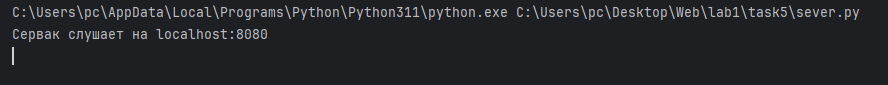
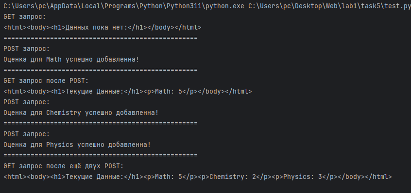

# Задание 5

Необходимо написать простой web-сервер для обработки GET и POST http
запросов средствами Python и библиотеки socket.
- Принять и записать информацию о дисциплине и оценке по дисциплине.
- Отдать информацию обо всех оценах по дсициплине в виде html-страницы.

## Ход выполнения работы

### Код server.py

    import socket
    
    
    class MyHTTPServer:
        def __init__(self, host, port, name):
            self.host = host
            self.port = port
            self.name = name
            self.server_socket = socket.socket(socket.AF_INET, socket.SOCK_STREAM)
            self.dataBase = {}
    
        def serve_forever(self):
            # 1. Запуск сервера на сокете, обработка входящих соединений
            self.server_socket.bind((self.host, self.port))
            self.server_socket.listen(1)
            print(f"Сервак слушает на {self.host}:{self.port}")
            try:
                while True:
                    client_socket, client_address = self.server_socket.accept()
                    self.serve_client(client_socket)
            finally:
                self.server_socket.close()
    
        def serve_client(self, client_socket):
            # 2. Обработка клиентского подключения
            request_data = client_socket.recv(1024)
            if not request_data:
                return
            request_str = request_data.decode('utf-8')
            method, url, params = self.parse_request(request_str)
            if method == 'GET':
                self.handle_get_request(client_socket)
            elif method == 'POST':
                self.handle_post_request(client_socket, params)
    
    
        def parse_request(self, request_str):
            lines = request_str.split('\r\n')
            method, url, _ = lines[0].split()
    
            params = {}
            if method == 'POST':
                params_str = lines[-1]
                params_list = params_str.split('&')
                for param in params_list:
                    key, value = param.split('=')
                    params[key] = value
    
            return method, url, params
    
        def parse_headers(self, request_str):
            # 4. Функция для обработки headers
            lines = request_str.split('\r\n')
            headers = {}
            for line in lines[1:]:
                if not line:
                    break
                key, value = line.split(': ', 1)
                headers[key] = value
            return headers
    
        def handle_get_request(self, client_socket):
            status_code = 200
            if not self.dataBase:
                response_body = "<html><body><h1>Данных пока нет:</h1></body></html>"
            else:
                response_body = "<html><body><h1>Текущие Данные:</h1>"
                for subject, score in self.dataBase.items():
                    response_body += f"
{subject}: {score}
"
                response_body += "</body></html>"
            self.send_response(client_socket, status_code, response_body)
    
        def handle_post_request(self, client_socket, params):
            if 'subject' in params and 'score' in params:
                subject = params['subject']
                score = params['score']
                self.dataBase[subject] = score
                response_body = f"Оценка для {subject} успешно добавленна!"
            else:
                response_body = "Неверные параметры запроса для добавления очков."
    
            status_code = 200
            self.send_response(client_socket, status_code, response_body)
    
        def send_response(self, client_socket, status_code, response_body):
            # 6. Функция для отправки ответа.
            status_line = f"HTTP/1.1 {status_code} OK\n"
            headers = "Content-Type: text/html; charset=utf-8\n"
            response = status_line + headers + "\n" + response_body
            client_socket.sendall(response.encode('utf-8'))
            client_socket.close()
    
    if __name__ == '__main__':
        host = 'localhost'
        port = 8080
        name = 'MyHTTPServer'
        serv = MyHTTPServer(host, port, name)
        try:
            serv.serve_forever()
        except KeyboardInterrupt:
            pass

### Код test.py
файл для проверки

    import requests
    
    
    server_url = "http://localhost:8080"
    
    get_response = requests.get(f"{server_url}/")
    print("GET запрос:")
    print(get_response.text)
    print("="*50)
    
    post_data = {"subject": "Math", "score": "5"}
    post_response = requests.post(f"{server_url}/add_score", data=post_data)
    print("POST запрос:")
    print(post_response.text)
    print("="*50)
    
    get_response_after_post = requests.get(f"{server_url}/")
    print("GET запрос после POST:")
    print(get_response_after_post.text)
    
    post_data = {"subject": "Chemistry", "score": "2"}
    post_response = requests.post(f"{server_url}/add_score", data=post_data)
    print("POST запрос:")
    print(post_response.text)
    print("="*50)
    
    post_data = {"subject": "Physics", "score": "3"}
    post_response = requests.post(f"{server_url}/add_score", data=post_data)
    print("POST запрос:")
    print(post_response.text)
    print("="*50)
    
    get_response_after_post = requests.get(f"{server_url}/")
    print("GET запрос после ещё двух POST:")
    print(get_response_after_post.text)

## Результат
Запускаем server.py

Запускаем test.py

