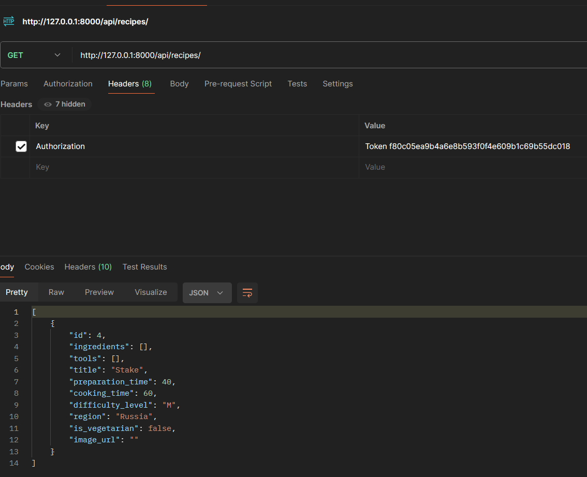
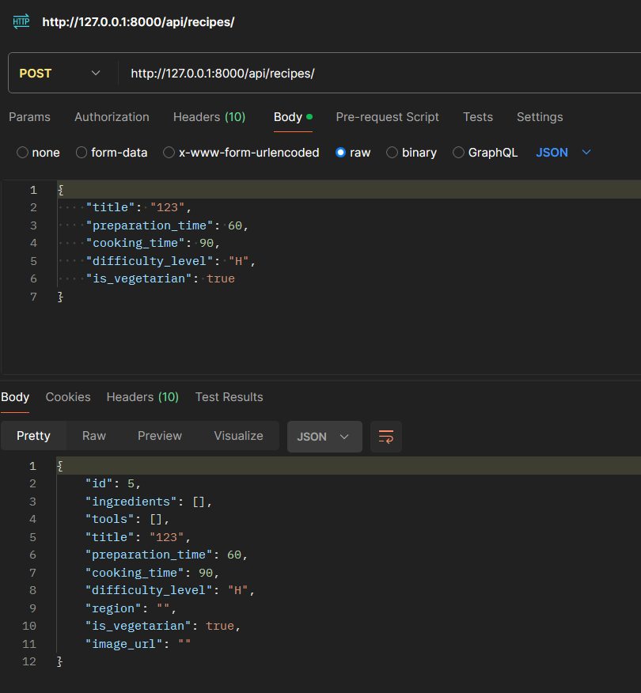

# Лабораторная работа 3. Реализация серверной части на django rest. 
## Дисциплина: Основы web-программирования
## Тарабанов Алексей K33402

Цель работы: овладеть практическими навыками реализации серверной части (backend) приложений средствами Django REST framework.

## Скриншоты
Отправка get запроса

Отправка post запроса

