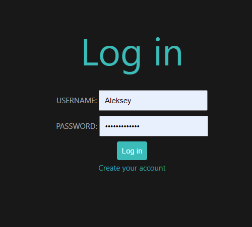
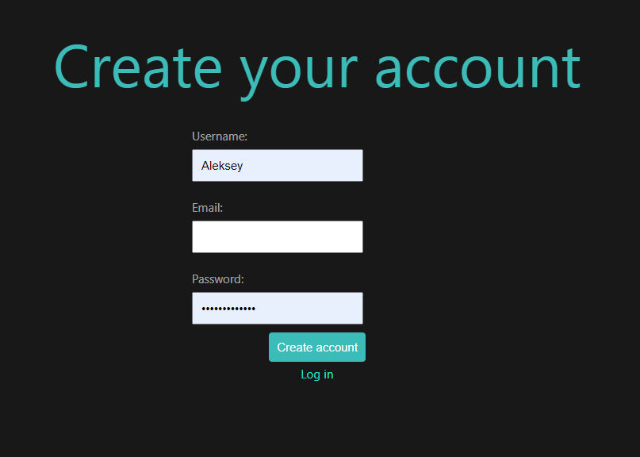
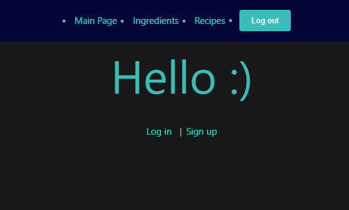
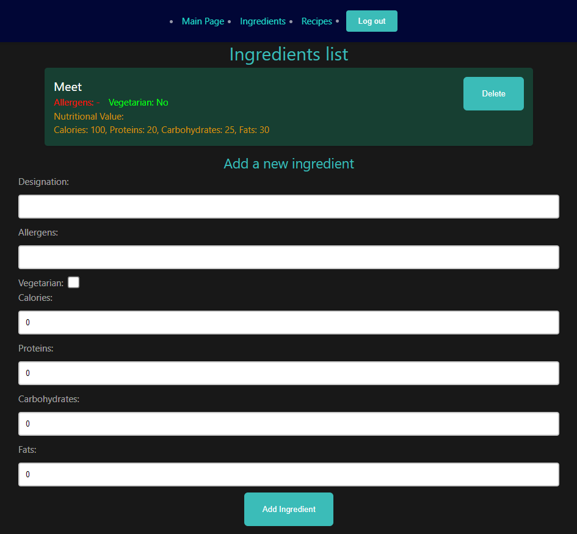
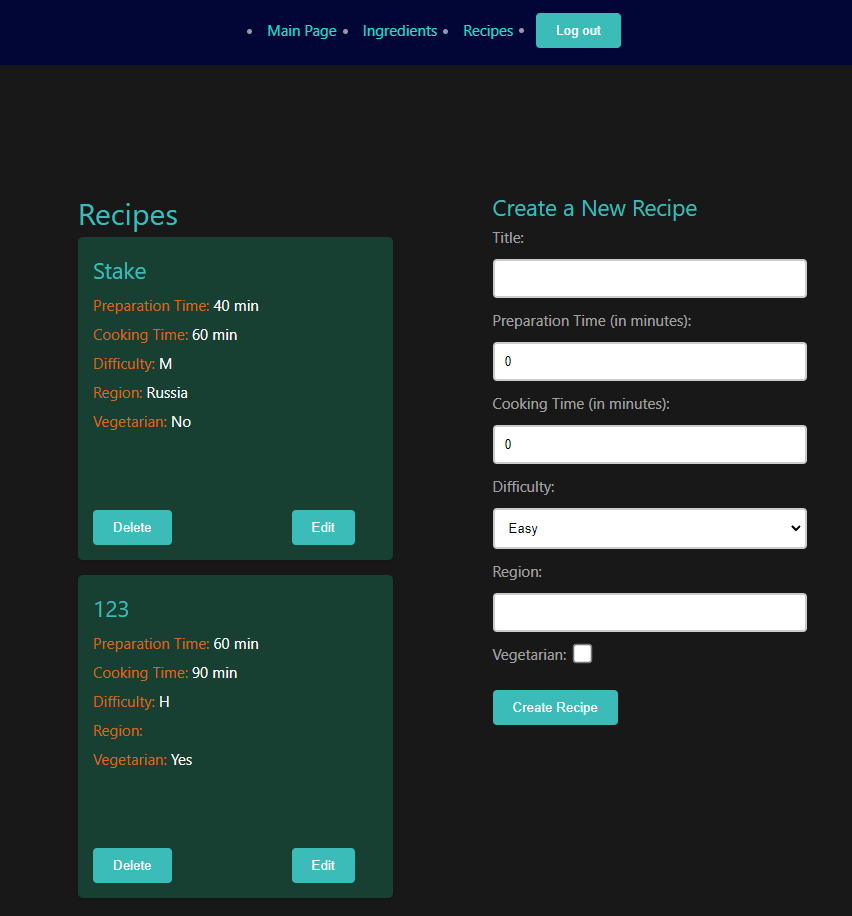
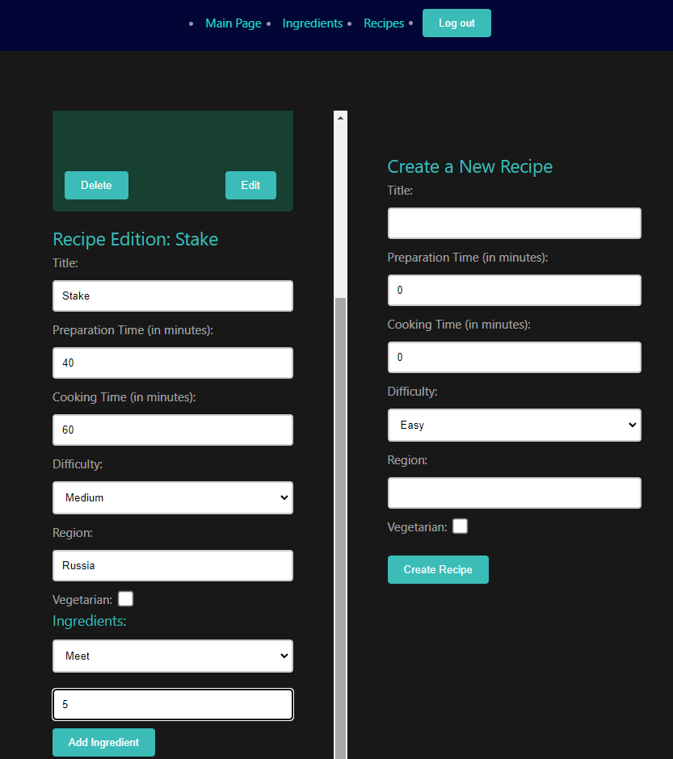

# Лабораторная работа 4. Реализация клиентской части средствами Vue.js. 
## Дисциплина: Основы web-программирования
## Тарабанов Алексей K33402

Цель работы: Овладеть практическими навыками и умениями 
реализации клиентской части приложения средствами vue.js

## Скриншоты
Вход

Регистрация (создание нового аккаунта)

Главная страница

Долбавление ингредиентов в БД

Создание рецепта

Редактирование рецепта / добавление ингредиентов

