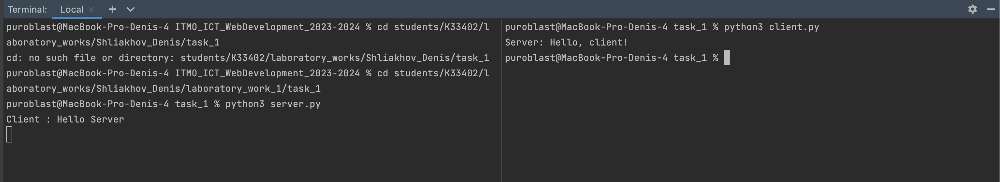

# Задание 1

Реализовать клиентскую и серверную часть приложения. Клиент отсылает серверу сообщение «Hello, server». Сообщение должно
отразиться на стороне сервера. Сервер в ответ отсылает клиенту сообщение «Hello, client». Сообщение должно отобразиться
у клиента.

Обязательно использовать библиотеку socket

Реализовать с помощью протокола UDP

## Ход выполнения работы

### Код server.py

    import socket

    server = socket.socket(socket.AF_INET, socket.SOCK_DGRAM)
    server.bind((socket.gethostname(), 9090))
    
    while True:
        clientMsg, addr = server.recvfrom(1024)
    
        if clientMsg.decode() == "shut":
            break
    
        print(f"Client : {clientMsg.decode()}")
    
        serverMsg = "Hello, client!"
        server.sendto(serverMsg.encode("utf-8"), addr)
    
    server.close()

### Код client.py

    import socket

    client = socket.socket(socket.AF_INET, socket.SOCK_DGRAM)
    client.connect((socket.gethostname(), 9090))
    
    client.send("Hello Server".encode())
    
    serverMsg, addr = client.recvfrom(1024)
    
    print(f"Server: {serverMsg.decode()}")
    
    client.close()

## Результат

