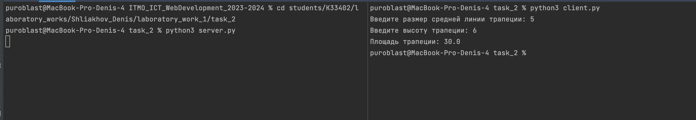

# Задание 2

Реализовать клиентскую и серверную часть приложения. Клиент запрашивает у сервера выполнение математической операции,
параметры, которые вводятся с клавиатуры. Сервер обрабатывает полученные данные и возвращает результат клиенту. Вариант:
Поиск площади трапеции

Обязательно использовать библиотеку socket

Реализовать с помощью протокола TCP

## Ход выполнения работы

### Код server.py

    import socket

    server = socket.socket(socket.AF_INET, socket.SOCK_STREAM)
    server.bind((socket.gethostname(), 9090))
    server.listen(5)
    
    while True:
        client_socket, addr = server.accept()
    
        try:
            m = float(client_socket.recv(1024).decode())
            h = float(client_socket.recv(1024).decode())
    
            res = m * h
    
            client_socket.send(str(res).encode("utf-8"))
        except Exception as e:
            client_socket.send(f"Error {e}".encode())
    
        client_socket.close()

### Код client.py

    import socket

    client = socket.socket(socket.AF_INET, socket.SOCK_STREAM)
    client.connect((socket.gethostname(), 9090))
    
    try:
        m = float(input("Введите размер средней линии трапеции: "))
        h = float(input("Введите высоту трапеции: "))
    
        client.send(str(m).encode())
        client.send(str(h).encode())
    
        res, addr = client.recvfrom(1024)
    
        print(f"Площадь трапеции: {res.decode()}")
    
        client.close()
    except Exception as e:
        print(e)

## Результат

