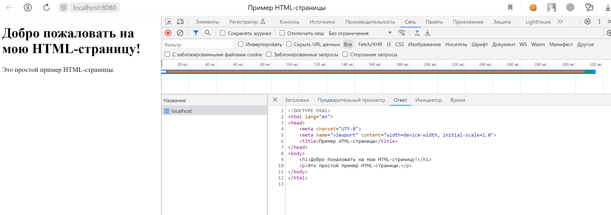
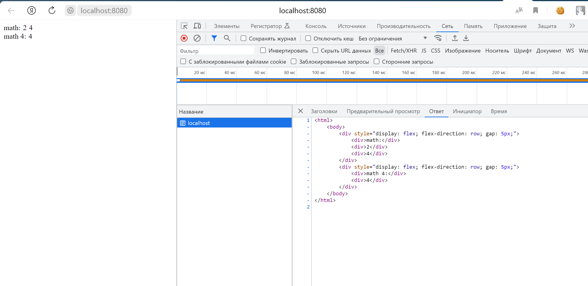

# Отчет по лабораторной работе №1

#### Цель работы:

Научиться основам создания web-серверов.

## Задание 1

#### Текст задания:

Реализовать клиентскую и серверную часть приложения. Клиент отсылает серверу
сообщение «Hello, server». Сообщение должно отразиться на стороне сервера.
Сервер в ответ отсылает клиенту сообщение «Hello, client». Сообщение должно
отобразиться у клиента.
Обязательно использовать библиотеку socket
Реализовать с помощью протокола UDP

#### Ход решения:

Сервер:

```
import socket

# Создаем UDP сервер
server_socket = socket.socket(socket.AF_INET, socket.SOCK_DGRAM)

server_address = ("localhost", 12345)

server_socket.bind(server_address)
print("Сервер ожидает сообщения...")

while True:
    data, client_address = server_socket.recvfrom(1024)
    print(f"Получено сообщение от клиента: {data.decode()}")

    response = b"Hello, client"
    server_socket.sendto(response, client_address)
```

Создаем сокет, задаем серверу таймаут и в цикле прослушиваем порт 1234, когда ответ получен отправляем на клиент сообщение "Hello, client".

Клиент:

```
import socket

# Подключаемся к серверу
client_socket = socket.socket(socket.AF_INET, socket.SOCK_DGRAM)

server_address = ("localhost", 12345)

message = b"Hello, server"

try:
    client_socket.sendto(message, server_address)
    data, server = client_socket.recvfrom(1024)
    print(f"Сервер ответил: {data.decode()}")

finally:
    client_socket.close()
```

## Задание 2

#### Текст задания:

Реализовать клиентскую и серверную часть приложения. Клиент запрашивает у
сервера площадь трапеции, параметры, которые вводятся с
клавиатуры. Сервер обрабатывает полученные данные и возвращает результат
клиенту.

#### Ход решения:

Сервер:

```
import socket


def calculate_trapezoid_area(base1, base2, height):
    return 0.5 * (base1 + base2) * height


def main():
    server_socket = socket.socket(socket.AF_INET, socket.SOCK_STREAM)
    server_address = ("localhost", 3000)
    server_socket.bind(server_address)

    # Ожидаем соединения клиента
    server_socket.listen(1)
    print("Ожидание подключения клиента...")
    client_socket, client_address = server_socket.accept()
    print(f"Подключен клиент: {client_address}")

    while True:
        try:
            data = client_socket.recv(1024).decode("utf-8")
            params = data.split(",")
            if len(params) == 3:
                base1, base2, height = map(float, params)
                result = calculate_trapezoid_area(base1, base2, height)
                client_socket.send(str(result).encode("utf-8"))
            else:
                client_socket.send("Неверные параметры. Ожидается основание1, основание2, высота".encode("utf-8"))
        except Exception as e:
            print(f"Ошибка: {str(e)}")
            break

    client_socket.close()
    server_socket.close()


if __name__ == "__main__":
    main()
```

Клиент:

```
import socket


def main():
    client_socket = socket.socket(socket.AF_INET, socket.SOCK_STREAM)
    server_address = ("localhost", 3000)
    client_socket.connect(server_address)

    base1 = float(input("Введите длину первого основания: "))
    base2 = float(input("Введите длину второго основания: "))
    height = float(input("Введите высоту: "))

    data = f"{base1},{base2},{height}"
    client_socket.send(data.encode("utf-8"))

    result = client_socket.recv(1024).decode("utf-8")
    print(f"Площадь трапеции: {result}")

    client_socket.close()


if __name__ == "__main__":
    main()
```

Соединяемся с сервером через сокет. Предлагаем пользователю ввести данные задачи и отправляем их на сервер. Получаем с сервера ответ.

## Задание 3

#### Текст задания:

Реализовать серверную часть приложения. Клиент подключается к серверу. В ответ
клиент получает http-сообщение, содержащее html-страницу, которую сервер
подгружает из файла index.html.

#### Ход решения:

Сервер:

```
import socket


def generate_http_response():
    with open('index.html', 'r', encoding='utf-8') as file:
        html_content = file.read()

    http_response = "HTTP/1.1 200 OK\r\n"
    http_response += "Content-Type: text/html; charset=UTF-8\r\n"
    http_response += f"Content-Length: {len(html_content.encode('utf-8'))}\r\n"
    http_response += "\r\n"

    http_response += html_content

    return http_response


def main():
    server_socket = socket.socket(socket.AF_INET, socket.SOCK_STREAM)
    server_address = ('localhost', 8080)
    server_socket.bind(server_address)
    server_socket.listen(1)
    print("Ожидание подключения клиента...")
    client_socket, client_address = server_socket.accept()
    print(f"Подключен клиент: {client_address}")
    while True:
        try:
            request = client_socket.recv(1024).decode('utf-8')
            http_response = generate_http_response()
            client_socket.send(http_response.encode('utf-8'))
            client_socket.close()
            break
        except Exception as e:
            print(f"Ошибка: {str(e)}")
            break

    server_socket.close()


if __name__ == '__main__':
    main()
```

## Задание 4

#### Текст задания:

Реализовать двухпользовательский или многопользовательский чат. Реализация
многопользовательского часа позволяет получить максимальное количество
баллов.
Обязательно использовать библиотеку threading.

Для применения с TCP необходимо запускать клиентские подключения И прием
и отправку сообщений всем юзерам на сервере в потоках. Не забудьте сохранять юзеров,
чтобы потом отправлять им сообщения.

#### Ход решения:

Сервер:

```
import socket, threading

server = socket.socket(socket.AF_INET, socket.SOCK_STREAM)
server.bind((socket.gethostname(), 1236))
server.listen(5)

client_list = list()
client_threads = list()


def connect_user():
    while True:
        client_socket, address = server.accept()
        if address not in client_list:
            client_list.append(client_socket)
            index = threading.Thread(target=add_user_message, args=(client_socket,))
            index.start()
            client_threads.append(client_socket)
        print(f"connect: {address}")


def add_user_message(user):
    while True:
        # noinspection PyBroadException
        try:
            input_data = user.recv(1024)

        except Exception:
            client_list.remove(user)
            break

        print(input_data.decode("utf-8"))

        # Перенаправить информацию от клиента и отправить ее другим клиентам
        for cli in client_list:
            if cli != user:
                cli.send(input_data)


accept_thread = threading.Thread(target=connect_user(), name="accept")
accept_thread.start()

# Выключите все серверы
for client in client_list:
    client.close()
print("сервер отключен")
```

Создаем сокет на порте 1234. Инициализируем список подключенных клиентов и список тех, кто уже создал потоки. Далее пишем функции на подключение новых клиентов, получение данных от них и отправки сообщений. Запускаем отдельные потоки для каждой функции (подключения, приема и отправки сообщений). Когда прекращает работу поток отсылающий сообщения, прекращаем соединения со всеми клиентами - отключаем сервер.

Клиент:

```
import socket, threading

client = socket.socket(socket.AF_INET, socket.SOCK_STREAM)

while True:
    name = input ("Введите username до 20 знаков : ")
    if 1 < len(name) < 20:
        break

client.connect((socket.gethostname(), 1236))
print ("Вы подключились к серверу")
print ("Чтобы выйти, нажмите Q" )


def send_to_chat():
    while True:
        message = input("")
        print()
        if message == "Q":
            client.send(f"{name}: отключился".encode("utf-8"))
            break

        if message == "":
            continue

        client.send(f"{name}: {message}".encode("utf-8"))
        print(f"{name}: {message}")


def update_chat():
    while True:
        input_data = client.recv(1024)
        print(input_data.decode("utf-8"))


input_thread = threading.Thread(target=update_chat, name="input")
input_thread.start()

out_thread = threading.Thread(target=send_to_chat, name="out")
out_thread.start()

out_thread.join()

print("Сессия завершена")
client.close()
```

## Задание 5

#### Текст задания:

Необходимо написать простой web-сервер для обработки GET и POST http
запросов средствами Python и библиотеки socket.

Задание: сделать сервер, который может:
<br/>1) Принять и записать информацию о дисциплине и оценке по дисциплине.
<br/>2) Отдать информацию обо всех оценах по дсициплине в виде html-страницы.

#### Ход решения:

Сервер:

```
import socket

HOST_NAME = "localhost"
BUFFER = 32768
PORT = 8080


class CustomHTTPServer:
    def __init__(self, host, port):
        self.connection = socket.socket(socket.AF_INET, socket.SOCK_STREAM)
        self.connection.setsockopt(socket.SOL_SOCKET, socket.SO_REUSEADDR, 1)
        self.connection.bind((host, port))
        self.connection.listen(5)
        self.journal = {}

    def start_server(self):
        while True:
            client, ip = self.connection.accept()
            self.client_listener(client)

    def client_listener(self, client):
        data = client.recv(BUFFER).decode(encoding="utf-8", errors="ignore")
        self.parse_request(client, data)

    def parse_request(self, client, data):
        lines = data.split("\n")
        method, url, version = lines[0].split()

        if method == "GET":
            params = (
                {p.split("=")[0]: p.split("=")[1] for p in url.split("?")[1].split("&")}
                if "?" in url
                else None
            )

        elif method == "POST":
            body = data.split("\n")[-1]
            params = {p.split("=")[0]: p.split("=")[1] for p in body.split("&")}

        else:
            params = None

        self.response_create(client, method, params)

    def response_create(self, client, method, params):
        if method == "GET":
            self.send_response(client, 200, "OK", self.generate_html())
            print("GET 200 OK")
        elif method == "POST":
            subject = params.get("subject")
            grade = params.get("grade")
            self.journal[subject] = grade
            self.send_response(client, 200, "OK", f'{subject}: {grade} добавлено')
            print("POST 200 OK")
        else:
            self.send_response(client, 404, "Not Found")
            print("ERR  404")

    # noinspection PyMethodMayBeStatic
    def send_response(self, client, code, reason, body):
        response = f"HTTP/1.1 {code} {reason}\nContent-Type: text/html\n\n{body}"
        client.send(response.encode("utf-8"))
        client.close()

    def generate_html(self):
        page = (
            "<html><body>"
            f"{''.join([f'<div>{subject}: {grade}</div>' for subject, grade in self.journal.items()])}"
            "</body></html>"
        )
        return page


if __name__ == "__main__":
    server = CustomHTTPServer(HOST_NAME, PORT)
    server.start_server()
```

## Вывод

В ходе выполнения работы я научился настраивать сервер через tcp udp, а также эмулировать http сервер.
