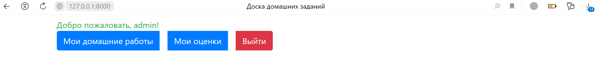
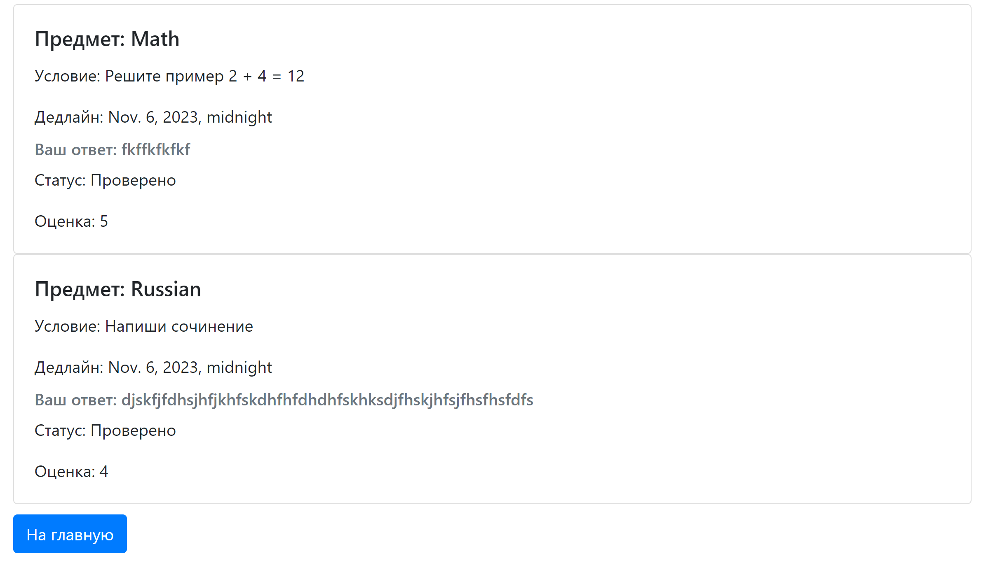
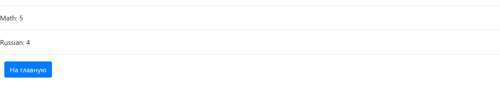

# Отчет по лабораторной работе №2

#### Цель работы:

Овладеть практическими навыками и умениями реализации web-сервисов
средствами Django 2.2.

## Задание

#### Текст задания:

Реализовать сайт используя фреймворк Django 3 и СУБД PostgreSQL \*, в
соответствии с вариантом задания лабораторной работы.

Хранится информация о названии тура, турагенстве, описании тура, периоде
проведения тура, условиях оплаты.
Необходимо реализовать следующий функционал:

- Регистрация новых пользователей.
- Просмотр домашних заданий. Пользователь должен иметь возможность
  добавить свое решение к каждому из домашних заданий.
- Администратор должен иметь возможность добавить новое домашнее задание и проверить работу ученика
  средствами Django-admin.
- В клиентской части должна формироваться таблица, отображающая все
  проданные туры по странам.

#### Ход Выполнения:

Для начала были созданы два приложения, одно отвечает за авторизацию и регистрацию пользователей, а второе за основную часть приложения. Также были созданы модели для базы данных и пользователь был наследован от AbstractUser для возможности авториации в системе.
Код моделей:

```
from django.db import models
from django.contrib.auth.models import AbstractUser

class User(AbstractUser):
    first_name = models.CharField(max_length=30, null=True)
    last_name = models.CharField(max_length=30, null=True)

    def __str__(self):
      return self.username


class Homework(models.Model):
    subject = models.CharField(max_length=100)
    text = models.TextField()
    deadline = models.DateTimeField()

class SubmittedWork(models.Model):
    user = models.ForeignKey(User, on_delete=models.CASCADE)
    homework = models.ForeignKey(Homework, on_delete=models.CASCADE)
    text = models.TextField()
    STATUS_CHOICES = [
        ('pending', 'Ожидает проверки'),
        ('checked', 'Проверено'),
    ]
    status = models.CharField(max_length=10, choices=STATUS_CHOICES)
    grade = models.IntegerField(null=True, blank=True)
```

#### Приложение регистрации

Начнем с приложения отвечающего за работу с пользователем.
Приложение сожержит следующие маршруты:

```
from django.urls import path
from django.contrib.auth.views import LogoutView
from . import views

urlpatterns = [
    path('register/', views.RegistrationView, name='register'),
    path('login/', views.LoginView, name='login'),
    path('logout/', LogoutView.as_view(), name='logout'),
]
```

Для функций создания и логина пользователя, были определены формы, основанные на встроенных функциях

```
from django import forms
from django.contrib.auth.forms import UserChangeForm, UserCreationForm, AuthenticationForm

from main.models import User

class CustomUserCreationForm(UserCreationForm):
    class Meta:
        model = User
        fields = ('username', 'first_name', 'last_name')


class CustomAuthenticationForm(AuthenticationForm):
    class Meta:
        model = User
```

Обработка запросов выглядит следующим образом:

```
from django.shortcuts import render, redirect
from django.contrib.auth import authenticate, login
from django.urls import reverse_lazy
from django.contrib.auth.models import Group
from django.views.generic import CreateView
from django.views import View


from users.forms import CustomUserCreationForm, CustomAuthenticationForm


def RegistrationView(request):
    if request.method == 'POST':
        form = CustomUserCreationForm(request.POST)
        print(form, "CHECK")
        if form.is_valid():
            form.save()
            username = form.cleaned_data.get('username')
            password = form.cleaned_data.get('password')
            user = authenticate(username=username, password=password)
            login(request, user)
            return redirect('index')
    else:
        form = CustomUserCreationForm()
    return render(request, 'users/register.html', {'form': form})


def LoginView(request):
    if request.method == 'POST':
        form = CustomAuthenticationForm(data=request.POST)
        if form.is_valid():
            user = form.get_user()
            login(request, user)
            return redirect('index')
    else:
        form = CustomAuthenticationForm()
    return render(request, 'users/login.html', {'form': form})
```

#### Основное приложение

Теперь перейдем к основному приложению.
Роуты выглядят следующим образом:

```
from django.urls import path
from . import views

urlpatterns = [
    path('', views.index, name='index'),
    path('homeworks', views.homeworks, name='homeworks'),
    path('marks', views.marks, name='marks'),
    path('solution/<int:homework_id>', views.add_solution, name='add_solution'),
]
```

Здесь указаны пути для основного приложения: стартовая, страница оценок, страница домашних заданий, с возможностью прикрепить ниже свое решение.

##### Главная страница



##### Страница домашних заданий



##### Страница оценок



## Вывод

В ходе выполнения работы я понял основные принципы фреймворка Django и научился создавать сайт с базовым функционалом.
