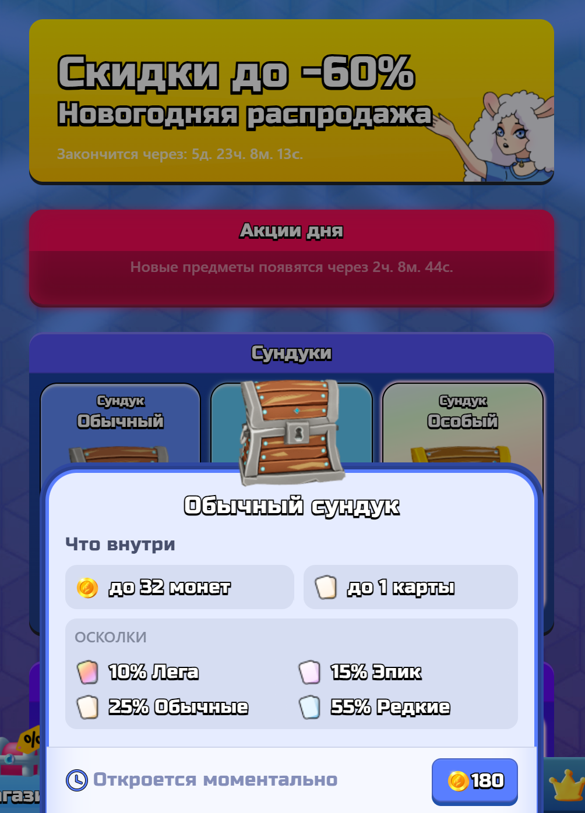

# Отчет по лабораторной работе №3

## Описание

#### Цель работы:

Реализация серверной части на django rest.

#### Текст задания:

Настроить rest api

## Реализация

#### Полезные ссылки:

[Результат](https://vk.com/services?w=app51491054)

#### Результат:





#### Описание проекта

В качестве проекта выбрал одну из задач, которую я выполнил во время работы в [kotbread](https://vk.com/kotbread)
Необходимо, было сделать магазин приложения [sheepRoyale](https://vk.com/services?w=app51491054). Настроить ендпоинты,
защитить их от манипуляций с телом и параметрами запроса. Реализовать сохранение в бд. Настроить связь с ранее сделанными обучениями

### Endpoint покупки сундука

```
/** Покупка сундука */
export default async function buyChest(
  req: IGetUserIDAuthInfoRequest,
  res: Response
) {
  const user = await findUser(req.userID);
  if (!user) return;

  const type = req.query.type;
  const storeId = req.query.shopId;

  if (!isIChestType(type))
    return res.status(400).json({ error: "Некорректный индекс сундука" });

  const shop = await findShop();
  if (!isStoreProducts(storeId))
    return res.status(400).json({ error: "Указан неверный StoreId" });

  if (!shop)
    return res.status(400).json({ error: "Сервер магазина не работает" });

  if (user.shop.boughtProducts.includes(storeId))
    return res.status(400).json({ error: "Сундук уже куплен" });

  if (storeId.includes("discont") && type === user.shop.chest.chestType) {
    if (user.balance < shop.chests[type].coins * 0.8)
      return res.status(400).json({ error: "недостаточно денег для покупки" });
    user.balance -= shop.chests[type].coins * 0.8;
  } else if (!storeId.includes("discont")) {
    if (user.balance < shop.chests[type].coins)
      return res.status(400).json({ error: "недостаточно денег для покупки" });
    user.balance -= shop.chests[type].coins;
  } else return res.status(400).json({ error: "неизвестная ошибка" });

  user.shop.boughtProducts = [...user.shop.boughtProducts, storeId];

  const chest = {
    type: type,
    adWatchedTimes: 0,
    status: "opening",
    willOpenAt: 0,
  };

  const loot = ChestsData[chest.type].loot;

  // Генерируем сундук с рандомными товарами, которых еще нет у пользователя
  const items = lootGenerate(loot, user);
  await user.save();

  // Проверка валидности фрагмента карты по скидке после покупки сундука.
  if (user.shop.cardFragment) {
    const isNotValid = user.cards.some(
      (item) => item.entity === user.shop.cardFragment.card && !item.parts
    );
    const isDiscontCardBought = user.shop.boughtProducts.includes(
      StoreProducts.discontCard
    );

    if (isNotValid && !isDiscontCardBought) {
      user.shop.cardFragment.card = "";
    }
  }

  await user.save();

  const { collection } = getCollection(user.cards);

  res.status(200).json({
    items,
    balance: user.balance,
    collection,
    shop: {
      cardFragment: user.shop.cardFragment,
      chest: user.shop.chest,
      boughtProducts: user.shop.boughtProducts,
    },
  });
}
```

### Endpoint для покупки монет с повторным подтверждением от api vk

```
/** Покупка монет за голоса */
export async function buyCoins(req: any, res: Response) {
  const item = req.body.item;
  const userID = req.body.user_id;
  let notification;
  console.log("BOUGHT");

  if (process.env.NODE_ENV === "production") notification = NOTIFICATION_TYPES;
  else notification = TEST_NOTIFICATION_TYPES;

  const shop = await findShop();
  const user = await findUser(userID);

  if (!shop) return res.status(400).json({ error: "Магазин не найден" });

  if (!user) {
    return res.status(400).json({ error: "Пользователь не найден" });
  }

  if (user.shop.boughtProducts.includes(item as StoreProducts))
    return res.status(300).json({ error: "Товар уже куплен" });

  // Первичный запрос для получение информации о товаре
  if (req.body.notification_type === notification.get_item) {
    const productInfo = {
      price: 0,
      title: "",
      photo_url: "",
    };

    if (isCoin(item)) {
      productInfo.photo_url = сoinsData[item].src;
      productInfo.title = сoinsData[item].title;
      productInfo.price = shop.coins[item];
    } else if (isDiscontCard(item)) {
      const cardData = CardsData[user.shop.cardFragment.card as CardUnits];
      if (!cardData) return res.status(400);
      if (user.shop.cardFragment.currency !== "voices") {
        return res.status(400).json({ error: "Товар не продается за голоса" });
      }
      if (!user.shop.cardFragment.card)
        return res.status(400).json({ error: "Товар не продается за голоса" });
      const cardRarity = cardData.rarity;
      productInfo.price = shop.cards[cardRarity].voices;
      productInfo.title = cardData.name;
      productInfo.photo_url =
        UNIT_SPRITE_SOURCE + cardData.unitType + "Card.png";
    } else if (isDiscontChest(item)) {
      const chestData = ChestsData[user.shop.chest.chestType as IChestTypes];
      if (!chestData) return res.status(400);
      productInfo.title = chestData.name;
      productInfo.photo_url = chestData.src;
      if (user.shop.chest.currency !== "voices") {
        return res.status(400).json({ error: "Товар не продается за голоса" });
      }
      if (!user.shop.chest.chestType)
        return res.status(400).json({ error: "Товар не продается за голоса" });
      productInfo.price = shop.chests[user.shop.chest.chestType].voices;
    } else return res.status(400).json({ error: "Товара нет в наличии" });

    return res.status(200).json({
      response: {
        item_id: item,
        ...productInfo,
      },
    });
  }

  // Вторичный запрос с информацией о совершении покупки
  if (req.body.notification_type === notification.order_status_change) {
    user.shop.boughtProducts = [...user.shop.boughtProducts, req.body.item];

    if (isCoin(item)) {
      user.balance += сoinsData[item].value;
    } else if (isDiscontCard(item)) {
      const cardName = user.shop.cardFragment.card;
      const userCard = user.cards.find((card) => card.entity === cardName);

      if (userCard && userCard.parts) {
        userCard.parts++;
        if (userCard.parts === 4) userCard.parts = undefined;
      } else if (!userCard && cardName) {
        user.cards.push({ entity: cardName, parts: 1 });
      } else {
        res.status(400).json({ error: "не правильное указанное имя" });
        return;
      }
    }

    await redis.set(String(`${userID}_` + req.body.order_id), req.body.item);
    await user.save();

    return res.status(200).json({
      response: {
        order_id: Number(req.body.order_id),
        app_order_id: Number(req.body.order_id),
      },
    });
  }
}
```

### Подкдючение endpoint(ов)

```
router.use(express.json()); // for parsing application/json
router.use(express.urlencoded({ extended: true })); // for parsing application/x-www-form-urlencoded
router.post("/buyCoins", buyCoins);

router.use(checkSignMiddleware);
router.get("/get", getContent);
router.get("/buyCard", buyCard);
router.get("/buyChest", buyChest);

module.exports = router;
```

### Модель магазина

```
export interface IShop {
  chests: Record<IChestTypes, { voices: number; coins: number }>;
  cards: Record<CardRarity, { voices: number; coins: number }>;
  coins: Record<Coin, number>;
  updateTime: number;
}

const ShopSchema = new Schema<IShop>({
  chests: {
    legendary: {
      coins: { type: Number, required: true, default: 300 },
      voices: { type: Number, required: true, default: 20 },
    },
    magic: {
      coins: { type: Number, required: true, default: 200 },
      voices: { type: Number, required: true, default: 10 },
    },
    common: {
      coins: { type: Number, required: true, default: 100 },
      voices: { type: Number, required: true, default: 5 },
    },
  },
  cards: {
    legendary: {
      coins: { type: Number, required: true, default: 300 },
      voices: { type: Number, required: true, default: 20 },
    },
    rare: {
      coins: { type: Number, required: true, default: 300 },
      voices: { type: Number, required: true, default: 20 },
    },
    common: {
      coins: { type: Number, required: true, default: 300 },
      voices: { type: Number, required: true, default: 20 },
    },
    epic: {
      coins: { type: Number, required: true, default: 300 },
      voices: { type: Number, required: true, default: 20 },
    },
  },
  coins: {
    coins: {
      type: Number,
      required: true,
      default: 10,
    },
    heapCoins: {
      type: Number,
      required: true,
      default: 10,
    },
    bigHeapCoins: {
      type: Number,
      required: true,
      default: 10,
    },
  },
  updateTime: {
    type: Number,
    required: true,
    default: 0,
  },
});

export const Shop = mongoose.model("shops", ShopSchema);
```

```
// Обновление магазина
export const initShopTimerUpdating = () => {
  cron.schedule(`0 0 0 * * *`, async () => {
    console.log("UPDATE_SHOP");
    const shop = await findShop();
    if (!shop) return;
    shop.updateTime = Date.now();
    await shop.save();
  });
};
```

### Запрос с фронтенда

```
export const fetchShop = createAsyncThunk(
  "User/setShop",
  async function (_, { dispatch }) {
    const shopInfo = await request<IShop>({
      method: "shop/get",
      params: { getShop: true },
    });

    dispatch(
      setShop({
        ...shopInfo,
        nextShopUpdate: shopInfo.nextShopUpdate,
      })
    );
  }
);
```

### Покупка сундука

```
  const buyChest = React.useCallback(async () => {
    const controller = new AbortController();
    fetchControllers.current.push(controller);
    const res = await request<ServerAnswer>({
      auth: true,
      method: "shop/buyChest",
      params: { type, shopId },
      controller,
    });

    if ("error" in res) {
      dispatch(setSnackbar({ type: "error", text: "Недостаточно монет" }));
      return onClose();
    }
    const {
      shop: { boughtProducts, ...discontProducts },
      ...chest
    } = res;

    dispatch(setBoughtProducts(boughtProducts));
    dispatch(setDiscontProducts(discontProducts));
    replace("/shop?chestOpening=-1", { type, serverAnswer: chest });
  }, [type, shopId]);
```

## Вывод

В ходе работы над задачей, была налажена связь сервера с фронтом через rest api, были настроены endpoint, в которых  
совершались обращения в базе данных. Также были предвращены возможные атаки, через манипуляции с адресом endpoint(а)
