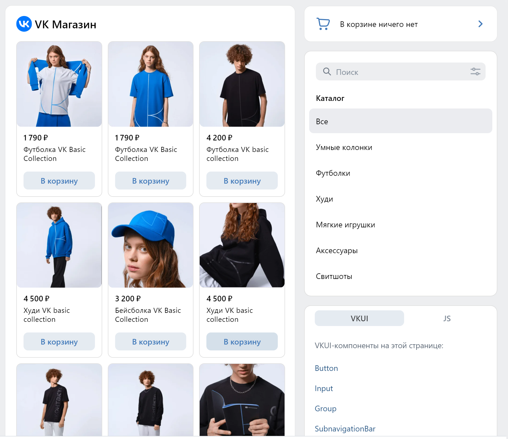
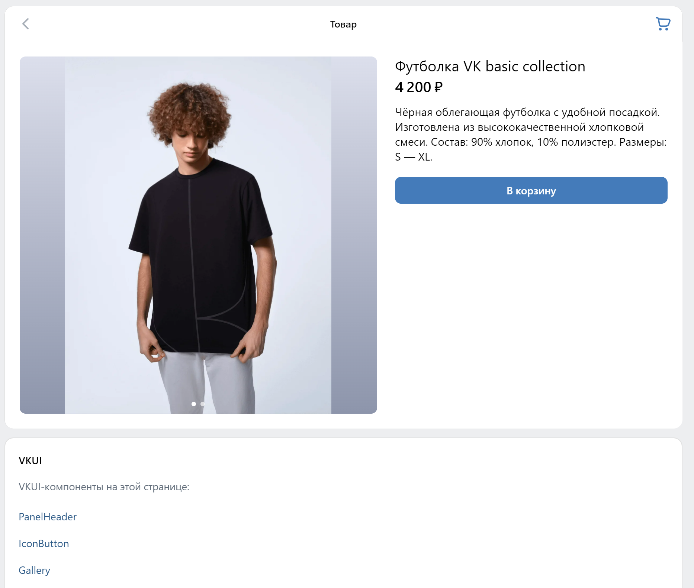
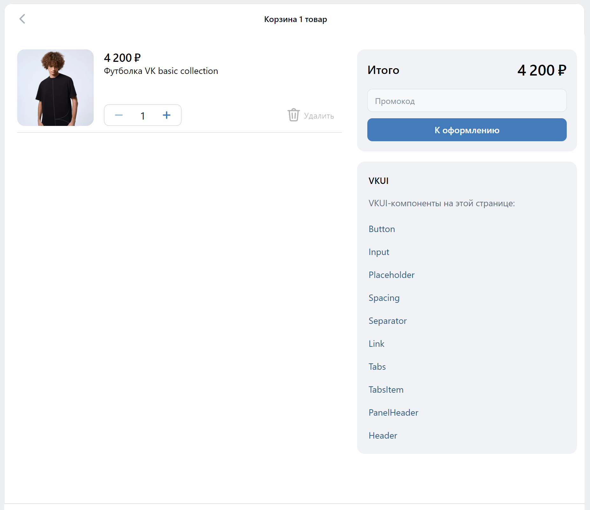
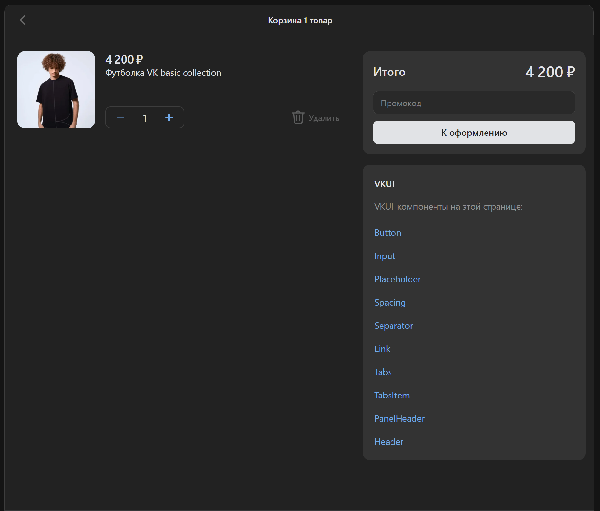

# Отчет по лабораторной работе №4

## Описание

#### Цель работы:

Реализация клиентской части средствами Vue.js.

#### Текст задания:

Реализовать SPA - single page application

## Реализация

#### Полезные ссылки:

[Результат](https://vk.com/app51654068)  
[Github](https://skillbox.ru/media/)  
[Дока на dev портале](https://dev.vk.com/ru/mini-apps/examples/shop)  
[Самописный роутер](https://github.com/VKCOM/vk-mini-apps-router/)

#### Результат:






#### Описание проекта

В рамках стажировки мне доверели проект мини приложения магазина, главными целями которого были:

- Показать пример хорошего кода новичкам в веб разработке
- Продемонстрировать возможности нашего(вкшного) sdk
- Тестировать на нем [роутер](https://github.com/VKCOM/vk-mini-apps-router/) для реакта, который мы параллельно разрабатывали с моим ментором
- Показать возможность нашей ui библиотеки [VKUI](https://vkcom.github.io/VKUI/)

Проект реализован на реакте, в качестве стейт менеджера использовался redux toolkit  
Так выглядит реализация слайса в магазине:

```
export interface UserState {
  id?: number,
  name: string
  onboadrdingComplete: boolean
}

const initialState: UserState = {
  id: undefined,
  name: '',
  onboadrdingComplete: true,
}

const userSlice = createSlice({
  name: 'user',
  initialState,
  reducers: {
    setUserData(state, action: PayloadAction<{id: number, name: string}>) {
      state.name = action.payload.name
      state.id = action.payload.id
    },

    setOnboardingComplete(state, action: PayloadAction<boolean>) {
      state.onboadrdingComplete = action.payload
    },
  },
})
```

Пример написан целиком на typescript для чистоты кода и увеличения производиьельности
В качестве основы для ui взята библиотека vkui, вот такая структура на проекте:

```
    <ConfigProvider
      appearance={appereance ?? Appearance.LIGHT}
      isWebView={bridge.isWebView()}
      hasCustomPanelHeaderAfter={false}
    >
      <AdaptivityProvider {...adaptivity}>
        <AppRoot safeAreaInsets={insets ?? {}}>
          <Provider store={store}>
            <RouterProvider router={router}>
              <App />
            </RouterProvider>
          </Provider>
        </AppRoot>
      </AdaptivityProvider>
    </ConfigProvider>
```

Для запросов сделал сделал бек с рест апи и на фронте обертку над fetch

```
import { ApiEndpoint } from 'src/types'

const API_URL = 'https://shop-boilerplate-backend.vercel.app'

interface Arguments {
  endpoint: ApiEndpoint
  params?: Record<string, string>
  requestOptions?: RequestInit
}

/**
 * Обертка над http запросом, чтобы обеспечить независимость от используемых библиотек
 * @param endpoint - api endpoint
 * @param params - query параметры запроса в виде объекта
 * @param requestOptions - настройки запроса: method, headers, cashe
 * @returns ответ сервера
 * @example
  // get запрос
  makeRequest(endpoint: 'productInfo', params: {id: '2'})
  // post запрос
  makeRequest('postProduct', requestOptions: JSON.stringify({method: 'post', body: {id: 2}}))
 */
export const makeRequest = async <T = never>({
  params,
  endpoint,
  requestOptions,
}: Arguments): Promise<T> => {
  const url = new URL(API_URL + '/' + endpoint)
  url.search = new URLSearchParams(params).toString()

  return (await fetch(url, requestOptions)).json() as T
}
```

## Вывод

В ходе работы добился идеальных метрих lighthouse, без ssr и c большим количеством медиаконтента. Поработал с тематизацией. Написал чистый код с четкой и понятной структурой.
