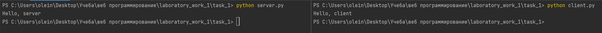

# Задание 1

Реализовать клиентскую и серверную часть приложения. Клиент отсылает серверу
сообщение «Hello, server». Сообщение должно отразиться на стороне сервера.
Сервер в ответ отсылает клиенту сообщение «Hello, client». Сообщение должно
отобразиться у клиента.

Обязательно использовать библиотеку socket

Реализовать с помощью протокола UDP

## Ход выполнения работы

### Код server.py

    import socket
    
    sock = socket.socket(socket.AF_INET, socket.SOCK_DGRAM)
    sock.bind(('localhost', 9090))
    data, address = sock.recvfrom(1024)
    
    print(data.decode("utf-8"))
    sock.sendto(b"Hello, client", address)
    
    sock.close()

### Код client.py

    import socket
    
    sock = socket.socket(socket.AF_INET, socket.SOCK_DGRAM)
    sock.connect(('localhost', 9090))
    sock.send(b"Hello, server")
    
    data = sock.recv(1024)
    print(data.decode("utf-8"))
    
    sock.close()

## Результат

