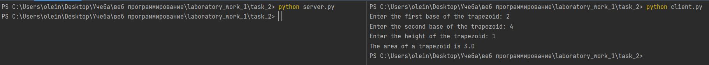

# Задание 2

Реализовать клиентскую и серверную часть приложения. Клиент запрашивает у
сервера выполнение математической операции, параметры, которые вводятся с
клавиатуры. Сервер обрабатывает полученные данные и возвращает результат
клиенту. Вариант: Поиск площади трапеции

Обязательно использовать библиотеку socket

Реализовать с помощью протокола TCP

## Ход выполнения работы

### Код server.py

    import socket
    import json
    
    
    def calculate_trapezoid_area(a, b, h):
        return ((a + b) * h) / 2
    
    
    sock = socket.socket(socket.AF_INET, socket.SOCK_STREAM)
    sock.bind(('localhost', 9090))
    sock.listen()
    connection, address = sock.accept()
    
    while True:
        data = connection.recv(1024)
        if not data:
            break
        params = json.loads(data.decode("utf-8"))
        res = calculate_trapezoid_area(**params)
        connection.send(str(res).encode("utf-8"))
    
    connection.close()

### Код client.py

    import socket
    import json
    
    a = int(input("Enter the first base of the trapezoid: "))
    b = int(input("Enter the second base of the trapezoid: "))
    h = int(input("Enter the height of the trapezoid: "))
    
    sock = socket.socket(socket.AF_INET, socket.SOCK_STREAM)
    sock.connect(('localhost', 9090))
    sock.send(json.dumps({"a": a, "b": b, "h": h}).encode("utf-8"))
    
    data = sock.recv(1024)
    print("The area of a trapezoid is " + data.decode("utf-8"))
    
    sock.close()

## Результат

