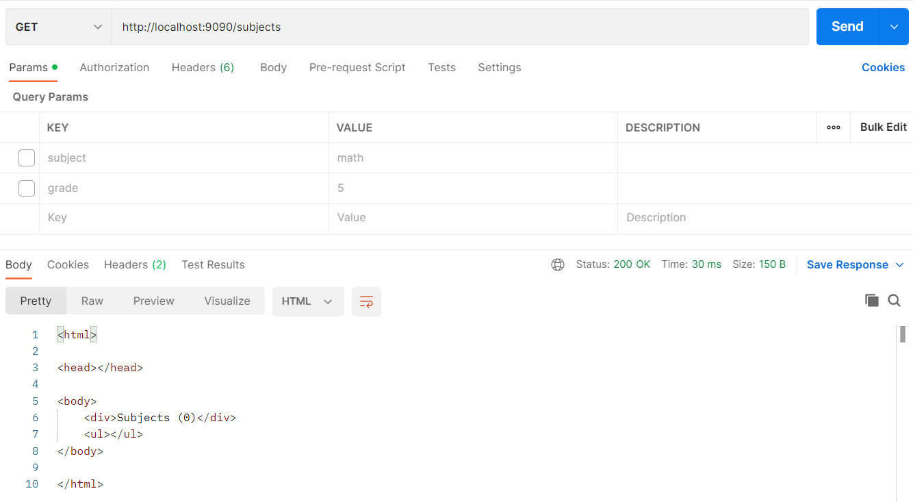

# Задание 5

Необходимо написать простой web-сервер для обработки GET и POST http
запросов средствами Python и библиотеки socket.

Задание: сделать сервер, который может:

- Принять и записать информацию о дисциплине и оценке по дисциплине.
- Отдать информацию обо всех оценах по дсициплине в виде html-страницы.

## Ход выполнения работы

### Код server.py

    import socket
    from email.parser import Parser
    from functools import lru_cache
    from urllib.parse import parse_qs, urlparse
    
    MAX_LINE = 64 * 1024
    MAX_HEADERS = 100
    
    
    class MyHTTPServer:
        def __init__(self, host, port):
            self._host = host
            self._port = port
            self._subjects = {}
    
        def serve_forever(self):
            serv_sock = socket.socket(socket.AF_INET, socket.SOCK_STREAM)
            try:
                serv_sock.bind((self._host, self._port))
                serv_sock.listen()
    
                while True:
                    conn, _ = serv_sock.accept()
                    self.serve_client(conn)
            finally:
                serv_sock.close()
    
        def serve_client(self, conn):
            try:
                req = self.parse_request(conn)
                resp = self.handle_request(req)
                self.send_response(conn, resp)
            except ConnectionResetError:
                conn = None
            except Exception as e:
                body = str(e).encode('utf-8')
                resp = Response(500, 'Internal Server Error', [('Content-Length', len(body))], body)
                self.send_response(conn, resp)
    
            if conn:
                req.rfile.close()
                conn.close()
    
        def parse_request(self, conn):
            rfile = conn.makefile('rb')
    
            raw = rfile.readline(MAX_LINE + 1)
            if len(raw) > MAX_LINE:
                raise HTTPError(400, 'Bad request', 'Request line is too long')
    
            req_line = str(raw, 'iso-8859-1')
            words = req_line.split()
            if len(words) != 3:
                raise HTTPError(400, 'Bad request', 'Malformed request line')
    
            method, target, ver = words
            if ver != 'HTTP/1.1':
                raise HTTPError(505, 'HTTP Version Not Supported')
    
            headers = self.parse_headers(rfile)
            host = headers.get('Host')
            if not host:
                raise HTTPError(400, 'Bad request', 'Host header is missing')
            return Request(method, target, ver, headers, rfile)
    
        @staticmethod
        def parse_headers(rfile):
            headers = []
            while True:
                line = rfile.readline(MAX_LINE + 1)
                if len(line) > MAX_LINE:
                    raise HTTPError(494, 'Request header too large')
    
                if line in (b'\r\n', b'\n', b''):
                    break
    
                headers.append(line)
                if len(headers) > MAX_HEADERS:
                    raise HTTPError(494, 'Too many headers')
    
            sheaders = b''.join(headers).decode('iso-8859-1')
            return Parser().parsestr(sheaders)
    
        def handle_request(self, req):
            if req.path == '/subjects' and req.method == 'POST':
                return self.handle_post_subjects(req)
    
            if req.path == '/subjects' and req.method == 'GET':
                return self.handle_get_subjects()
    
            raise HTTPError(404, 'Not found')
    
        @staticmethod
        def send_response(conn, resp):
            wfile = conn.makefile('wb')
            status_line = f'HTTP/1.1 {resp.status} {resp.reason}\r\n'
            wfile.write(status_line.encode('iso-8859-1'))
    
            if resp.headers:
                for (key, value) in resp.headers:
                    header_line = f'{key}: {value}\r\n'
                    wfile.write(header_line.encode('iso-8859-1'))
    
            wfile.write(b'\r\n')
    
            if resp.body:
                wfile.write(resp.body)
    
            wfile.flush()
            wfile.close()
    
        def handle_post_subjects(self, req):
            subject_id = len(self._subjects) + 1
            self._subjects[subject_id] = {'id': subject_id,
                                          'subject': req.query['subject'][0],
                                          'grade': req.query['grade'][0]}
            return Response(204, 'Created')
    
        def handle_get_subjects(self):
            content_type = 'text/html; charset=utf-8'
            body = '<html><head></head><body>'
            body += f'
Subjects ({len(self._subjects)})
'
            body += '<ul>'
            for u in self._subjects.values():
                body += f'<li>#{u["id"]} {u["subject"]}, {u["grade"]}</li>'
            body += '</ul>'
            body += '</body></html>'
    
            body = body.encode('utf-8')
            headers = [('Content-Type', content_type), ('Content-Length', len(body))]
            return Response(200, 'OK', headers, body)
    
    
    class Request:
        def __init__(self, method, target, version, headers, rfile):
            self.method = method
            self.target = target
            self.version = version
            self.headers = headers
            self.rfile = rfile
    
        @property
        def path(self):
            return self.url.path
    
        @property
        @lru_cache(maxsize=None)
        def query(self):
            return parse_qs(self.url.query)
    
        @property
        @lru_cache(maxsize=None)
        def url(self):
            return urlparse(self.target)
    
        def body(self):
            size = self.headers.get('Content-Length')
            if not size:
                return None
            return self.rfile.read(size)
    
    
    class Response:
        def __init__(self, status, reason, headers=None, body=None):
            self.status = status
            self.reason = reason
            self.headers = headers
            self.body = body
    
    
    class HTTPError(Exception):
        def __init__(self, status, reason, body=None):
            super()
            self.status = status
            self.reason = reason
            self.body = body
    
    
    if __name__ == '__main__':
        serv = MyHTTPServer('localhost', 9090)
        serv.serve_forever()

## Результат

.png)
.png)