# Темплейты/Стилизация

Для добавления css стилей использовался bootstrap 4.

Шапка сайта:

- если пользователь авторизирован: есть ссылки на все рейсы, мои рейсы, имя, кнопка выхода
- если нет: есть ссылки на все рейсы, кнопки войти, зарегистрироваться

## Авторизация и регистрация

Форма с необходимыми полями и кнопкой и ссылкой на противоположную форму

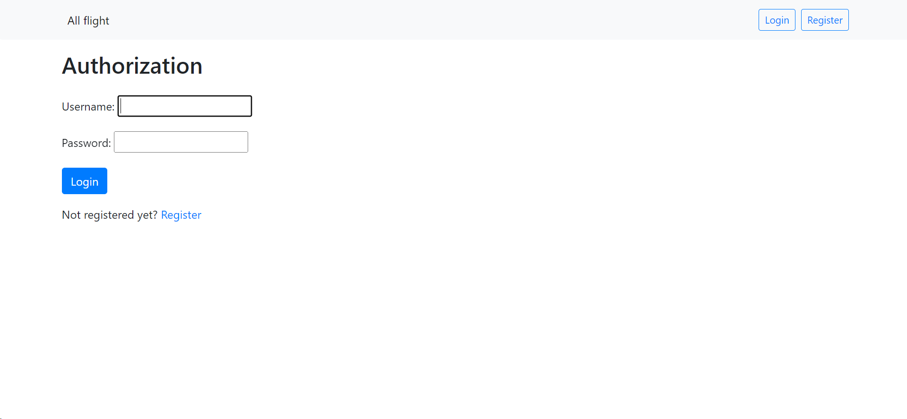
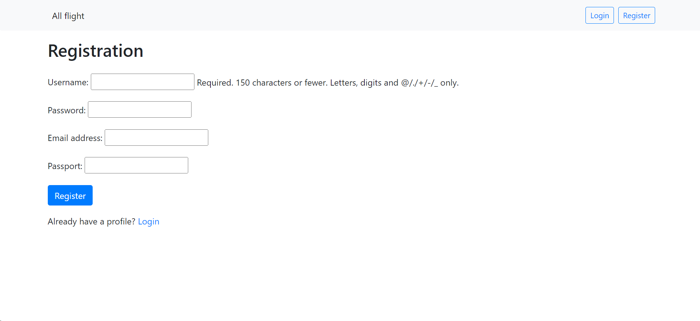

## Табло рейсов

Таблица с информацией о рейсах и ссылкой на страницу рейса

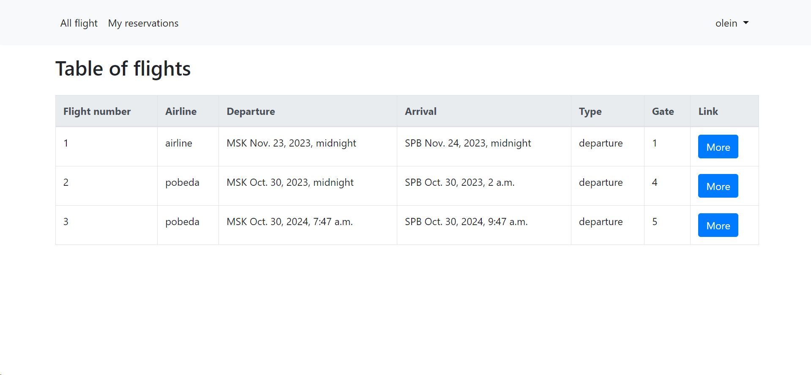

## Табло резервирований

Таблица с информацией о резервированиях и ссылкой на страницу рейса

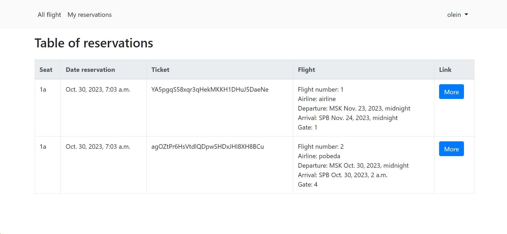

## Страница рейса

Здесь пользователь не зарегестрирован на рейс - у него есть информация о рейсе, комментарии и кнопка для регистрации
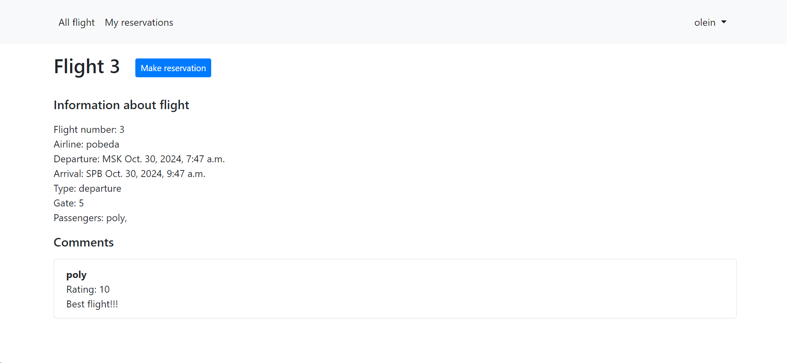
Здесь пользователь зарегестрирован на рейс - у него в дополнение есть форма для комментариев, информация о
резервировании и кнопки для изменения\удаления резервирования
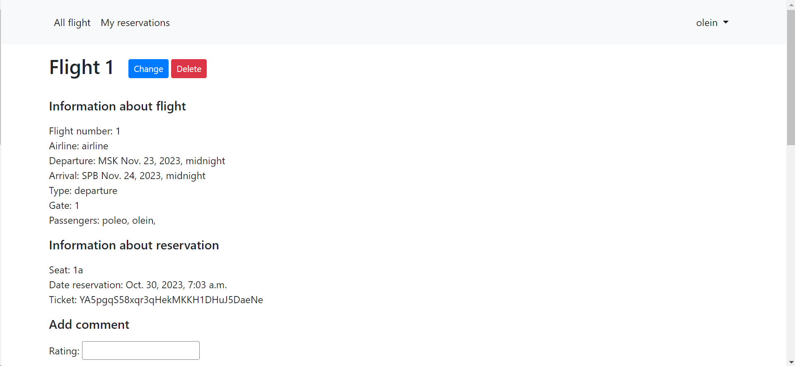
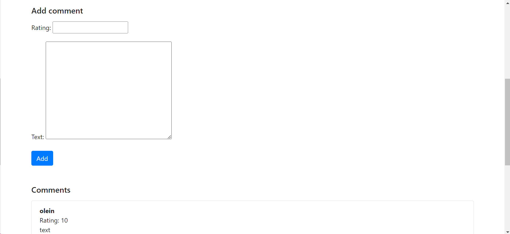
Этот рейс уже не доступен для изменения: кнопок нет.
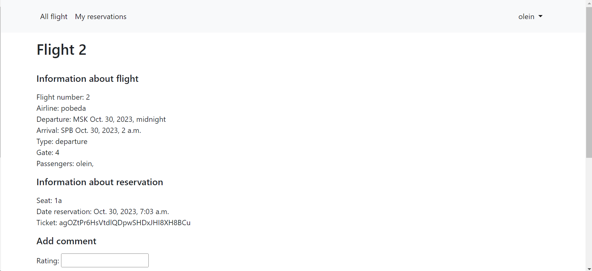

## Страницы для регистрации на рейс, изменении, удалении

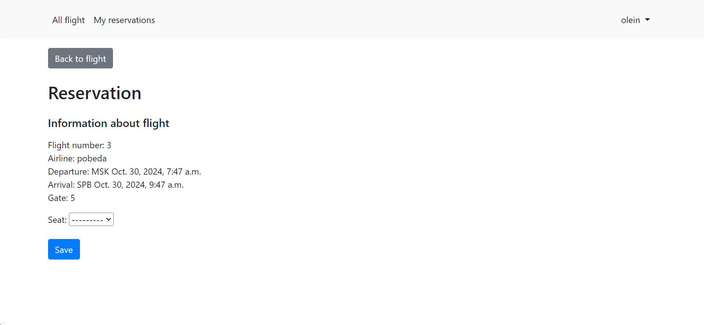
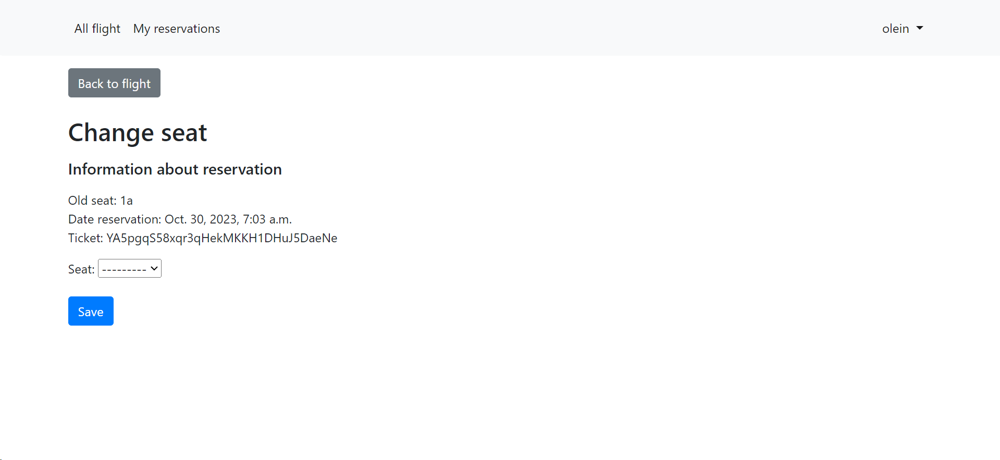
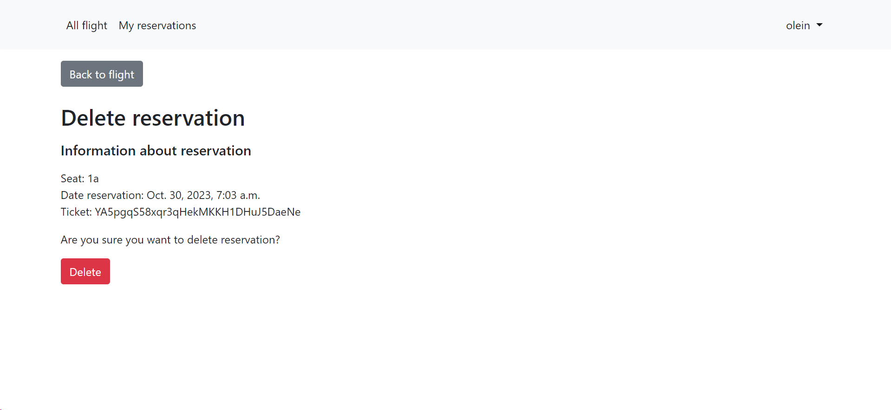
