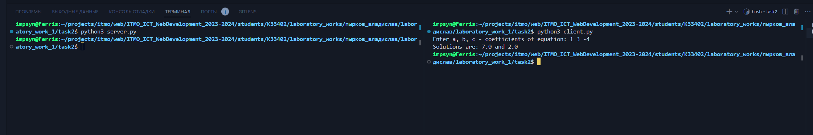

# Задание 2

Реализовать клиентскую и серверную часть приложения. Клиент запрашивает у сервера выполнение математической операции,
параметры, которые вводятся с клавиатуры. Сервер обрабатывает полученные данные и возвращает результат клиенту. Вариант:
Решение квадратного уравнения.

Обязательно использовать библиотеку socket

Реализовать с помощью протокола TCP

## Ход выполнения работы

### Код client.py

    import socket

    client = socket.socket(socket.AF_INET, socket.SOCK_STREAM)
    client.connect((socket.gethostname(), 3001))
    data = input("Enter a, b, c - coefficients of equation: ")
    client.send(bytes(data, "utf-8"))

    full_msg = ""

    while True:
        msg = client.recv(1024)

        if len(msg) <= 0:
            break

        full_msg += msg.decode("utf-8")

    print(full_msg)

### Код server.py

    import socket

    server = socket.socket(socket.AF_INET, socket.SOCK_STREAM)
    server.bind((socket.gethostname(), 3001))
    server.listen(5)

    clientsocket, address = server.accept()
    msg = clientsocket.recv(1024)

    data = msg.decode("utf-8")
    arr = data.split(" ")

    if len(arr) == 3:
        a, b, c = float(arr[0]), float(arr[1]), float(arr[2])
        answ1 = (b**2 + (b ** 2 - 4 * a * c) ** 0.5) / ( 2 * a)
        answ2 = (b**2 - (b ** 2 - 4 * a * c) ** 0.5) / ( 2 * a)
        clientsocket.send(bytes(f"Solutions are: {answ1} and {answ2}", "utf-8"))
    else:
        clientsocket.send(bytes("Incorrect", "utf-8"))

    clientsocket.close()

## Результат

