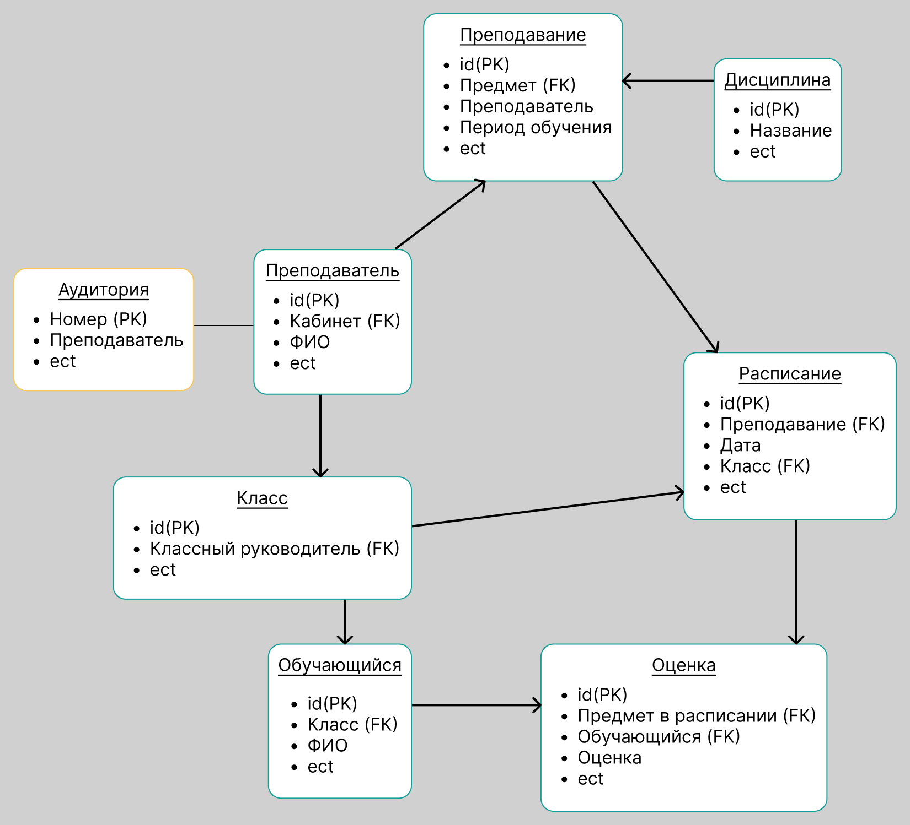

# Документация к лабораторной работе №3

Цель: овладеть практическими навыками и умениями реализации web-сервисов средствами Django.

## Задание
Реализовать сайт, используя фреймворк Django 3, Django REST Framework, Djoser и
СУБД PostgreSQL *, в соответствии с вариантом задания лабораторной работы. Мною был выбран вариант образовательного учреждения.


## Сериалайзер

```python
    from rest_framework import serializers

    from .models import *

    class CabinetSerializer(serializers.ModelSerializer):
        class Meta:
            model = Cabinets
            fields = '__all__'

    class TeacherSerializer(serializers.ModelSerializer):
        #cabinet = CabinetSerializer(many=False)
        class Meta:
            model = Teachers
            fields = '__all__'

    class ClassSerializer(serializers.ModelSerializer):
        class Meta:
            model = Classes
            fields = '__all__'

    class StudentSerializer(serializers.ModelSerializer):
        class Meta:
            model = Students
            fields = '__all__'

    class TeachingSerializer(serializers.ModelSerializer):
        class Meta:
            model = Teachings
            fields = '__all__'

    class SubjectSerializer(serializers.ModelSerializer):
        class Meta:
            model = Subjects
            fields = '__all__'

    class GradeSerializer(serializers.ModelSerializer):
        class Meta:
            model = Grades
            fields = '__all__'

    class ScheduleSerializer(serializers.ModelSerializer):
        class Meta:
            model = Schedules
            fields = '__all__'
```

## API view

```python
    from django.shortcuts import render

    # Create your views here.
    from rest_framework import generics, status, permissions
    from rest_framework.response import Response
    from rest_framework.views import APIView

    from .models import *
    from .serializers import *


    class TeacherListView(generics.ListAPIView):
        queryset = Teachers.objects.all()
        serializer_class = TeacherSerializer
        permission_classes = [permissions.IsAuthenticated, ]

    class TeacherRetrieveView(generics.RetrieveAPIView):
        queryset = Teachers.objects.all()
        serializer_class = TeacherSerializer
        permission_classes = [permissions.IsAuthenticated, ]

    class TeacherCreateView(generics.CreateAPIView):
        queryset = Teachers.objects.all()
        serializer_class = TeacherSerializer
        permission_classes = [permissions.IsAuthenticated, ]

    class TeacherUpdateView(generics.UpdateAPIView):
        queryset = Teachers.objects.all()
        serializer_class = TeacherSerializer
        permission_classes = [permissions.IsAuthenticated, ]

    class TeacherDeleteView(generics.DestroyAPIView):
        queryset = Teachers.objects.all()
        serializer_class = TeacherSerializer
        permission_classes = [permissions.IsAuthenticated, ]


    class CabinetListView(generics.ListAPIView):
        queryset = Cabinets.objects.all()
        serializer_class = CabinetSerializer
        permission_classes = [permissions.IsAuthenticated, ]

    class CabinetRetrieveView(generics.RetrieveAPIView):
        queryset = Cabinets.objects.all()
        serializer_class = CabinetSerializer
        permission_classes = [permissions.IsAuthenticated, ]

    class CabinetCreateView(generics.CreateAPIView):
        queryset = Cabinets.objects.all()
        serializer_class = CabinetSerializer
        permission_classes = [permissions.IsAuthenticated, ]

    class CabinetUpdateView(generics.UpdateAPIView):
        queryset = Cabinets.objects.all()
        serializer_class = CabinetSerializer
        permission_classes = [permissions.IsAuthenticated, ]

    class CabinetDeleteView(generics.DestroyAPIView):
        queryset = Cabinets.objects.all()
        serializer_class = CabinetSerializer
        permission_classes = [permissions.IsAuthenticated, ]


    class ClassListView(generics.ListAPIView):
        queryset = Classes.objects.all()
        serializer_class = ClassSerializer
        permission_classes = [permissions.IsAuthenticated, ]

    class ClassRetrieveView(generics.RetrieveAPIView):
        queryset = Classes.objects.all()
        serializer_class = ClassSerializer
        permission_classes = [permissions.IsAuthenticated, ]

    class ClassCreateView(generics.CreateAPIView):
        queryset = Classes.objects.all()
        serializer_class = ClassSerializer
        permission_classes = [permissions.IsAuthenticated, ]

    class ClassUpdateView(generics.UpdateAPIView):
        queryset = Classes.objects.all()
        serializer_class = ClassSerializer
        permission_classes = [permissions.IsAuthenticated, ]

    class ClassDeleteView(generics.DestroyAPIView):
        queryset = Classes.objects.all()
        serializer_class = ClassSerializer
        permission_classes = [permissions.IsAuthenticated, ]


    class StudentListView(generics.ListAPIView):
        queryset = Students.objects.all()
        serializer_class = StudentSerializer
        permission_classes = [permissions.IsAuthenticated, ]

    class StudentRetrieveView(generics.RetrieveAPIView):
        queryset = Students.objects.all()
        serializer_class = StudentSerializer
        permission_classes = [permissions.IsAuthenticated, ]

    class StudentCreateView(generics.CreateAPIView):
        queryset = Students.objects.all()
        serializer_class = StudentSerializer
        permission_classes = [permissions.IsAuthenticated, ]

    class StudentUpdateView(generics.UpdateAPIView):
        queryset = Students.objects.all()
        serializer_class = StudentSerializer
        permission_classes = [permissions.IsAuthenticated, ]

    class StudentDeleteView(generics.DestroyAPIView):
        queryset = Students.objects.all()
        serializer_class = StudentSerializer
        permission_classes = [permissions.IsAuthenticated, ]


    class ScheduleListView(generics.ListAPIView):
        queryset = Schedules.objects.all()
        serializer_class = ScheduleSerializer
        permission_classes = [permissions.IsAuthenticated, ]

    class ScheduleRetrieveView(generics.RetrieveAPIView):
        queryset = Schedules.objects.all()
        serializer_class = ScheduleSerializer
        permission_classes = [permissions.IsAuthenticated, ]

    class ScheduleCreateView(generics.CreateAPIView):
        queryset = Schedules.objects.all()
        serializer_class = ScheduleSerializer
        permission_classes = [permissions.IsAuthenticated, ]

    class ScheduleUpdateView(generics.UpdateAPIView):
        queryset = Schedules.objects.all()
        serializer_class = ScheduleSerializer
        permission_classes = [permissions.IsAuthenticated, ]

    class ScheduleDeleteView(generics.DestroyAPIView):
        queryset = Schedules.objects.all()
        serializer_class = ScheduleSerializer
        permission_classes = [permissions.IsAuthenticated, ]


    class TeachingListView(generics.ListAPIView):
        queryset = Teachings.objects.all()
        serializer_class = TeachingSerializer
        permission_classes = [permissions.IsAuthenticated, ]

    class TeachingRetrieveView(generics.RetrieveAPIView):
        queryset = Teachings.objects.all()
        serializer_class = TeachingSerializer
        permission_classes = [permissions.IsAuthenticated, ]

    class TeachingCreateView(generics.CreateAPIView):
        queryset = Teachings.objects.all()
        serializer_class = TeachingSerializer
        permission_classes = [permissions.IsAuthenticated, ]

    class TeachingUpdateView(generics.UpdateAPIView):
        queryset = Teachings.objects.all()
        serializer_class = TeachingSerializer
        permission_classes = [permissions.IsAuthenticated, ]

    class TeachingDeleteView(generics.DestroyAPIView):
        queryset = Teachings.objects.all()
        serializer_class = TeachingSerializer
        permission_classes = [permissions.IsAuthenticated, ]


    class SubjectListView(generics.ListAPIView):
        queryset = Subjects.objects.all()
        serializer_class = SubjectSerializer
        permission_classes = [permissions.IsAuthenticated, ]

    class SubjectRetrieveView(generics.RetrieveAPIView):
        queryset = Subjects.objects.all()
        serializer_class = SubjectSerializer
        permission_classes = [permissions.IsAuthenticated, ]

    class SubjectCreateView(generics.CreateAPIView):
        queryset = Subjects.objects.all()
        serializer_class = SubjectSerializer
        permission_classes = [permissions.IsAuthenticated, ]

    class SubjectUpdateView(generics.UpdateAPIView):
        queryset = Subjects.objects.all()
        serializer_class = SubjectSerializer
        permission_classes = [permissions.IsAuthenticated, ]

    class SubjectDeleteView(generics.DestroyAPIView):
        queryset = Subjects.objects.all()
        serializer_class = SubjectSerializer
        permission_classes = [permissions.IsAuthenticated, ]


    class GradeListView(generics.ListAPIView):
        queryset = Grades.objects.all()
        serializer_class = SubjectSerializer
        permission_classes = [permissions.IsAuthenticated, ]

    class GradeRetrieveView(generics.RetrieveAPIView):
        queryset = Grades.objects.all()
        serializer_class = GradeSerializer
        permission_classes = [permissions.IsAuthenticated, ]

    class GradeCreateView(generics.CreateAPIView):
        queryset = Grades.objects.all()
        serializer_class = GradeSerializer
        permission_classes = [permissions.IsAuthenticated, ]

    class GradeUpdateView(generics.UpdateAPIView):
        queryset = Grades.objects.all()
        serializer_class = GradeSerializer
        permission_classes = [permissions.IsAuthenticated, ]

    class GradeDeleteView(generics.DestroyAPIView):
        queryset = Grades.objects.all()
        serializer_class = GradeSerializer
        permission_classes = [permissions.IsAuthenticated, ]


    class LogOut(APIView):
        def get(self, request, format=None):
            request.user.auth_token.delete()
            return Response(status=status.HTTP_200_OK)```
```

## URLS 

```python
    from django.urls import path, include
    from rest_framework.authtoken.views import obtain_auth_token
    from .views import *

    urlpatterns = [

        path('teachers/all/', TeacherListView.as_view(), name='teacher_list'),
        path('teachers/<int:pk>/', TeacherRetrieveView.as_view(), name='teacher_detail'),
        path('teachers/create/', TeacherCreateView.as_view(), name='teacher_create'),
        path('teachers/update/<int:pk>/', TeacherUpdateView.as_view(), name='teacher_update'),
        path('teachers/delete/<int:pk>/', TeacherDeleteView.as_view(), name='teacher_delete'),

        path('cabinets/all/', CabinetListView.as_view(), name='cabinet_list'),
        path('cabinets/<int:pk>/', CabinetRetrieveView.as_view(), name='cabinet_detail'),
        path('cabinets/create/', CabinetCreateView.as_view(), name='cabinet_create'),
        path('cabinets/update/<int:pk>/', CabinetUpdateView.as_view(), name='cabinet_update'),
        path('cabinets/delete/<int:pk>/', CabinetDeleteView.as_view(), name='cabinet_delete'),

        path('classes/all/', ClassListView.as_view(), name='class_list'),
        path('classes/<int:pk>/', ClassRetrieveView.as_view(), name='class_detail'),
        path('classes/create/', ClassCreateView.as_view(), name='class_create'),
        path('classes/update/<int:pk>/', ClassUpdateView.as_view(), name='class_update'),
        path('classes/delete/<int:pk>/', ClassDeleteView.as_view(), name='class_delete'),

        path('students/all/', StudentListView.as_view(), name='student_list'),
        path('students/<int:pk>/', StudentRetrieveView.as_view(), name='student_detail'),
        path('students/create/', StudentCreateView.as_view(), name='student_create'),
        path('students/update/<int:pk>/', StudentUpdateView.as_view(), name='student_update'),
        path('students/delete/<int:pk>/', StudentDeleteView.as_view(), name='student_delete'),

        path('schedules/all/', ScheduleListView.as_view(), name='schedule_list'),
        path('schedules/<int:pk>/', ScheduleRetrieveView.as_view(), name='schedule_detail'),
        path('schedules/create/', ScheduleCreateView.as_view(), name='schedule_create'),
        path('schedules/update/<int:pk>/', ScheduleUpdateView.as_view(), name='schedule_update'),
        path('schedules/delete/<int:pk>/', ScheduleDeleteView.as_view(), name='schedule_delete'),

        path('teachings/all/', TeachingListView.as_view(), name='teaching_list'),
        path('teachings/<int:pk>/', TeachingRetrieveView.as_view(), name='teaching_detail'),
        path('teachings/create/', TeachingCreateView.as_view(), name='teaching_create'),
        path('teachings/update/<int:pk>/', TeachingUpdateView.as_view(), name='teaching_update'),
        path('teachings/delete/<int:pk>/', TeachingDeleteView.as_view(), name='teaching_delete'),

        path('subjects/all/', SubjectListView.as_view(), name='subject_list'),
        path('subjects/<int:pk>/', SubjectRetrieveView.as_view(), name='subject_detail'),
        path('subjects/create/', SubjectCreateView.as_view(), name='subject_create'),
        path('subjects/update/<int:pk>/', SubjectUpdateView.as_view(), name='subject_update'),
        path('subjects/delete/<int:pk>/', SubjectDeleteView.as_view(), name='subject_delete'),

        path('grades/all/', GradeListView.as_view(), name='grade_list'),
        path('grades/<int:pk>/', GradeRetrieveView.as_view(), name='grade_detail'),
        path('grades/create/', GradeCreateView.as_view(), name='grade_create'),
        path('grades/update/<int:pk>/', GradeUpdateView.as_view(), name='grade_update'),
        path('grades/delete/<int:pk>/', GradeDeleteView.as_view(), name='grade_delete'),

        path('auth/', include('djoser.urls')),
        path('auth/token', obtain_auth_token, name='token'),
        path('logout', LogOut.as_view()),
    ]
```
