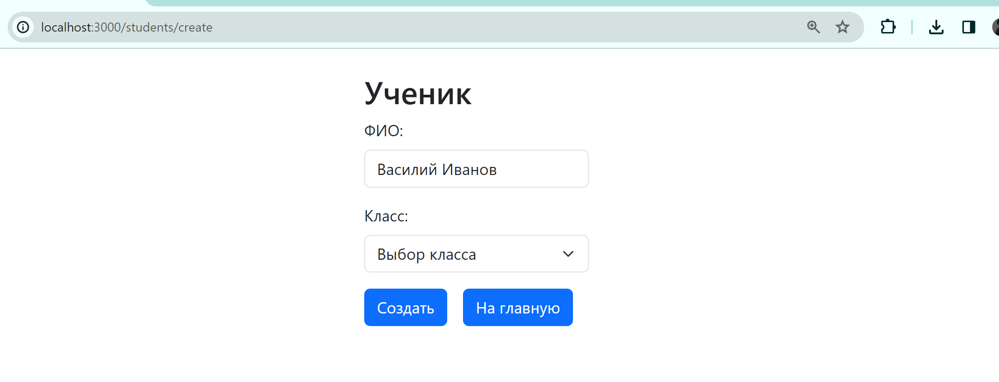

# Документация к лабораторной работе №4

Реализация клиентской части приложения средствами vue.js.

## Выполнение
Для клиентского приложения основной библиотекой был выбран ReactJs.
Также для роутинга использовался ReactRouter, а для применения стилей был выбран Bootstrap.


## Данные

Для менеджмента состояний и данных о пользователе было решено воспользоваться ContextAPI. приложение было обернуто в контекстный компонент, дающий доступ к данным в любой его точке
```js
    import { createContext, useState } from "react";

    const UserContext = createContext({
    token: "",
    setToken: () => {},
    });

    export const UserProvider = ({ children }) => {
    const [token, setToken] = useState("");

    return (
        <UserContext.Provider value={{ token, setToken }}>
        {children}
        </UserContext.Provider>
    );
    };

export default UserContext;
```

При обращении к серверу использовал стандартный инструмент fetch

```js
  const getGrades = useCallback(() => {
    fetch("http://localhost:8000/api/grades/all/", {
      method: "GET",
      headers: {
        Authorization: `Token ${token}`,
      },
    })
      .then((response) => response.json())
      .then((result) => {
        setGrades(result);
      })
      .catch((error) => console.error("Error fetching data:", error));
  }, [token]);
```

## CORS

Для серверной части из предыдущей лабораторной работы была произведена настройка Cross-origin resource sharing


## Итоги

В результате полученное приложение позволяет взаимодействовать с данными об оценках и учениках.


