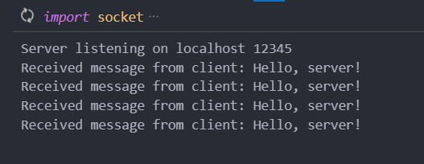
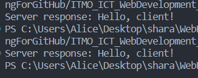

# Задание №1

>Реализовать клиентскую и серверную часть приложения. Клиент отсылает серверу сообщение «Hello, server». Сообщение должно отразиться на стороне сервера. Сервер в ответ отсылает клиенту сообщение «Hello, client». Сообщение должно отобразиться у клиента.

>Обязательно использовать библиотеку socket

>Реализовать с помощью протокола UDP

**client**

```
import socket

server_ip = 'localhost'
server_port = 12345

sock = socket.socket(socket.AF_INET, socket.SOCK_DGRAM)

message = 'Hello, server!'

sock.sendto(message.encode(), (server_ip, server_port))

data, server_address = sock.recvfrom(4096)
response = data.decode()

print('Server response:', response)

sock.close()
```
**server**

```
import socket

server_ip = 'localhost'
server_port = 12345

sock = socket.socket(socket.AF_INET, socket.SOCK_DGRAM)

sock.bind((server_ip, server_port))

print('Server listening on', server_ip, server_port)

while True:
    data, client_address = sock.recvfrom(4096)
    message = data.decode()

    print('Received message from client:', message)
    
    response = 'Hello, client!'
    sock.sendto(response.encode(), client_address)

```
**Результат:**


**Сервер**


**Клиент**
