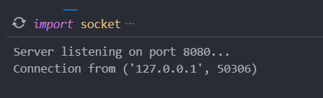
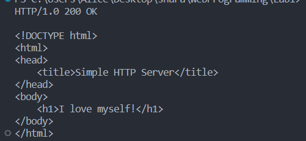

# Задание №3

>Реализовать серверную часть приложения. Клиент подключается к серверу. В ответ клиент получает http-сообщение, содержащее html-страницу, которую сервер подгружает из файла index.html.

>Обязательно использовать библиотеку socket

**client**

```
import socket

def get_html():
    client_socket = socket.socket(socket.AF_INET, socket.SOCK_STREAM)
    client_socket.connect(('localhost', 8080))
    request = 'GET / HTTP/1.0\r\n\r\n'
    client_socket.sendall(request.encode())
    response = client_socket.recv(1024).decode()
    print(response)
    client_socket.close()

get_html()
```
**server**

```
import socket

def send_html(client_socket):
    with open('tsk3_index.html', 'r') as file:
        response = 'HTTP/1.0 200 OK\n\n' + file.read()
        client_socket.sendall(response.encode())

def handle_client(client_socket):
    request = client_socket.recv(1024).decode()
    if request.startswith('GET / HTTP'):
        send_html(client_socket)
    client_socket.close()

def run_server():
    server_socket = socket.socket(socket.AF_INET, socket.SOCK_STREAM)
    server_socket.bind(('localhost', 8080))
    server_socket.listen(1)
    print('Server listening on port 8080...')
    while True:
        client_socket, address = server_socket.accept()
        print('Connection from', address)
        handle_client(client_socket)

run_server()
```


**index.html**

```
<!DOCTYPE html>
<html>
<head>
    <title>Simple HTTP Server</title>
</head>
<body>
    <h1>I love myself!</h1>
</body>
</html>
```
**Результат:**


**Сервер**


**Клиент**
