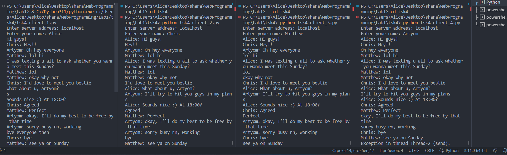

# Задание №4

>Реализовать двухпользовательский или многопользовательский чат. Реализация многопользовательского часа позволяет получить максимальное количество баллов. Реализован с помощью протокола TCP. Для применения с TCP необходимо запускать клиентские подключения И прием и отправку сообщений всем юзерам на сервере в потоках. Не забудьте сохранять юзеров, чтобы потом отправлять им сообщения.

>Обязательно использовать библиотеку socket

>Обязательно использовать библиотеку threading.

**client**

```
import socket
import threading

server_address = input("Enter server address: ")

client_socket = socket.socket(socket.AF_INET, socket.SOCK_STREAM)

client_socket.connect((server_address, 12345))

client_name = input("Enter your name: ")

client_socket.send(client_name.encode())

def receive():
    while True:
        try:
            message = client_socket.recv(1024).decode()
            print(message)
        except:
            break

def send():
    while True:
        message = input()
        client_socket.send(message.encode())

receive_thread = threading.Thread(target=receive)
send_thread = threading.Thread(target=send)

receive_thread.start()
send_thread.start()
```
**server**

```
import socket
import threading

server_socket = socket.socket(socket.AF_INET, socket.SOCK_STREAM)
server_address = ('localhost', 12345)

server_socket.bind(server_address)

server_socket.listen(5)
print("Server is running on {}:{}".format(*server_address))

clients = []

def handle_client(client_socket, client_address):
    client_name = client_socket.recv(1024).decode()
    print("New connection from {}: {} joined".format(client_address[0], client_name))

    clients.append((client_socket, client_name))

    while True:
        try:
            message = client_socket.recv(1024).decode()

            if not message:
                break

            for client in clients:
                if client[0] != client_socket:
                    client[0].send("{}: {}".format(client_name, message).encode())
        except ConnectionResetError:
            break

    clients.remove((client_socket, client_name))
    print("Connection closed from {}: {}".format(client_address[0], client_name))

while True:
    client_socket, client_address = server_socket.accept()

    client_thread = threading.Thread(target=handle_client, args=(client_socket, client_address))
    client_thread.start()
```

**Результат:**


**Сервер**


**Клиент**
