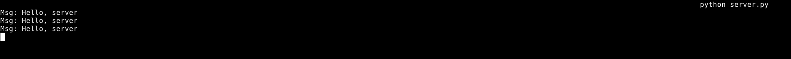
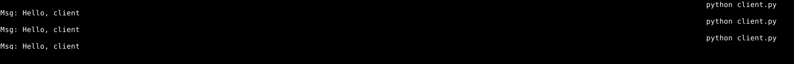

# Задание №1

???+ question Задание

    Реализовать клиентскую и серверную часть приложения. Клиент отсылает серверу
    сообщение «Hello, server». Сообщение должно отразиться на стороне сервера.
    Сервер в ответ отсылает клиенту сообщение «Hello, client». Сообщение должно
    отобразиться у клиента.

    Обязательно использовать библиотеку `socket`. Реализовать с помощью протокола UDP.

=== "Серверная часть"

    ```Python title="server.py"
    --8<-- "laboratory_work_1/task1/server.py"
    ```

    - Создаём объект сокета c указанием семейства адресов `AF_INET` (используем IPv4) и типа сокета `SOCK_DGRAM` (протокол UDP), используя контекстный менеджер для автоматического удаления объекта по выходу из контекста.
    - Привязываем сокет к заданному хосту и порту.

    В бесконечном цикле повторяем следующие действия:

    - Через метод `recvfrom` получаем данные и адрес клиента.
    - Через метод `sendto` отправляем ответ на полученный адрес.

    Блок `try-except` используется для обработки `KeyboardInterrupt`, чтобы иметь возможность прекратить работу сервера по нажанию `Ctrl+C`.

    <figure markdown>
        
        <figcaption> Вывод сервера </figcaption>
    </figure>

=== "Клиентская часть"

    ```Python title="client.py"
    --8<-- "laboratory_work_1/task1/client.py"
    ```

    - Создаём объект сокета c указанием семейства адресов `AF_INET` (используем IPv4) и типа сокета `SOCK_DGRAM` (протокол UDP), используя контекстный менеджер для автоматического удаления объекта по выходу из контекста.
    - Через метод `sendto` отправляем сообщение на указанные адрес и порт.
    - Через метод `recvfrom` получаем ответ сервера (адрес не сохраняется)
    - Выводим декодированное (переведённое из `bytes` в строку) сообщение на стандартный вывод.

    <figure markdown>
        
        <figcaption> Вывод клиента </figcaption>
    </figure>