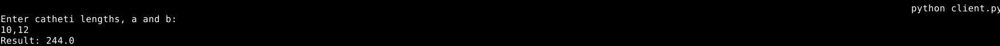

# Задание №2

???+ question "Задание"

    Реализовать клиентскую и серверную часть приложения. Клиент запрашивает у
    сервера выполнение математической операции, параметры, которые вводятся с
    клавиатуры. Сервер обрабатывает полученные данные и возвращает результат
    клиенту.

    Обязательно использовать библиотеку `socket`.
    Реализовать с помощью протокола TCP.

=== "Серверная часть"

    ```Python
    --8<-- "laboratory_work_1/task2/server.py::14"
    ```
    Задаём глобальные переменные: хост/порт сервера, вариант работы, "приветственные" сообщения для каждого варианта.

    ??? warning
        
        Проверка корректности входящих данных в указанных далее функциях на стороне сервера не проводится.

    ```Python
    --8<-- "laboratory_work_1/task2/server.py:16:18"
    ```
    Данная функция вычисляет длину гипотенузы по длинам квадратов катетов.
    ```Python
    --8<-- "laboratory_work_1/task2/server.py:19:27"
    ```
    Данная функция вычисляет корни квадратного уравнения по коэффициентам `a`, `b`, и `c`.

    Возвращаются два значения: соответствующий корень уравнения или `None` в случае отсутствия вещественного корня. В случае повторения корня (дискриминант равен нулю) второе значение также равняется `None`.

    ```Python
    --8<-- "laboratory_work_1/task2/server.py:27:29"
    ```
    Данная функция вычисляет площадь трапеции по двум сторонам трапеции и высоте.

    ```Python
    --8<-- "laboratory_work_1/task2/server.py:30:32"
    ```
    Данная функция вычисляет площадь параллелограмма по двум сторонам и углу (ожидается угол в градусах).

    ```Python title="Основной код"
    --8<-- "laboratory_work_1/task2/server.py:33"
    ```

    В блоке обработки исключения `KeyboardInterrupt` (нужно для обработки сочетания `Ctrl+C`):
    
    - Создаём объект сокета c указанием семейства адресов `AF_INET` (используем IPv4) и типа сокета `SOCK_STREAM` (протокол TCP), используя контекстный менеджер для автоматического удаления объекта по выходу из контекста.
    - Привязываем сокет к указанным хосту и порту.
    - Указываем количество принимаемых соединений (число 20 выбрано случайно).
    - Устанавливаем таймаут подключения на случай возможной задержки обработки.

    В бесконечном цикле и блоке обработки исключения `socket.timeout` (в `except` воспользуемся ключевым словом `pass` для пропуска обработки, чтобы таймаут не вызывал отключение сервера):

    - Проверим значение варианта, значение 4 и более некорректны, выбросим исключение (вариант устанавливается "хардкодом", защита получается скорее от самого себя).
    - Принимаем подключение от клиента методом `accept` и получаем данные и адрес.
    - Посылаем подходящее "приветственное сообщение" (prompt) с просьбой ввести параметры пользователю методом `send` (переведя в `bytes` методом `encode`).
    - Получаем параметры от пользователя методом `recv`.
    - Разделяем полученную строку на числовые параметры (в качестве разделителя используется запятая).
    - Проверяем значение варианта и в зависимости от значения проверяем количество присланных параметров, в случае несовпадения с заданным количеством в соответствующих функциях, отправляем ответ "Неверное количество параметров".
    - В случае получения верного количества параметров вызываем подходящую функцию и посылаем возвращённый ей результат клиенту.

    В штатной ситуации вывод сервера в консоль не предусмотрен.

=== "Клиентская часть"

    ```Python
    --8<-- "laboratory_work_1/task2/client.py"
    ```

    - Создаём объект сокета c указанием семейства адресов `AF_INET` (используем IPv4) и типа сокета `SOCK_STREAM` (протокол TCP), используя контекстный менеджер для автоматического удаления объекта по выходу из контекста.
    - Подключаемся с серверу на указанных хосте и порту методом `connect`.
    - Получаем "приветственное" сообщение от сервера и выводим в стандартный вывод.
    - Сохраняем ввод пользователя (в `stdin`).
    - Через метод `send` отправляем сообщение серверу.
    - Через метод `recv` получаем ответ сервера.
    - Выводим декодированное (переведённое из `bytes` в строку) сообщение на стандартный вывод.

    <figure markdown>
        
        <figcaption> Пример вывода клиента (вариант 1) </figcaption>
    </figure>