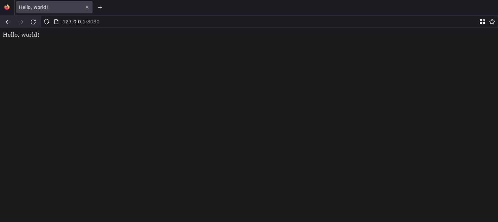

# Задание №3

???+ question Задание

    Реализовать серверную часть приложения. Клиент подключается к серверу. В ответ
    клиент получает http-сообщение, содержащее html-страницу, которую сервер
    подгружает из файла `index.html`.
    Обязательно использовать библиотеку `socket`.

```Python title="server.py"
--8<-- "laboratory_work_1/task3/server.py"
```

В блоке обработки `KeyboardInterrupt` (необходимо для обработки сочетания клавиш `Ctrl+C`):

- Создаём объект сокета c указанием семейства адресов `AF_INET` (используем IPv4) и типа сокета `SOCK_STREAM` (протокол TCP), используя контекстный менеджер для автоматического удаления объекта по выходу из контекста.
- Устанавливаем количество принимаемых подключений.
- Устанавливаем время таймаута подключения.
В бесконечном цикле:

- Используем контекстный менеджер `contextlib.suppress(socket.timeout)` для игнорирования таймаутов сервером (эквивательно блоку `try-catch` с `pass`)
- Принимаем подключение от клиента.
- Открываем файл `index.html` и читаем его содержимое, сразу переводя в `bytes` методом `encode`
- Создаём HTTP-заголовок (версия протокола 1.1, код 200, тип контента: гипертекст, указана длина контента, указано, что сервер хотел бы закрыть подключение)
- Соединяем заголовок и "полезную нагрузку" (содержимое `index.html`) и посылаем клиенту.

<figure markdown>

<figcaption> Полученная страница </figcaption>
</figure>