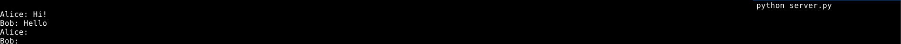
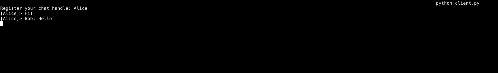
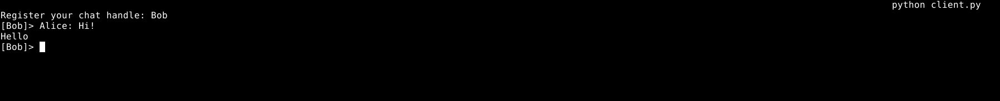

# Задание №4

???+ question Задание
    Реализовать двухпользовательский или многопользовательский чат.
    Обязательно использовать библиотеку `threading`.
    Для реализации с помощью UDP, `threading` использовать для получения
    сообщений у клиента.
    Для применения с TCP необходимо запускать клиентские подключения **и** прием
    и отправку сообщений всем юзерам на сервере в потоках. Не забудьте сохранять юзеров,
    чтобы потом отправлять им сообщения.

=== "Сервер"

    ```Python
    --8<-- "laboratory_work_1/task4/server.py::7"
    ```
    Создадим словарь для хранения пользователей во время работы сервера.

    ??? warning
        Сохранение состояния не предусмотрено.

    ```Python
    --8<-- "laboratory_work_1/task4/server.py:9:23"
    ```
    Данная функция обрабатывает подключение нового клиента. В ней происходит следующее:

    - Получаем данные от клиента, будем считать данное сообщение именем пользователя в чате.
    - Сохраняем сокет клиента (передаётся в функцию аргументом) в глобальный словарь `CLIENTS`.
    В бесконечном цикле:
    - Обрабатываем исключение `ConnectionResetError`, возникающее в случае обрыва (перезапуска) соединения, прерываем цикл при его получении.
    - Получаем сообщение от клиента (в случае пустого сообщения прерываем цикл).
    - Для каждого сохранённого клиента, кроме того, чьё имя совпадает с именем текущего обрабатываемого клиента, выполняем `send`, посылая клиенту ранее полученное сообщение.

    ```Python title="Основной код"
    --8<-- "laboratory_work_1/task4/server.py:24:"
    ```
    В обработчике `KeyboardInterrupt` (необходимо для реагирования на сочетание `Ctrl+C`):

    - Создаём TCP-сокет.
    - Привязываем сокет к заданным хосту и порту.
    - Указываем количество подключений (не более 5, число выбрано случайно).
    В бесконечном цикле:

    - Принимаем подключение от клиента.
    - Запускаем отдельный поток для выполнения обработчика `client_handler`.

    <figure markdown>
    
    <figcaption> Пример вывода сервера </figcaption>
    </figure>

    Пустые сообщения являются "артефактом" особенностей обработки отключения пользователя.

=== "Клиент"

    ```Python
    --8<-- "laboratory_work_1/task4/client.py::13"
    ```
    Данная функция получает сообщения от сервера. В бесконечном цикле получается сообщение от сервера и выводится на экран, в случае возникновения исключения цикл прерывается.

    ```Python
    --8<-- "laboratory_work_1/task4/client.py:15:19"
    ```
    Данная функция посылает сообщения на сервер. В бесконечном цикле на экран выводится имя клиента с приглашающей строкой и ожидается ввод, введённый текст посылается на сервер.

    ```Python title="Основной код"
    --8<-- "laboratory_work_1/task4/client.py:20:"
    ```
    В обработчике `KeyboardInterrupt` (необходимо для реагирования на сочетания клавиш `Ctrl+C`):

    - Создаём TCP-сокет.
    - Подключаемся к указанныму хосту и порту (т.е. к серверу).
    - Ожидаем ввода пользователем имени.
    - Посылаем имя пользователя на сервер (регистрируемся в чате).
    - Создаём два отдельных потока: один для обработчика отправления сообщений, а второй для получения сообщений от сервера.
    
    <figure markdown>
    
    <figcaption> Пример вывода клиента №1 </figcaption>
    </figure>

    <figure markdown>
    
    <figcaption> Пример вывода клиента №2 </figcaption>
    </figure>