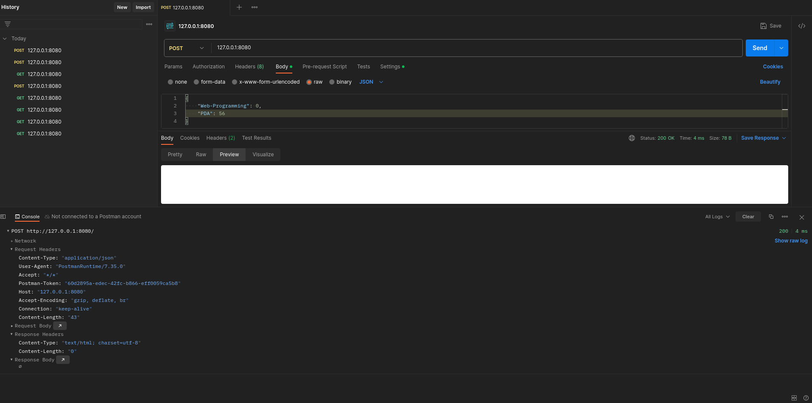
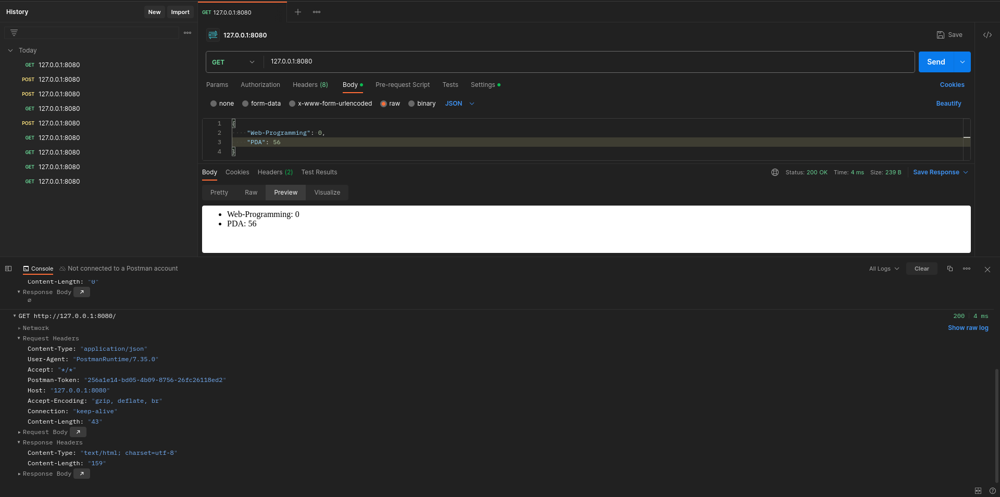

# Задание №5

???+ question Задание
    Необходимо написать простой web-сервер для обработки GET и POST http
    запросов средствами Python и библиотеки socket.

    Задание: сделать сервер, который может:

    - Принять и записать информацию о дисциплине и оценке по дисциплине.
    - Отдать информацию обо всех оценках по дисциплине в виде html-страницы.

```Python
--8<-- "laboratory_work_1/task5/server.py::12"
```
Данный класс предоставляет чуть более удобный способ работы с возвращением статус-кодов с ошибками.

```Python
--8<-- "laboratory_work_1/task5/server.py:12:16"
```
В основном классе сервера сохраним как поля хост и порт.

```Python
--8<-- "laboratory_work_1/task5/server.py:17:25"
```
Метод `serve_forever` является бесконечным циклом, в котором происходит работа сервера.

- Создаём TCP-сокет с использованием контекстного менеджера, привязываем к хосту и порту, устанавливаем количество соединений.
- Бесконечно принимаем входящие подключения и обрабатываем их (возвращаем клиенту ответ на запрос).

```Python
--8<-- "laboratory_work_1/task5/server.py:26:35"
```
В методе `serve_client` реализована общая структура ответа клиенту.

- Получаем данные от клиента.
- Разбираем вид запроса.
- Выделяем "тело" в полученных данных.
- Отвечаем на запрос.
- В случае ошибки (`HTTPException`) прерываем обработку и отвечаем клиенту о соответствующей ошибке.

```Python
--8<-- "laboratory_work_1/task5/server.py:36:48"
```
Статический метод `parse_request` нужен для отделения вида метода и пути запроса.

- Разделяем полученный текст на строки (разделитель `\r\n`, в стиле Windows).
- В случае, если текст "пуст", отвечаем `400 Bad Request`.
- Отделяем вид метода, URL и версию протокола.
- Если версия протокола не `HTTP/1.1`, отвечаем `505 HTTP Version Not Supported` (большинство современных браузеров/клиентов не поддерживают старшие версии HTTP).
- Обрабатываем переданный в заголовке путь (с использованием `urllib`).
- Возвращаем метод и путь.

```Python
--8<-- "laboratory_work_1/task5/server.py:49:59"
```
Статический метод `parse_headers` нужен для выделения полей заголовка запроса. Первая строка текста запроса игнорируется (т.к содержит тип метода, версию протокола и путь).
В каждой строке до первой пустой строки (которая отделяет заголовок от тела) выделим части до и после символа ":" и сохраним как ключи и значения словаря.

```Python
--8<-- "laboratory_work_1/task5/server.py:60:67"
```
Статический метод `parse_body` необходим для выделения тела (полезной нагрузки) запроса.

- Разделим текст на отдельные строки.
- Найдём пустую строку (разделяет заголовок и тело запроса).
- Соединим все строки после найденной пустой символом "\n" в одну и вернём её как полезную нагрузку.

```Python
--8<-- "laboratory_work_1/task5/server.py:68:82"
```
В данном методе происходит формирование ответа на запрос.

- В случае обращения к корню сервера ответим `404 Not Found` (там ничего не хранится).
В случае, если метод запроса `GET`:

- Читаем файл `grades.json` в той же директории, что и скрипт сервера (он выполняет функцию эрзац-базы данных и хранит дисциплины и отметки по ним)
- Отвечаем содержимым этого файла, обёрнутым в созданный `grades_body_generator` HTML-код.

В случае, если метод запроса `POST`:

- Предполагаем, что тело запроса содержит JSON с дисциплинами и отметками по ним.
- Сохраняем данный JSON в файл.
- Отвечаем `200 OK` с пустым телом ответа.

Иначе отвечаем `405 Method not Allowed` (методы помимо `GET` и `POST` не поддерживаются).

```Python
--8<-- "laboratory_work_1/task5/server.py:83:90"
```
Данный метод добавляет к уже сформированному заголовку ответа недостающие значения (статус-код, длину тела ответа) и само тело и отправляет данный текст (переведённый в `bytes`) клиенту.

```Python
--8<-- "laboratory_work_1/task5/server.py:91:104"
```
Данный код генерирует простой HTML-код для отображения кодов статуса (код и краткое объяснение отображаются в названии страницы и тексте)

```Python
--8<-- "laboratory_work_1/task5/server.py:105:125"
```
Данный метод генерирует HTML-код для отображения дисциплин и суммы баллов по ним (список, дисциплина и балл разделёны двоеточием)

```Python
--8<-- "laboratory_work_1/task5/server.py:126:"
```
Driver code для запуска сервера, создаёт объект класса и вызывает метод `serve_forever`, обернув в обработку `KeyboardInterrupt`.

<figure markdown>

<figcaption> Пример выполнения POST-запроса. </figcaption>
</figure>

<figure markdown>

<figcaption> Пример выполнения GET-запроса. </figcaption>
</figure>