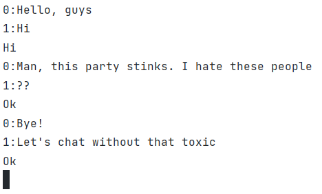

# Упраженение 4

## Реализация

### Клиента

Клиент имеет 2 потока. Один для ввода сообщений. Другой для вывода сообщений
```python
import socket
import concurrent.futures
import threading

stop_event = threading.Event()


def input_thread(conn: socket.socket):
    """Поток для ввода данных"""
    while not stop_event.is_set():
        msg = input()
        msg_encoded = msg.encode()
        conn.send(msg_encoded)
        if msg == 'Bye!':
            print('Stopped everything')
            stop_event.set()


def msg_printer_thread(conn: socket.socket):
    """Поток для вывода данных"""
    while not stop_event.is_set():
        msg = conn.recv(13000)
        print(msg.decode('utf-8'))


def main():
    conn = socket.socket(socket.AF_INET, socket.SOCK_STREAM)
    conn.connect(('127.0.0.1', 14900))
    with concurrent.futures.ThreadPoolExecutor() as executor:
        executor.submit(input_thread, conn)
        executor.submit(msg_printer_thread, conn)
    conn.close()


if __name__ == '__main__':
    main()
```
### Сервера


Сервер имеет 3 потока:

- Поток для обработки новых подключений
- Поток для получений сообщейни от конкретного пользователя(их может быть несколько)
- Поток отправки сообщений пользователям

2 последних потока общаяются друг с другом при помощи `msg_queue` 

```python
import socket

from queue import Queue
from concurrent import futures
import threading
from dataclasses import dataclass
from typing import Dict


@dataclass(frozen=True)
class Client():
    """
    Объект клиента, передается в поток управления клиентом
    """
    conn: socket.socket
    stop_event: threading.Event
    """Событие остоновки потока"""


id_client_dict: Dict[int, Client] = {}
msg_queue = Queue()


def main_thread():
    """Основной поток, из которого запускаются все остальные"""
    conn = socket.socket(socket.AF_INET, socket.SOCK_STREAM)
    conn.bind(('127.0.0.1', 14900))
    conn.listen(10)
    new_client_id = 0

    with futures.ThreadPoolExecutor() as executor:
        executor.submit(sender_thread)

        while True:
            client_conn, address = conn.accept()
            client_conn.send(f'Server: you have received id {new_client_id}'.encode('utf-8'))
            client = Client(client_conn, threading.Event())
            id_client_dict[new_client_id] = client
            executor.submit(client_thread, client, new_client_id)
            new_client_id += 1


def client_thread(client: Client, _id):
    """Выполняет обработку поступающий сообщений отклиента"""
    while not client.stop_event.is_set():
        client_msg = client.conn.recv(15000).decode('utf-8')
        msg_queue.put((client_msg, _id))


def sender_thread():
    """Рассылка сообщений из очереди"""
    while True:
        msg, sender_id = msg_queue.get()

        for _id, client in id_client_dict.items():
            if sender_id != _id:
                client.conn.send(f'{sender_id}:{msg}'.encode())
        # Обработка выхода пользователя из чата
        if msg == 'Bye!':
            sender_client = id_client_dict[sender_id]
            sender_client.stop_event.set()
            del id_client_dict[sender_id]


if __name__ == '__main__':
    main_thread()
```

## Демонстрация
Для демонстрации я создам 4 клиента, которые будут переписываться в чате


*Как видит переписку пользователь с id=0*

---


*Как видит переписку пользователь с id=1*

---



*Как видит переписку пользователь с id=2*

---


