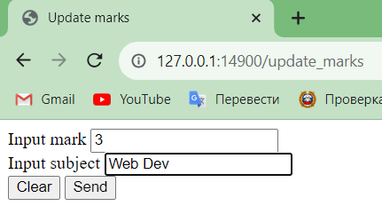
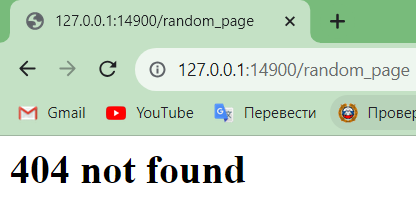

# Упражнение 5

## Код

### Код сервера
```python
import socket
import logging
from io import BufferedWriter, BufferedReader
import email.parser
import email.message
from urllib.parse import  parse_qs, urlparse
from dataclasses import dataclass
from typing import List, Tuple


class Request:
    """
    Class containing request data
    """
    def __init__(self, method, target, version, headers, rfile):
        self.method = method
        self.target = target
        self.version = version
        self.headers = headers
        self.rfile = rfile

    @property
    def url_path(self):
        return self.url.path

    @property
    def url_params(self):
        return parse_qs(self.url.query)

    @property
    def url(self):
        return urlparse(self.target)


class ConnWriter:
    """
    Wrapper around file interface of socket
    """
    encoding = 'iso-8859-1'

    def __init__(self, wfile: BufferedWriter):
        self._wfile = wfile

    def encode_and_write(self, s: str):
        if not s.endswith('\r\n'):
            s += '\r\n'
        encoded = s.encode(self.encoding)
        self._wfile.write(encoded)

    def write_empty_line(self):
        self._wfile.write(b'\r\n')

    def write_bytes(self, s: bytes):
        if not s.endswith(b'\r\n'):
            s += b'\r\n'
        self._wfile.write(s)

    def __enter__(self):
        return self

    def __exit__(self, exc_type, exc_val, exc_tb):
        self._wfile.flush()
        self._wfile.close()


@dataclass(frozen=True)
class Response:
    """
    Dataclass from which response created
    """
    status: int
    reason: str
    headers: List[Tuple] = None
    body: bytes = None


@dataclass(frozen=True)
class Mark:
    """
    Dataclass to imitate row in database
    """
    subject: str
    mark: int


class MyHTTPServer:
    """
    Accept requests, generate responses
    """
    def __init__(self, host, port, server_name):
        self._host = host
        self._port = port
        self._server_name = server_name
        self.marks: List[Mark] = [Mark('Math', 5), Mark('Programming', 4)]
        """Dict to imitate database. Already packed with some values"""


    def serve_forever(self):
        """
        Starts server. Main function of a class
        """

        conn = socket.socket(socket.AF_INET, socket.SOCK_STREAM)
        try:
            conn.bind((self._host, self._port))
            conn.listen(10)
            while True:
                client_conn, client_address = conn.accept()
                self.serve_client(client_conn)
        finally:
            conn.close()

    def serve_client(self, client_conn):
        """
        Get response from a client and send appropriate response
        """
        request = self.parse_request(client_conn)
        response = self.handle_request(request)
        self.send_response(client_conn, response)

    def parse_request(self, conn):
        """
        Convert request into Request instance
        """
        rfile = conn.makefile('rb')
        method, target, version = self.parse_request_line(rfile)
        logging.debug(f'request_line: {method} {target} {version}')
        headers = self.parse_headers(rfile)
        logging.debug(f'headers:\n{headers}')
        self.check_host(headers)

        return Request(method, target, version, headers, rfile)

    def parse_request_line(self, rfile):
        request_line = rfile.readline().decode('iso-8859-1')
        request_line = request_line.rstrip('\r\n')
        method, target, version = request_line.split()
        if version != 'HTTP/1.1':
            raise Exception('Invalid HTTP version')
        return method, target, version

    def parse_headers(self, rfile: BufferedReader) -> email.message.Message:
        headers_list = []
        while True:
            line = rfile.readline()

            if line in (b'\r\n', b'\n', b''):
                break
            headers_list.append(line)
        headers_str = b''.join(headers_list).decode('iso-8859-1')
        return email.parser.Parser().parsestr(headers_str)

    def check_host(self, headers):
        """Is host correct?"""
        host = headers.get('Host', '')
        logging.debug(f'host: {host}')
        if not host:
            raise Exception('Request without host')
        if host not in (self._server_name,
                        f'{self._host}:{self._port}'):
            raise Exception('Invalid host')

    def handle_request(self, request:Request) -> Response:
        """Handle different types of request. Even if this request is not supported"""
        if request.method == 'GET' and request.url_path == '/':
            return self.handle_get_mark(request)
        if request.method == 'POST' and request.url_path =='/update_marks':
            return self.handle_post_update_marks(request)
        if request.method == 'GET' and request.url_path == "/update_marks":
            return self.handle_get_update_marks(request)
        if request.method == 'GET' and request.url_path == '/favicon.ico':
            return Response(200, 'OK')

        return self.handle_404(request)

    def handle_post_update_marks(self, request: Request):
        arg_line = request.rfile.readline()
        arg_line = arg_line.decode('iso-8859-1')
        parameters = parse_qs(arg_line)
        if 'mark' not in parameters:
            raise Exception('No mark in post')
        if 'subject' not in parameters:
            raise Exception('No subject in post')
        mark = parameters['mark'][0]
        if not mark.isnumeric():
            raise Exception('Invalid mark')
        mark = int(mark)
        subject = parameters['subject'][0]
        self.marks.append(Mark(subject, mark))
        return Response(204, 'Created')

    def handle_get_mark(self, request: Request):
        content_type = 'text/html; charset=utf-8'
        body = '<html><head></head><body>'
        body += '<table>'
        for mark in self.marks:
            body += '<tr>'
            body += f'<td>{mark.subject}</td>'
            body += f'<td>{mark.mark}</td>'
            body += '</tr>'
        body += '</table>'
        body += '</body></html>'

        body = body.encode('utf-8')
        headers = [('Content-Type', content_type),
                   ('Content-Length', len(body))]
        return Response(404, 'Not Found', headers, body)

    def handle_404(self, request: Request):
        body = '<html><head></head><body><h1>404 not found</h1></body>'
        body = body.encode('utf-8')
        content_type = 'text/html; charset=utf-8'
        headers = [('Content-Type', content_type),
                   ('Content-Length', len(body))]
        return Response(200, 'OK', headers, body)


    def handle_get_update_marks(self, request):
        with open('update_marks.html') as f:
            body = ''.join(f.readlines())
        body = body.encode('utf-8')

        headers = [('Content-Type', 'text/html; charset=utf-8'),
                   ('Content-Length', len(body))]
        return Response(200, 'OK', headers, body)


    def send_response(self, conn: socket.socket, resp: Response):
        """Convert Response class instance into appropriate test and sends it via socket"""
        with ConnWriter(conn.makefile('wb')) as wfile_wrapped:
            status_line = f'HTTP/1.1  {resp.status} {resp.reason}'
            wfile_wrapped.encode_and_write(status_line)

            if resp.headers is not None:
                for key, value in resp.headers:
                    header_line = f'{key}: {value}'
                    wfile_wrapped.encode_and_write(header_line)
            wfile_wrapped.write_empty_line()

            if resp.body is not None:
                wfile_wrapped.write_bytes(resp.body)


if __name__ == '__main__':
    format = "%(asctime)s: %(message)s"
    logging.basicConfig(format=format, level=logging.INFO,
                        datefmt="%H:%M:%S")
    host = '127.0.0.1'
    port = 14900
    name = 'example.local'
    server = MyHTTPServer(host, port, name)
    server.serve_forever()
```

### Код update_marks.html

```html
<!DOCTYPE html>
<html lang="en-GB">
<head>
  <title>Update marks</title>
</head>
<body>

<form action="/update_marks" method="post">
    <label>
        Input mark
        <input type="number" size="3" id="mark" name="mark">
    </label>
    <br>
    <label>
        Input subject
        <input type="text" size="20" id="subject" name="subject">
    </label>
    <div>
        <input type="reset" value="Clear">
        <input type="submit" value="Send">
    </div>
</form>
</body>
</html>
```

## Демонстрация


*Содержание корневой страницы до добавления данных*

----



*Странице для добавления оценок*

----


*Корневая страница после добавления оценки*

----



*При указании несуществующей страницы получаем not found*
