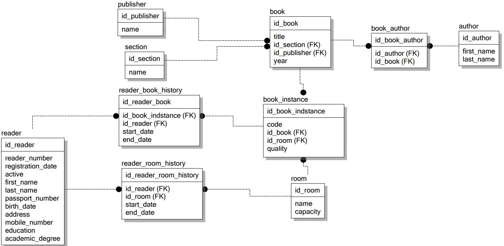

# models

```python
from django.db import models
from django.contrib.auth.models import  AbstractUser

class UserModel(AbstractUser):
    REQUIRED_FIELDS = ['first_name', 'last_name', 'email']


class Publisher(models.Model):
    name = models.CharField(max_length=100)

    def __str__(self):
        return str(self.name)


class Section(models.Model):
    name = models.CharField(max_length=100)

    def __str__(self):
        return str(self.name)


class Book(models.Model):
    title = models.CharField(max_length=100)
    section = models.ForeignKey('Section',
                                related_name='books',
                                on_delete=models.RESTRICT)
    publisher = models.ForeignKey('Publisher',
                                  related_name='books',
                                  on_delete=models.RESTRICT)
    year = models.IntegerField()
    authors = models.ManyToManyField('Author',
                                     related_name='books',
                                     through='BookAuthors')
    rooms = models.ManyToManyField('Room',
                                   related_name='books',
                                   through='BookInstance')

    def __str__(self):
        return f'{self.title}'


class Author(models.Model):
    first_name = models.CharField(max_length=100)
    last_name = models.CharField(max_length=100)

    def __str__(self):
        return f'{self.first_name} {self.last_name}'


class BookAuthors(models.Model):
    author = models.ForeignKey('Author', on_delete=models.RESTRICT)
    book = models.ForeignKey('Book',  on_delete=models.RESTRICT)


class BookInstance(models.Model):
    quality_types = (
        ('b', 'bad'),
        ('g', 'good'),
        ('n', 'new')
    )
    code = models.CharField(max_length=10, unique=True)
    book = models.ForeignKey('Book',
                             related_name='instances',
                             on_delete=models.RESTRICT)
    room = models.ForeignKey('Room',
                             related_name='book_instances',
                             on_delete=models.RESTRICT)
    quality = models.CharField(max_length=1, choices=quality_types)

    def __str__(self):
        return f'b:{self.book} r:{self.room} q:{self.quality}'


class Room(models.Model):
    name = models.CharField(max_length=100)
    capacity = models.IntegerField()

    def __str__(self):
        return str(self.name)


class Reader(models.Model):
    education_types = (('b', 'beginner'),
                       ('m', 'middle'),
                       ('h', 'higher'),
                       ('d', 'degree'))

    reader_number= models.CharField(max_length=10)
    registration_date=models.DateField()
    active = models.BooleanField(default=True)
    first_name = models.CharField(max_length=100)
    last_name = models.CharField(max_length=100)
    passport_number = models.CharField(max_length=10)
    birth_date = models.DateField()
    address = models.CharField(max_length=200)
    mobile_number = models.CharField(max_length=12)
    education = models.CharField(max_length=1, choices=education_types)
    book_instances = models.ManyToManyField('BookInstance',
                                            related_name='readers',
                                            through='ReaderBookHistory')
    rooms = models.ManyToManyField('Room',
                                   related_name='readers',
                                   through='ReaderRoomHistory')
    def __str__(self):
        return f'{self.first_name} {self.last_name}'


class ReaderBookHistory(models.Model):
    book_instance = models.ForeignKey('BookInstance',
                                      related_name='readers_history',
                                      on_delete=models.CASCADE)
    reader = models.ForeignKey('Reader',
                               related_name='books_history',
                               on_delete=models.RESTRICT)
    start_date = models.DateField()
    end_date = models.DateField(null=True, blank=True)


class ReaderRoomHistory(models.Model):
    reader = models.ForeignKey('Reader',
                               related_name='rooms_history',
                               on_delete=models.RESTRICT)
    room = models.ForeignKey('Room',
                             related_name='readers_history',
                             on_delete=models.RESTRICT)
    start_date = models.DateField()
    end_date = models.DateField(null=True, blank=True)

from django.db import models

from django.contrib.auth.models import  AbstractUser

class UserModel(AbstractUser):
    REQUIRED_FIELDS = ['first_name', 'last_name', 'email']


class TestModel(models.Model):
    title = models.CharField(max_length=100)


class Publisher(models.Model):
    name = models.CharField(max_length=100)

    def __str__(self):
        return str(self.name)


class Section(models.Model):
    name = models.CharField(max_length=100)

    def __str__(self):
        return str(self.name)


class Book(models.Model):
    title = models.CharField(max_length=100)
    section = models.ForeignKey('Section',
                                related_name='books',
                                on_delete=models.RESTRICT)
    publisher = models.ForeignKey('Publisher',
                                  related_name='books',
                                  on_delete=models.RESTRICT)
    year = models.IntegerField()
    authors = models.ManyToManyField('Author',
                                     related_name='books',
                                     through='BookAuthors')
    rooms = models.ManyToManyField('Room',
                                   related_name='books',
                                   through='BookInstance')

    def __str__(self):
        return f'{self.title}'


class Author(models.Model):
    first_name = models.CharField(max_length=100)
    last_name = models.CharField(max_length=100)

    def __str__(self):
        return f'{self.first_name} {self.last_name}'


class BookAuthors(models.Model):
    author = models.ForeignKey('Author', on_delete=models.RESTRICT)
    book = models.ForeignKey('Book',  on_delete=models.RESTRICT)


class BookInstance(models.Model):
    quality_types = (
        ('b', 'bad'),
        ('g', 'good'),
        ('n', 'new')
    )
    code = models.CharField(max_length=10, unique=True)
    book = models.ForeignKey('Book',
                             related_name='instances',
                             on_delete=models.RESTRICT)
    room = models.ForeignKey('Room',
                             related_name='book_instances',
                             on_delete=models.RESTRICT)
    quality = models.CharField(max_length=1, choices=quality_types)

    def __str__(self):
        return f'b:{self.book} r:{self.room} q:{self.quality}'


class Room(models.Model):
    name = models.CharField(max_length=100)
    capacity = models.IntegerField()

    def __str__(self):
        return str(self.name)


class Reader(models.Model):
    education_types = (('b', 'beginner'),
                       ('m', 'middle'),
                       ('h', 'higher'),
                       ('d', 'degree'))

    reader_number= models.CharField(max_length=10)
    registration_date=models.DateField()
    active = models.BooleanField(default=True)
    first_name = models.CharField(max_length=100)
    last_name = models.CharField(max_length=100)
    passport_number = models.CharField(max_length=10)
    birth_date = models.DateField()
    address = models.CharField(max_length=200)
    mobile_number = models.CharField(max_length=12)
    education = models.CharField(max_length=1, choices=education_types)
    book_instances = models.ManyToManyField('BookInstance',
                                            related_name='readers',
                                            through='ReaderBookHistory')
    rooms = models.ManyToManyField('Room',
                                   related_name='readers',
                                   through='ReaderRoomHistory')
    def __str__(self):
        return f'{self.first_name} {self.last_name}'


class ReaderBookHistory(models.Model):
    book_instance = models.ForeignKey('BookInstance',
                                      related_name='readers_history',
                                      on_delete=models.CASCADE)
    reader = models.ForeignKey('Reader',
                               related_name='books_history',
                               on_delete=models.RESTRICT)
    start_date = models.DateField()
    end_date = models.DateField(null=True, blank=True)


class ReaderRoomHistory(models.Model):
    reader = models.ForeignKey('Reader',
                               related_name='rooms_history',
                               on_delete=models.RESTRICT)
    room = models.ForeignKey('Room',
                             related_name='readers_history',
                             on_delete=models.RESTRICT)
    start_date = models.DateField()
    end_date = models.DateField(null=True, blank=True)
```


