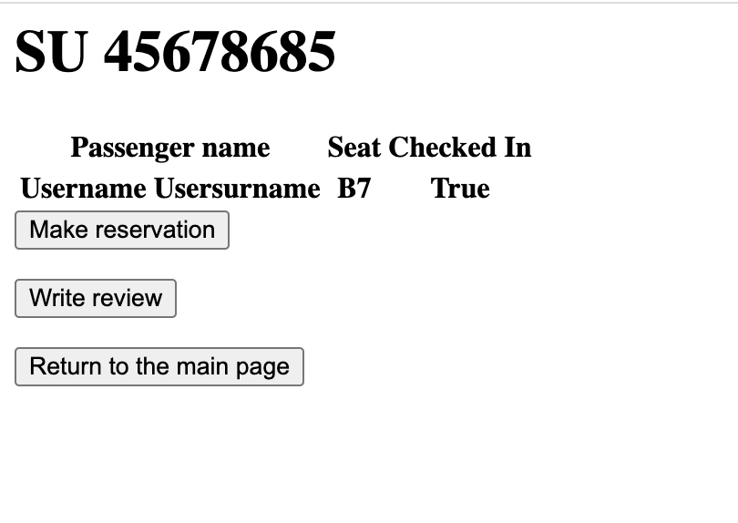

# Представления

**Домашняя стрaница с рейсами**
</br> Все предстоящие рейсы, на которые можно забронировать место
```

def index(request):
    flight_list: QuerySet[Flight] = Flight.objects.order_by("id")[:10]
    return render(request, 'index.html', {'flight_list': flight_list})
        
```
**HTML-код для отображения рейсов**
```

    <p>ARRIVALS</p>
    <ul>
        
            
                <li><a href="/airport/{{ flight.id }}/">{{ flight.flight_number }}</a></li>
            
        
    </ul>
    <p>DEPARTURES</p>
    <ul>
        
            
                <li><a href="/airport/{{ flight.id }}/">{{ flight.flight_number }}</a></li>
            
        
    </ul>

    <p>No flights are currently arriving or departing.</p>



    <a href="http://127.0.0.1:8000/airport/list_reservations/">My reservations<br></a>
    <a>Current user: {{ request.user.username }}</a>

<br><br>

    <a href="http://127.0.0.1:8000/login/">Change user?<br></a>


```


**Возврат на стартовую страницу**

```
def home_redirect(request):
    return redirect('/airport')
    
```

**Информация о конкретном рейсе**

```
def flight_info(request, flight_id):
    flight: Flight = get_object_or_404(Flight, pk=flight_id)
    dtos = []
    for passenger in flight.passengers.all():
        dtos.append(PassengerDTO(
            passenger.first_name + ' ' + passenger.last_name,
            Reservation.objects.filter(passenger=passenger.id).get().seat_number,
            Reservation.objects.filter(passenger=passenger.id).get().checked_in
        ))
    return render(request, 'flight_info.html', {
        'dtos': dtos,
        'flight_number': flight.flight_number,
        'flight_id': flight.id
    })
```



**Информация о ваших бронированиях**

```
def list_reservations(request):
    if request.user.is_authenticated:
        reservations = Reservation.objects.filter(passenger=request.user.id)
        return render(request, 'reservation_list.html', context={'reservations': reservations})
    else:
        return HttpResponse('Please sign in to view your reservations.')
```

**А также удаление этих бронирований**

```
def delete_reservation(request, reservation_id):
    if request.user.is_authenticated:
        get_object_or_404(Reservation, pk=reservation_id).delete()
        return redirect('/airport/list_reservations')
    else:
        return HttpResponse('Please sign in to manage your reservations.')
```

