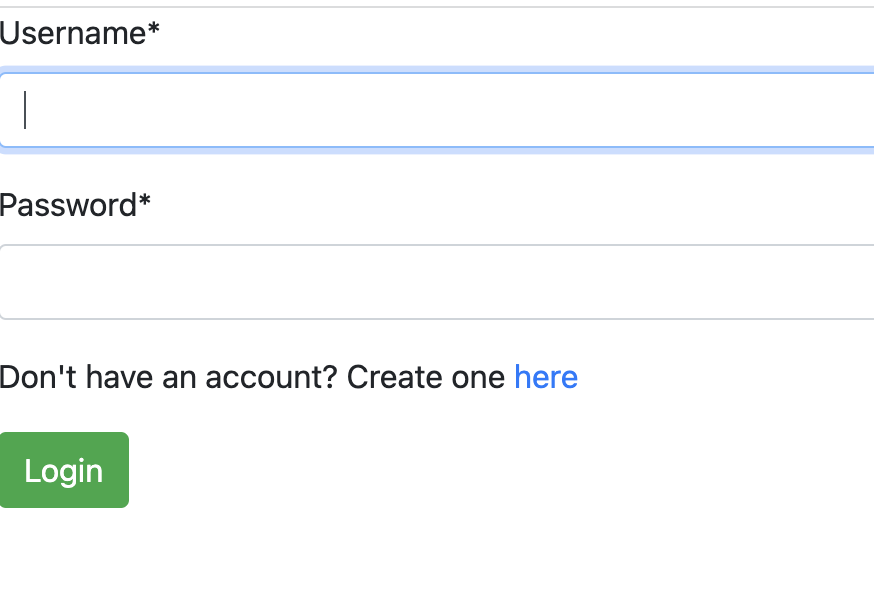
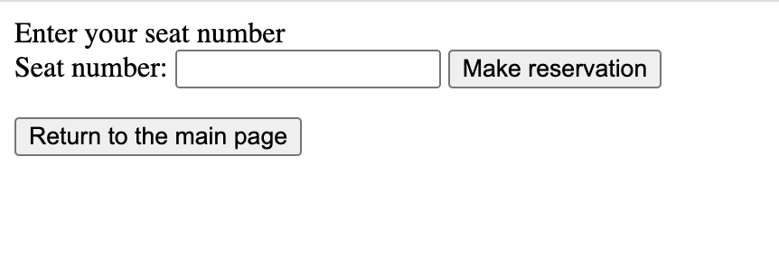
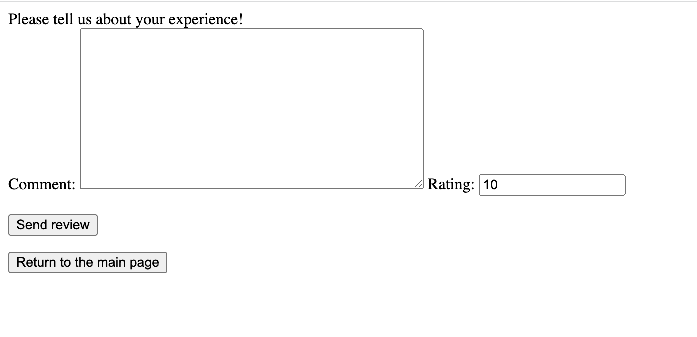

# Создание форм для регистрации, бронирования и добавления комментариев

**Форма для регистрации**

```

class RegisterForm(UserCreationForm):
    class Meta:
        model = User
        fields = ['username', 'first_name', 'last_name', 'email', 'password1', 'password2']

```

**Представление для регистрации**

```

def register(request):
    if request.method == 'POST':
        form = RegisterForm(request.POST)
        if form.is_valid():
            form.save()
            return redirect('/airport')
    else:
        form = RegisterForm()
    return render(request, 'registration/register.html', {'form': form})

```

**HTML-код для отображения формы регистрации**
```



Register




	<div class="content-section">
		<form method="POST" class="form-group">
			
			<legend class="border-bottom mb-3">Create an Account</legend>
			{{form|crispy}}
			<button name="create" type="submit" class="btn btn-success">Register</button>
		</form>
	</div>


```


**Форма бронирования выбранного места**

```

class ReservationForm(forms.ModelForm):
    class Meta:
        model = Reservation
        fields = ['seat_number']
        
```

**Представление для бронирования**

```
def make_reservation(request, flight_id, reservation_id=None):
    if request.user.is_authenticated:
        if request.method == 'POST':
            flight = get_object_or_404(Flight, pk=flight_id)
            if reservation_id is None:
                form = ReservationForm(request.POST)
                if form.is_valid():
                    new_res = form.save(commit=False)
                    new_res.flight = flight
                    new_res.passenger = request.user
                    new_res.save()
                    return redirect('/airport/list_reservations')
            else:
                reservation = get_object_or_404(Reservation, pk=reservation_id)
                form = ReservationForm(request.POST, instance=reservation)
                form.save()
                return redirect('/airport/list_reservations')
        else:
            form = ReservationForm()
        return render(request,
                      'make_reservation.html',
                      {'form': form, 'flight_id': flight_id, 'reservation_id': reservation_id})
    else:
        return HttpResponse('Please sign in to manage your reservations.')
        
```

**HTML-код для отображения формы бронирования**

```
Enter your seat number


	<div class="content-section">
    
		<form method="POST" action="/airport/make_reservation/{{ flight_id }}/{{ reservation_id }}/">
			
			{{ form }}
			<button name="create" type="submit">Make reservation</button>
		</form>
    
		<form method="POST" action="/airport/make_reservation/{{ flight_id }}/">
			
			{{ form }}
			<button name="create" type="submit">Make reservation</button>
		</form>
    
	</div>


<form action="http://127.0.0.1:8000/airport">
    <input type="submit" value="Return to the main page" />
</form>

```


**Форма для добавления комментариев**
</br> С добаалением комментариев логика такая же, как и с бронированием, id пользователя и рейса
мы уже имеем, следовательно, осталось добавить рейтинг и текст комментария

```

class ReviewForm(forms.ModelForm):
    class Meta:
        model = Review
        fields = ['comment', 'rating']
        
```

**Представление для комментариев**
```

def make_review(request, flight_id):
    if request.user.is_authenticated:
        if request.method == 'POST':
            flight = get_object_or_404(Flight, pk=flight_id)
            form = ReviewForm(request.POST)
            if form.is_valid():
                new_res = form.save(commit=False)
                new_res.flight = flight
                new_res.passenger = request.user
                new_res.save()
                return redirect('/airport/list_reservations')
        else:
            form = ReviewForm()
        return render(request, 'make_review.html', {'form': form, 'flight_id': flight_id})
    else:
        return HttpResponse('Please sign in to manage your reservations.')

```


**HTML-код для отображения формы добавления комментариев**
```

Please tell us about your experience!


	<div class="content-section">
		<form method="POST" action="/airport/make_review/{{ flight_id }}/">
			
			{{ form }}
            <br><br>
			<button name="create" type="submit">Send review</button>
		</form>
	</div>


<form action="http://127.0.0.1:8000/airport">
    <input type="submit" value="Return to the main page" />
</form>

```
