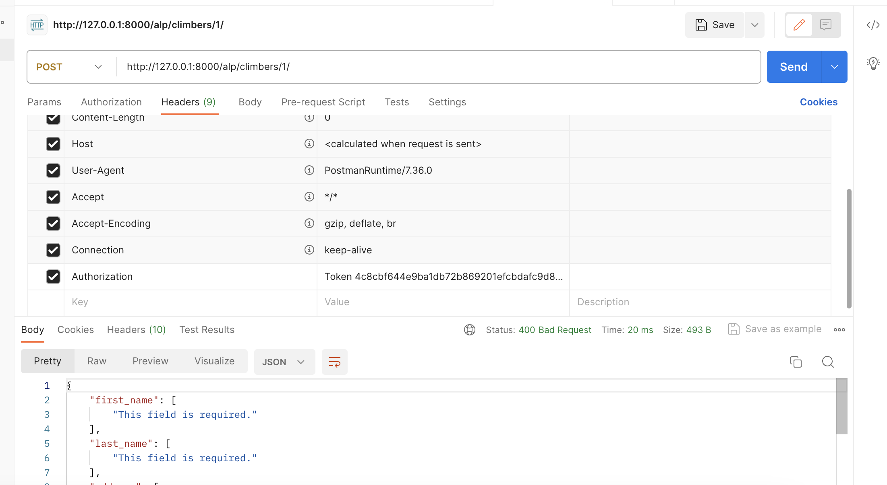
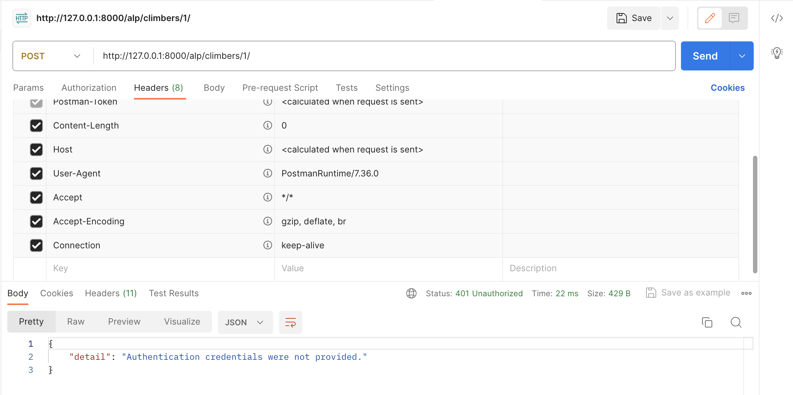

**Views:** 

Информация по всем альпинистам/конкретному:

```
class ClimberDetail(APIView):
    permission_classes = [IsAuthenticatedOrReadOnly]
    def get_object(self, pk):
        try:
            return Climber.objects.get(pk=pk)
        except Climber.DoesNotExist:
            raise Http404

    def get(self, request, pk, format=None):
        climbers = self.get_object(pk)
        serializer = ClimberSerializer(climbers)
        return Response(serializer.data)

    def post(self, request, pk, format=None):
        climber = self.get_object(pk)
        serializer = ClimberSerializer(climber, data=request.data)
        if serializer.is_valid():
            serializer.save()
            return Response(serializer.data)
        return Response(serializer.errors, status=status.HTTP_400_BAD_REQUEST)

    def delete(self, request, pk, format=None):
        climber = self.get_object(pk)
        climber.delete()
        return Response(status=status.HTTP_204_NO_CONTENT)


class ClimberList(APIView):
    permission_classes = [IsAuthenticatedOrReadOnly]
    def get(self, request, format=None):
        climbers = Climber.objects.all()
        serializer = ClimberSerializer(climbers, many=True)
        return Response(serializer.data)

    def post(self, request, format=None):
        serializer = ClimberSerializer(data=request.data)
        if serializer.is_valid():
            serializer.save()
            return Response(serializer.data, status=status.HTTP_201_CREATED)
        return Response(serializer.errors, status=status.HTTP_400_BAD_REQUEST)
```

Информация про группы, позволяющая в дальнейшем редактировать вложенные списки участников походов и добавлять постфактум комментарий

```
class GroupsDetailView(APIView):
    permission_classes = [IsAuthenticatedOrReadOnly]
    def get_object(self, pk):
        try:
            return Group.objects.get(pk=pk)
        except Group.DoesNotExist:
            raise Http404

    def get(self, request, pk, format=None):
        groups = self.get_object(pk)
        serializer = GroupGetSerializer(groups)
        return Response(serializer.data)

    def post(self, request, pk, format=None):
        group = self.get_object(pk)
        serializer = GroupPostSerializer(group, data=request.data)
        if serializer.is_valid():
            serializer.save()
            return Response(serializer.data)
        return Response(serializer.errors, status=status.HTTP_400_BAD_REQUEST)

    def delete(self, request, pk, format=None):
        group = self.get_object(pk)
        group.delete()
        return Response(status=status.HTTP_204_NO_CONTENT)


class GroupsListView(APIView):
    permission_classes = [IsAuthenticatedOrReadOnly]
    def get(self, request, format=None):
        groups = Group.objects.all()
        serializer = GroupGetSerializer(groups, many=True)
        return Response(serializer.data)

    def post(self, request, format=None):
        serializer = GroupPostSerializer(data=request.data)
        if serializer.is_valid():
            serializer.save()
            return Response(serializer.data, status=status.HTTP_201_CREATED)
        return Response(serializer.errors, status=status.HTTP_400_BAD_REQUEST)
```

Информация про конкретные восхождения

```
class AscensionListView(ListAPIView):
    permission_classes = [IsAuthenticatedOrReadOnly]
    queryset = Ascension.objects.all()
    serializer_class = AscensionSerializer


class AscensionDetailView(RetrieveAPIView):
    permission_classes = [IsAuthenticated]
    queryset = Ascension
    serializer_class = AscensionSerializer

    # permission_classes = (IsAuthenticated, )

    def get_queryset(self):
        return Ascension.objects.filter(id=self.kwargs['pk'])
```

Информация про горы

```
class MountainDetailView(APIView):
    permission_classes = [IsAuthenticatedOrReadOnly]
    def get_object(self, pk):
        try:
            return Mountain.objects.get(pk=pk)
        except Mountain.DoesNotExist:
            raise Http404

    def get(self, request, pk, format=None):
        mountains = self.get_object(pk)
        serializer = MountainSerializer(mountains)
        return Response(serializer.data)

    def post(self, request, pk, format=None):
        mountain = self.get_object(pk)
        serializer = MountainSerializer(mountain, data=request.data)
        if serializer.is_valid():
            serializer.save()
            return Response(serializer.data)
        return Response(serializer.errors, status=status.HTTP_400_BAD_REQUEST)

    def delete(self, request, pk, format=None):
        mountain = self.get_object(pk)
        mountain.delete()
        return Response(status=status.HTTP_204_NO_CONTENT)


class MountainsListView(APIView):
    permission_classes = [IsAuthenticatedOrReadOnly]
    def get(self, request, format=None):
        mountains = Mountain.objects.all()
        serializer = MountainSerializer(mountains, many=True)
        return Response(serializer.data)

    def post(self, request, format=None):
        serializer = MountainSerializer(data=request.data)
        if serializer.is_valid():
            serializer.save()
            return Response(serializer.data, status=status.HTTP_201_CREATED)
        return Response(serializer.errors, status=status.HTTP_400_BAD_REQUEST)
```

Блок клубов

```
class ClubsListView(ListAPIView):
    permission_classes = [IsAuthenticatedOrReadOnly]
    queryset = Club.objects.all()
    serializer_class = ClubSerializer


class ClubDetailView(RetrieveAPIView):
    permission_classes = [IsAuthenticatedOrReadOnly]
    queryset = Club
    serializer_class = ClubSerializer

    def get_queryset(self):
        return Club.objects.filter(id=self.kwargs['pk'])
```

Блок участия в конкретном походе

```
class AscentParticipationAPIView(viewsets.ModelViewSet):
    permission_classes = [IsAuthenticatedOrReadOnly]
    queryset = AscentParticipation.objects.all()
    serializer_class = AscentParticipationSerializer
    # permission_classes = (IsAuthenticated, )


class AscentParticipationDetailView(RetrieveAPIView):
    permission_classes = [IsAuthenticatedOrReadOnly]
    queryset = AscentParticipation
    serializer_class = AscentParticipationSerializer

    def get_queryset(self):
        return AscentParticipation.objects.filter(id=self.kwargs['pk'])

```


**...про авторизацию:**

Почти все страницы доступны в режиме IsAuthenticatedOrReadOnly, чтобы посмотреть-то посмотрел, но, в случае чего, ничего не сломал.


Но без регистрации, например, нельзя отследить список группы
