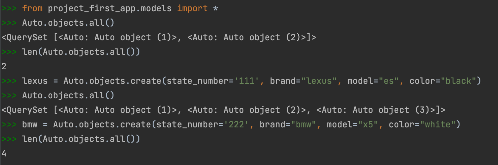
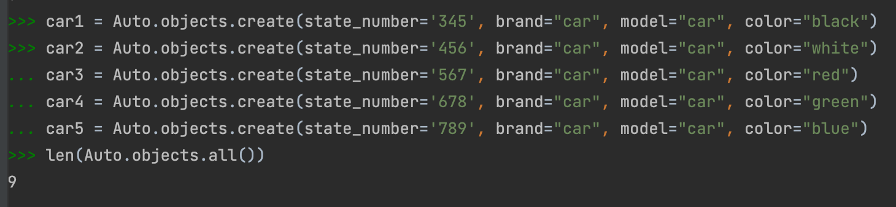
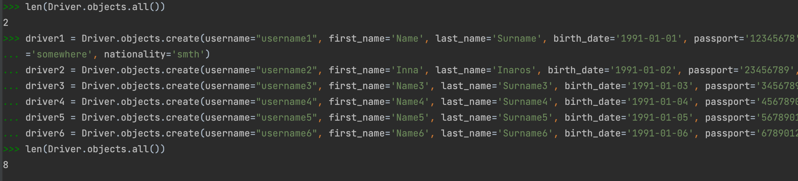
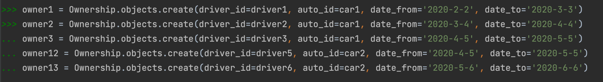

**Задание:** Напишите запрос на создание 6-7 новых автовладельцев и 5-6 автомобилей, каждому автовладельцу назначьте удостоверение и от 1 до 3 автомобилей. Задание можете выполнить либо в интерактивном режиме интерпретатора, либо в отдельном python-файле. Результатом должны стать запросы и отображение созданных объектов. 

**Скринкаст:**

Клиент-серверное взаимодействие:

Добавление нескольких автомобилей:

Добавление водителей:

Добавление документов на это всё:
