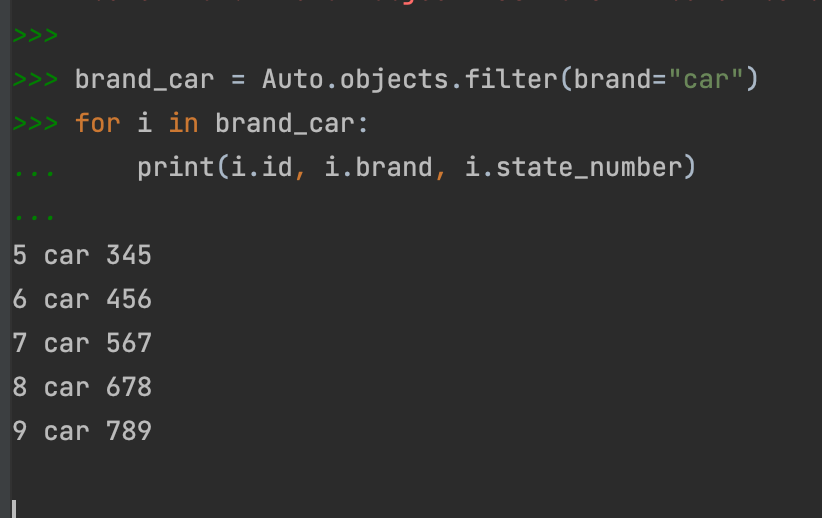
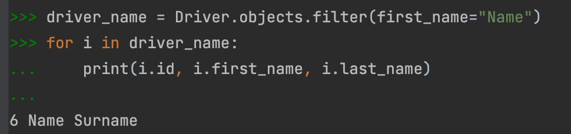
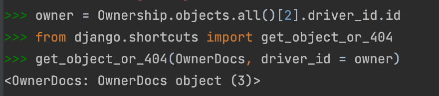
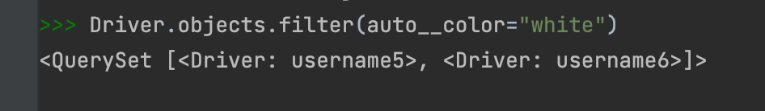
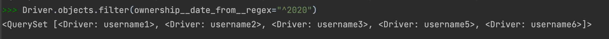

**Задание:** По созданным в пр.1 данным написать следующие запросы на фильтрацию:

**1. Выведете все машины марки “Toyota” (или любой другой марки, которая у вас есть)**

**2. Найти всех водителей с именем “Олег” (или любым другим именем на ваше усмотрение)**

**3. Взяв любого случайного владельца получить его id, и по этому id получить экземпляр удостоверения в виде объекта модели (можно в 2 запроса)**

**4. Вывести всех владельцев красных машин (или любого другого цвета, который у вас присутствует)**

**5. Найти всех владельцев, чей год владения машиной начинается с 2010 (или любой другой год, который присутствует у вас в базе)**

