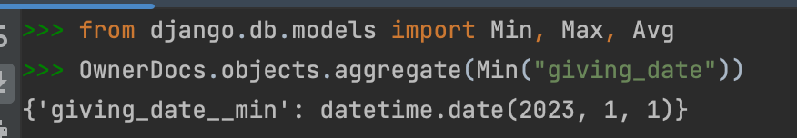
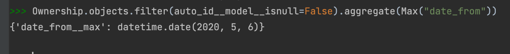
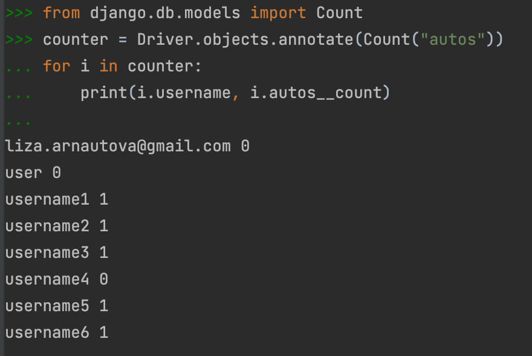
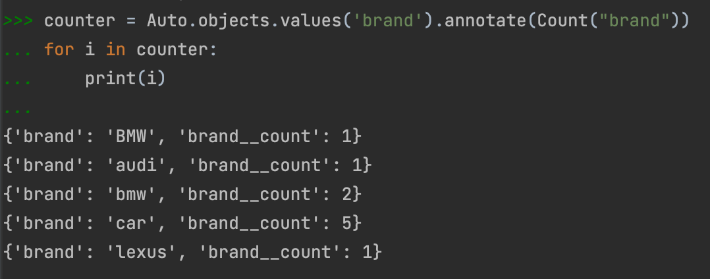
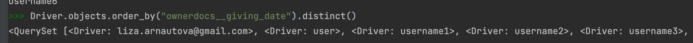

**Задание:** По созданным в пр.1 данным написать следующие запросы на фильтрацию:

**1. Вывод даты выдачи самого старшего водительского удостоверения**

**2. Укажите самую позднюю дату владения машиной, имеющую какую-то из существующих моделей в вашей базе**

**3. Выведите количество машин для каждого водителя**

**4. Подсчитайте количество машин каждой марки**

**5. Отсортируйте всех автовладельцев по дате выдачи удостоверения**

