**Задание:** 

Реализовать эндпоинты для добавления и просмотра скилов.
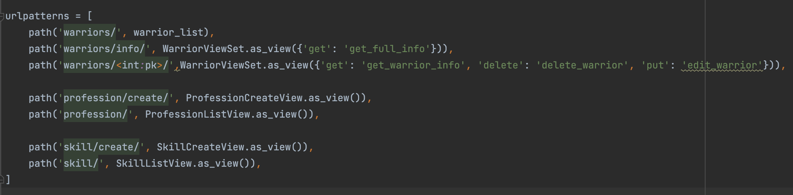
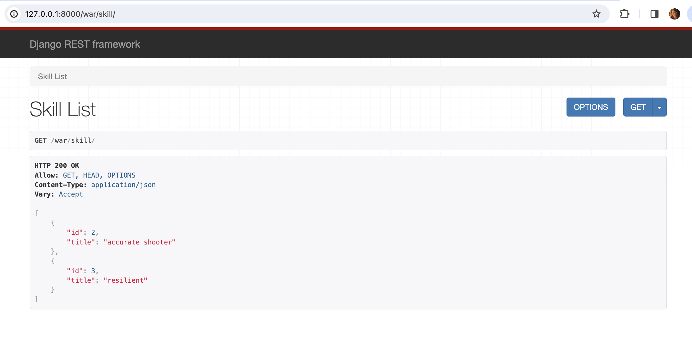
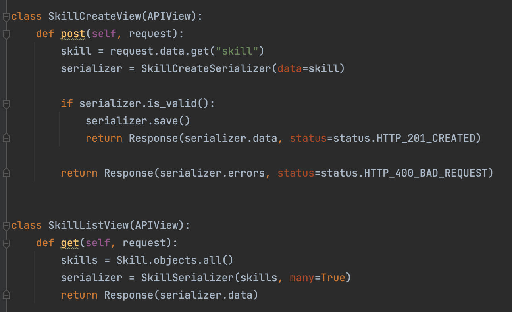

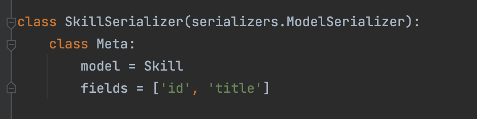

Реализовать эндпоинты:

- Вывод полной информации о всех воинах и их профессиях (в одном запросе).
- Вывод полной информации о всех воинах и их скилах (в одном запросе).
- Вывод полной информации о воине (по id), его профессиях и скилах.
- Удаление воина по id.
- Редактирование информации о воина.

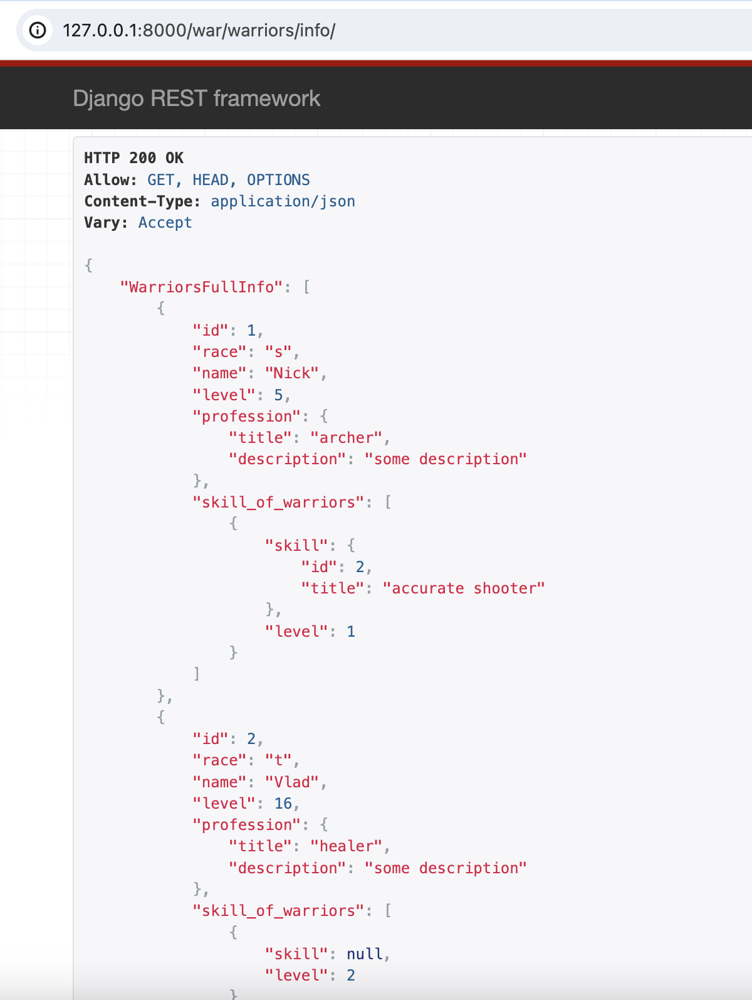
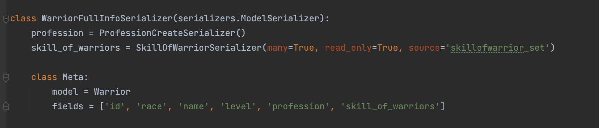
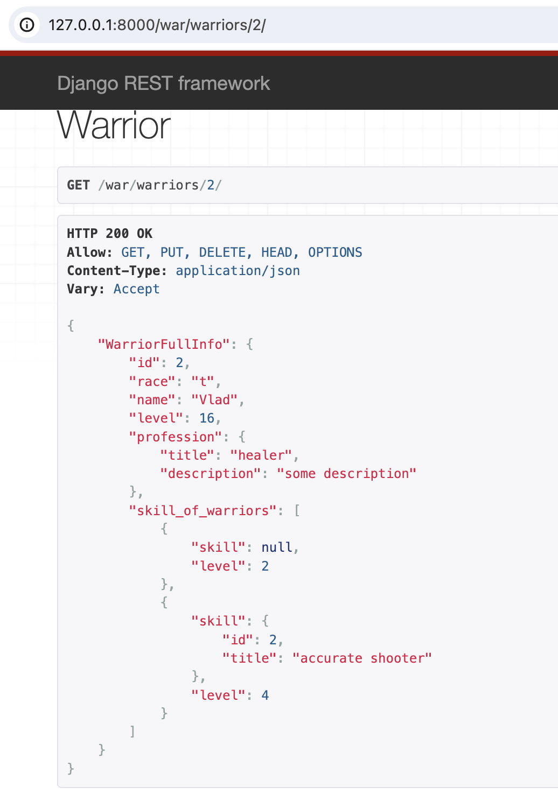

**И процедура удаления:**
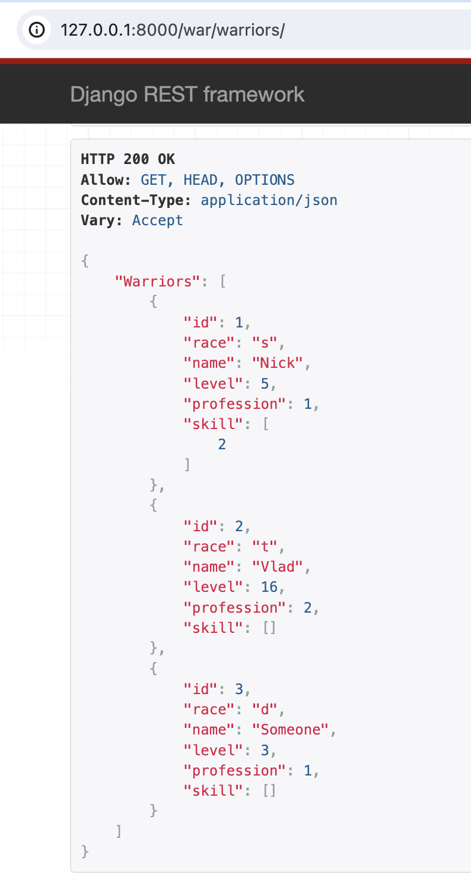
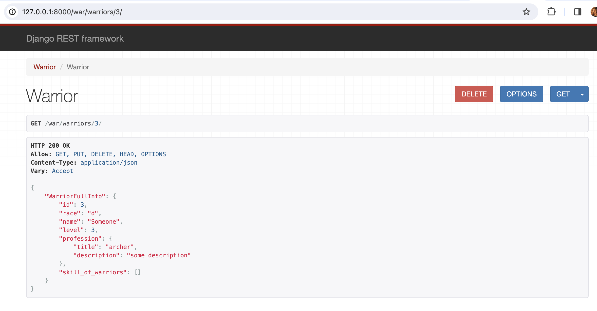
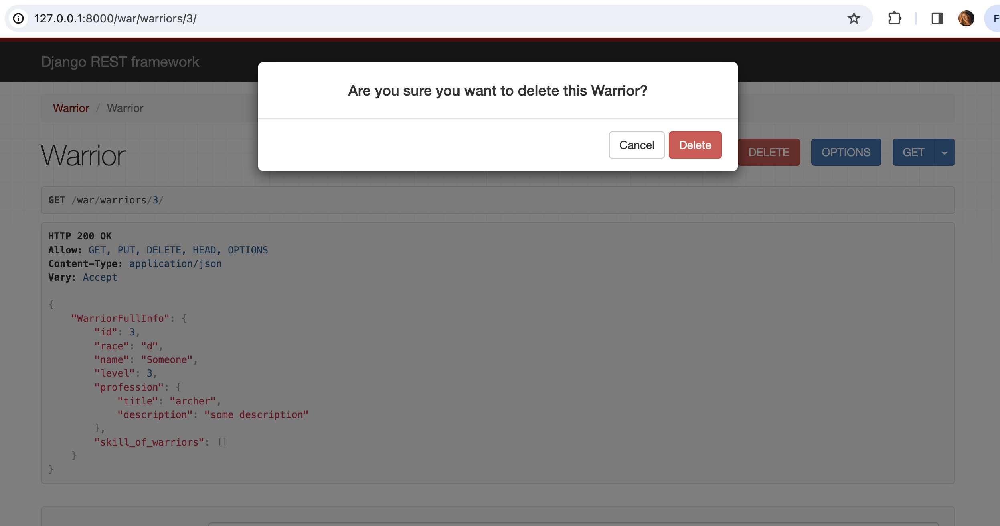
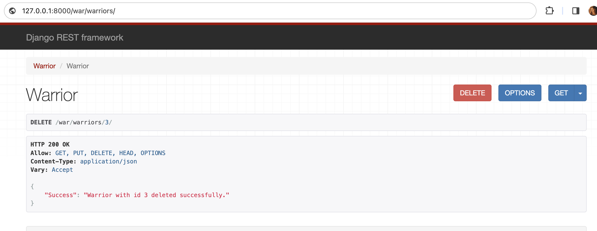
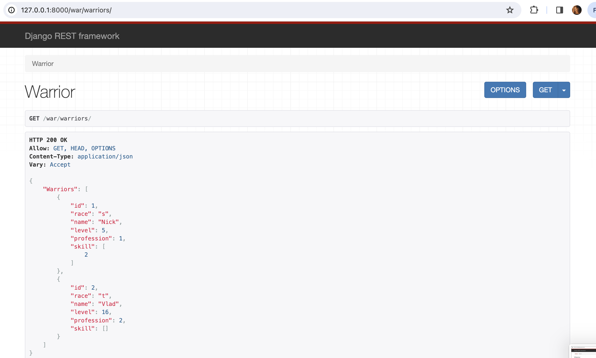
