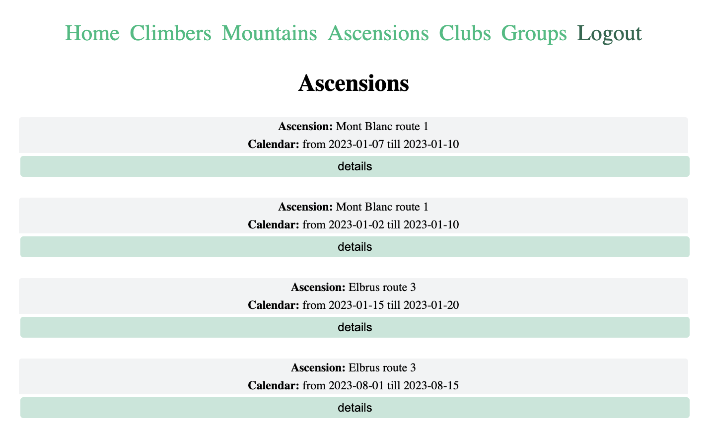
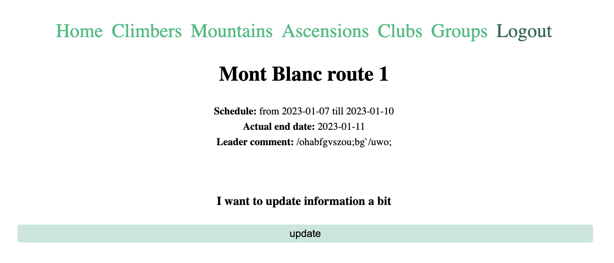
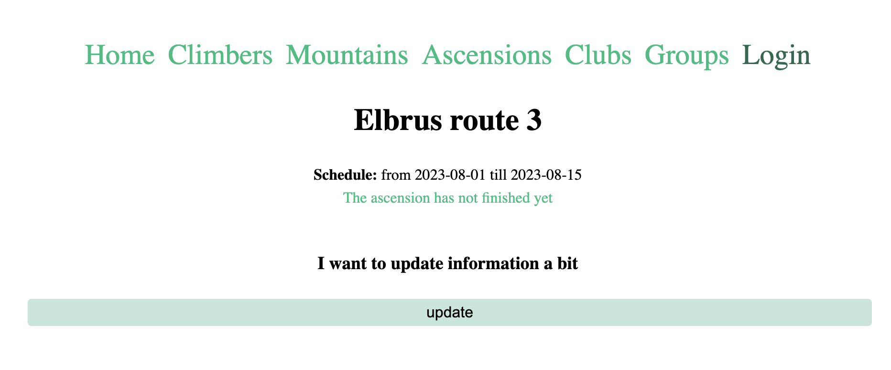
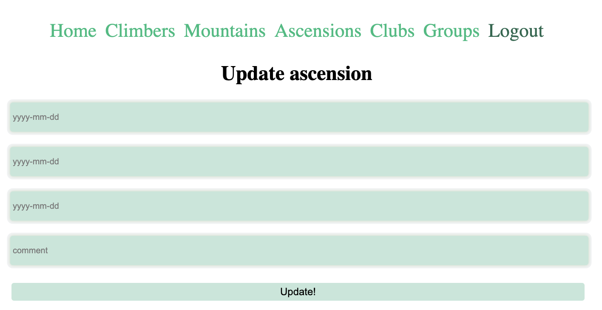

**Восхождения:** 
Список восхождений выводит ориентировочные даты похода, гору и номер маршрута вокруг нее

На странице более подробной информации показывается (если поход уже завершен), комментарий руководителя и дата фактического прибытия.

В противном случае - "простите, поход еще не завершился"

А также предоставляет возможность откорректировать информацию о походе: это важно для руководителей, оставляющих комментарии
