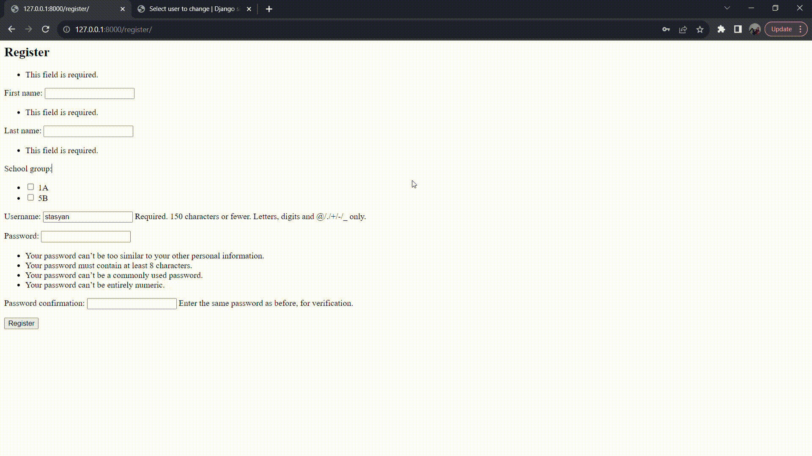
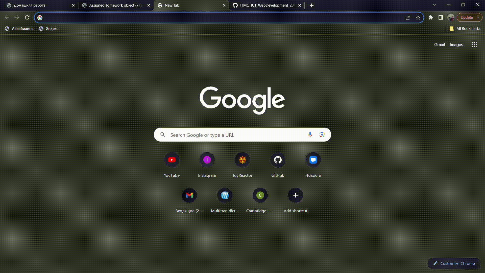

# Доска домашних заданий
## Описание варианта
О домашнем задании должна храниться следующая информация: предмет,
преподаватель, дата выдачи, период выполнения, текст задания, информация о штрафах.
Необходимо реализовать следующий функционал:

1. Регистрация новых пользователей.
2. Просмотр домашних заданий по всем дисциплинам (сроки выполнения,
описание задания).
3. Сдача домашних заданий в текстовом виде.
4. Администратор (учитель) должен иметь возможность поставить оценку за
задание средствами Django-admin.
5. В клиентской части должна формироваться таблица, отображающая оценки
всех учеников класса.
## Реализация варианта
#### Основные сущности/модели:
```Python
class SchoolGroup(models.Model):
    grade = models.CharField(max_length=2, default='0')
    letter_id = models.CharField(max_length=1, default='Ъ')

    def __str__(self):
        return f"{self.grade}{self.letter_id}"


class Student(models.Model):
    user = models.OneToOneField(User, on_delete=models.CASCADE, default=0)
    first_name = models.CharField(max_length=30)
    last_name = models.CharField(max_length=30)
    group = models.ForeignKey(SchoolGroup, on_delete=models.CASCADE, default=0)

    def __str__(self):
        return f"{self.first_name} {self.last_name}"

class Teacher(models.Model):
    user = models.OneToOneField(User, on_delete=models.CASCADE, default=0)
    first_name = models.CharField(max_length=30)
    last_name = models.CharField(max_length=30)

    def __str__(self):
        return f"{self.first_name} {self.last_name}"


class Discipline(models.Model):
    discipline = models.CharField(max_length=30)

    def __str__(self):
        return self.discipline


class Homework(models.Model):
    discipline_object = models.ForeignKey(Discipline, on_delete=models.CASCADE)
    teacher_object = models.ForeignKey(Teacher, on_delete=models.CASCADE)
    schoolgroup_object = models.ForeignKey(SchoolGroup, on_delete=models.CASCADE, default=0)
    date_received = models.DateField()
    date_deadline = models.DateField()
    task = models.CharField(max_length=200)
    penalty = models.CharField(max_length=200)

    def __str__(self):
        return f"{self.discipline_object} {self.schoolgroup_object}"


class AssignedHomework(models.Model):
    user = models.OneToOneField(User, on_delete=models.CASCADE, default=0)
    work_object = models.ForeignKey(Homework, on_delete=models.CASCADE)
    datetime.datetime.now()
    task = models.CharField(max_length=200)


class StudentGrade(models.Model):
    homework_object = models.ForeignKey(AssignedHomework, on_delete=models.CASCADE)
    grade = models.CharField(max_length=1)

    def save(self, *args, **kwargs):
        super(StudentGrade, self).save(*args, **kwargs)
        ahw = get_object_or_404(AssignedHomework, id=self.homework_object.id)
        student = get_object_or_404(Student, user=ahw.user)
        try:
            performance_object = StudentPerformance.objects.get(student_object=student, discipline_object=ahw.work_object.discipline_object)
            performance_object.grades.add(self)
        except StudentPerformance.DoesNotExist:
            temp = StudentPerformance.objects.create(student_object=student, discipline_object=ahw.work_object.discipline_object)
            temp.grades.add(self)

    def __str__(self):
        return f"{self.grade}"


class StudentPerformance(models.Model):
    student_object = models.ForeignKey(Student, on_delete=models.CASCADE)
    discipline_object = models.ForeignKey(Discipline, on_delete=models.CASCADE)
    grades = models.ManyToManyField(StudentGrade)
```
#### Расширение пользователя в файле admin.py:
```Python
class StudentInLine(admin.StackedInline):
    model = Student
    verbose_name_plural = 'Students'
    can_delete = False


class TeacherInLine(admin.StackedInline):
    model = Teacher
    verbose_name_plural = 'Students'
    can_delete = False


class CustomizedUserAdmin(UserAdmin):
    inlines = (TeacherInLine, StudentInLine)


admin.site.unregister(User)
admin.site.register(User, CustomizedUserAdmin)
```
#### Форма регистрации:
```Python
class UserCreateForm(UserCreationForm):
    first_name = forms.CharField(max_length=30, required=True)
    last_name = forms.CharField(max_length=30, required=True)
    group = forms.ModelMultipleChoiceField(
        queryset=SchoolGroup.objects.all(),
        label="School group",
        widget=forms.CheckboxSelectMultiple)

    class Meta:
        model = User
        fields = ['first_name', 'last_name', 'group', 'username']

    def save(self, commit=True):
        user = super(UserCreateForm, self).save(commit=True)
        group = f"{self.cleaned_data['group'].values_list('grade')[0][0]}{self.cleaned_data['group'].values_list('letter_id')[0][0]}"
        grade = group[0] if len(group) == 2 else group[0:1]
        letter = group[-1]
        student_object = Student(
            user=user,
            first_name=self.cleaned_data['first_name'],
            last_name=self.cleaned_data['last_name'],
            group=get_object_or_404(SchoolGroup, letter_id=letter, grade=grade))
        student_object.save()
        return user, student_object
```
В данной реализации метод save переопределен. В новом виде он делает запрос на получение группы, имени и фамилии со страницы и сохраняет пользователя с новыми полями
#### Основные представления:
```Python
class HomeworkListView(ListView):
    model = Homework
    queryset = model.objects.all()
    template_name = 'list_view.html'


class AssignHomework(CreateView):
    model = AssignedHomework
    success_url = '/homework'
    fields = ['task']
    template_name = 'post_homework.html'

    def form_valid(self, form):
        work_object = get_object_or_404(Homework, id=self.kwargs['work_object'])
        form.instance.work_object = work_object
        form.instance.user = self.request.user
        return super().form_valid(form)


class GroupGrades(LoginRequiredMixin, ListView):
    model = StudentPerformance
    fields = ['student_object', 'discipline_object', 'grades']
    template_name = 'table.html'


def LoginView(request):
    if request.method == 'POST':
        form = AuthenticationForm(data=request.POST)
        if form.is_valid():
            user = form.get_user()
            login(request, user)
            return redirect('/homework')
    else:
        form = AuthenticationForm()
    return render(request, 'login.html', {'form': form})


def register(request):
    if request.method == 'POST':
        form = UserCreateForm(request.POST)
        if form.is_valid():
            user = form.save()
            login(request, user[0])
            return redirect('/homework')
    else:
        form = UserCreationForm()
    return render(request, 'register.html', {'form': form})
```
#### URL, используемые представлениями:
```Python
from intestines import views

urlpatterns = [
    path('admin/', admin.site.urls),
    path('homework/', views.HomeworkListView.as_view()),
    path('assign/<int:work_object>/', views.AssignHomework.as_view()),
    path('login/', views.LoginView),
    path('performance/<int:group_id>/', views.GroupGrades.as_view()),
    path('register/', views.register),
]
```
#### Демонстрация регистрации ученика и сдачи работы 
#### Демонстрация таблицы 