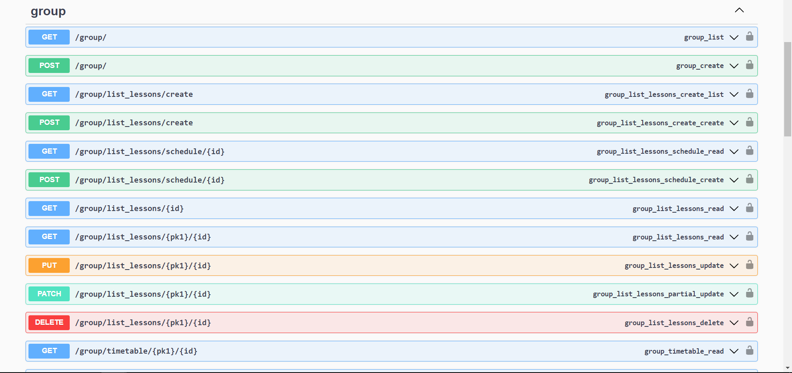

# Практическая 3.3
## Создание документации с помощью mkdocs и swagger
Была успешно произведена установка пакета drf_yasg. В код текущей лабораторной добавленые следующие строки на языке Python, аннотирующие код:
```Python
from rest_framework import permissions
from drf_yasg.views import get_schema_view
from drf_yasg import openapi

schema_view = get_schema_view(
   openapi.Info(
      title="API",
      default_version='Conversion, software version 7.0',
      description="Looking at life through the eyes of a tire hub ",
      terms_of_service="Пользуйтесь на здоровье",
      contact=openapi.Contact(email="Не пишите, но если уже начали - не прекращайте, nick.chaptykov@gmail.com"),
      license=openapi.License(name="Лицензия на продажу рыболовных снастей"),
   ),
   public=True,
   permission_classes=(permissions.AllowAny,),
)
```
## Результат работы скрипта
