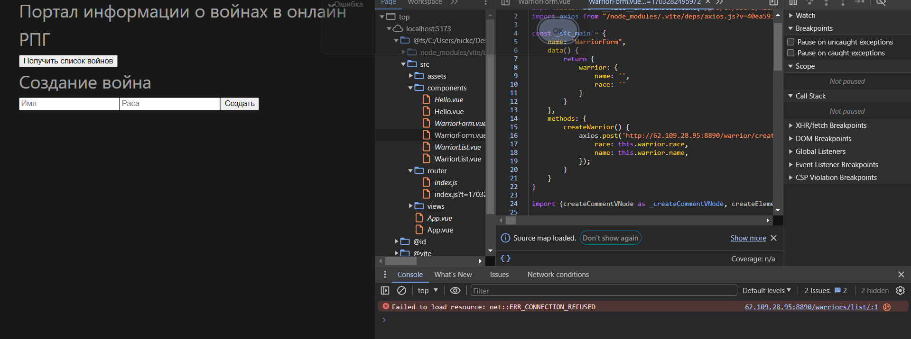
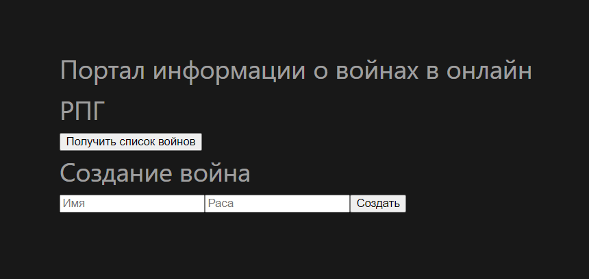

# Практическая 4.2
## Особенности выполнения работы
Некоторые предоставленные файлы имели несколько синтаксических ошибок, поэтому в ряде случаев их приходилось исправлять по ходу выполнения. Также ресурс не был доступен по предоставленному адресу, возможно это ошибка с моей стороны:


## Список воинов
```Html
<template>
 <div class="warrior" v-for="warrior in warriors"> <!-- v-for - директива для отображения списка элементов на основе массива. -->
   <div><strong>Имя:</strong> {{ warrior.name }}</div> 
   <div><strong>Расса:</strong> {{ warrior.race }}</div>
 </div>
</template>

<script>
export default {
 props: { // «Props» -- это специальное ключевое слово, обозначающее свойства . Его можно зарегистрировать в дочернем компоненте для передачи данных от родительского компонента к одному из его дочерних компонентов.
   warriors: {
     type: Array,
     required: true
   }
 }
}
</script>

<style scoped>

</style>
```
## Форма для воина
```html
<template>
 <form @submit.prevent> <!-- @submit.prevent позволяет остановить перезагрузку страницы после нажатия кнопки -->
   <h1>Создание война</h1>
   <input
       v-model="warrior.name"
       class="input"
       type="text"
       placeholder="Имя"> <!-- Вызывает форму, при нажатии кнопки "Создать", "warrior.name" получит значение из формы -->
   <input
       v-model="warrior.race"
       class="input"
       type="text"
       placeholder="Раса">
   <button class="btn" v-on:click="createWarrior">Cоздать</button> <!-- Нажатие кнопки "Создать" вызывает метод "createWarrior" и записывает данные в объект "warrior" -->
 </form>
</template>

<script>
import axios from "axios";

export default {
 name: "WarriorForm",
 data () {
   return {
     warrior: {
       name: '',
       race: ''
     }
   }
 },
 methods: {
   createWarrior() {
     axios.post('http://62.109.28.95:8890/warrior/create1', {
       race: this.warrior.race,
       name: this.warrior.name,
     });
   }
 }
}
</script>

<style scoped>

</style>
```
## View для воинов
```html
<template>
   <div class="app">
     <h1>Портал информации о войнах в онлайн РПГ</h1>
     <button v-on:click="fetchWarriors">Получить список войнов</button> <!-- Кнопка вызывает функцию получения списка данных (функция fetchWarriors объявлена в блоке "methods") -->
     <warrior-form/> <!-- Встраивание компонента формы -->
     <warrior-list
         v-bind:warriors="warriors"
     /> <!-- Встраивание компонента вызывающего список объектов. v-bind - директива служит для так называемой data binding -- привязки данных (данные объявляются в блоке данных data() (см. код ниже)). -->
   </div>
</template>

<script>
import WarriorForm from "@/components/WarriorForm.vue";
import WarriorList from "@/components/WarriorList.vue";
import axios from "axios";

export default {
 components: {
   WarriorForm, WarriorList
 },

 data() { // data - это функция, которая возвращает объект с данными
   return {
     warriors: [], // Массив данных (передается в компонент WarriorList, получает данные средствами функции fetchWarriors
   }
 },
 methods: { // methods. Это объект, который содержит список Javascript функций, которые должны выполняться в зависимости от того, какие действия производит пользователь.
   async fetchWarriors () { // асинхронная функция для получения данных
     try {
       const response = await axios.get('http://62.109.28.95:8890/warriors/list/') // Выполнение GET-запроса Backend-серверу. Запрос вернет JSON.
       console.log(response.data.results)
       this.warriors = response.data.results // Массив данных warriors из блока(функции) data() получает значением результат только-что выполненного запроса
     } catch (e) {
       alert('Ошибка')
     }
   }

 },
 mounted() {
   this.fetchWarriors() // Vue вызывает хук mount(), когда компонент добавляется в DOM.  В данном примере это позволяет вызвать fetchWarriors для получения списка воинов до отрисовки страницы в браузере, благодаря этому страница загружается с уже полученными ранее данными.

 }
}
</script>
```
## Результат

