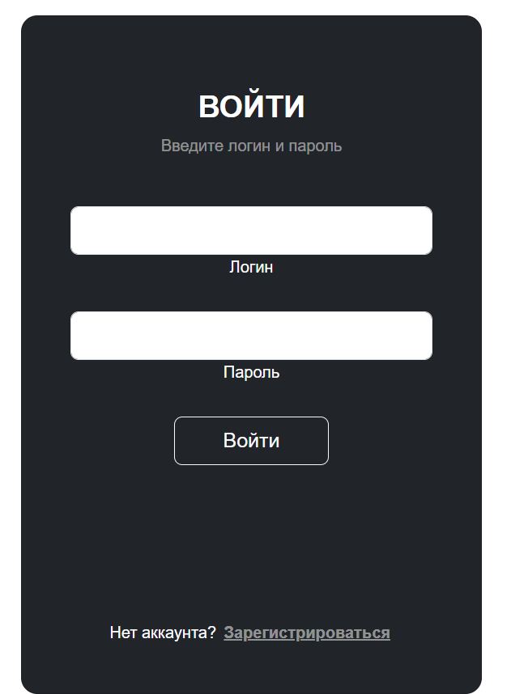
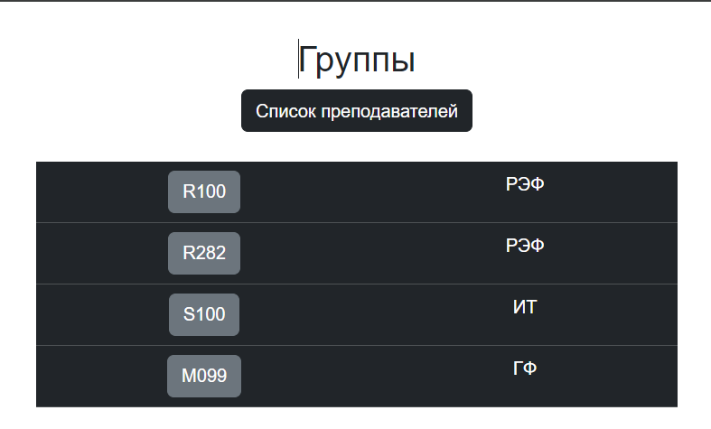

# Лабораторная работа 4
## Подготовка
Так как CORS был настроен в предыдущей практической, то можно приступить к созданию View для фронта на Vue. Есть сомнения по поводу решения с применением @csrf_exempt, так как этот декоратор позволяет полностью игнорировать csrf. Однако, в документации этот пример активно используется:
```Python
from rest_framework.authtoken.models import Token
from django.contrib.auth import authenticate
from django.views.decorators.csrf import csrf_exempt
import json
from rest_framework.decorators import api_view, renderer_classes
from rest_framework.renderers import JSONRenderer, TemplateHTMLRenderer
from django.contrib.auth.models import User


@csrf_exempt
@api_view(('POST',))
@renderer_classes((TemplateHTMLRenderer, JSONRenderer))
def sign_in_js(request):
    request_json = json.loads(request.body)
    print(request.body)
    username = request_json['username']
    password = request_json['password']
    user = authenticate(username=username, password=password)
    if user is not None:
        login(request, user=user)
        # token, created = Token.objects.get_or_create(user=user)
        return Response(status=200)
    else:
        return Response(status=404)


@csrf_exempt
@api_view(('POST',))
@renderer_classes((TemplateHTMLRenderer, JSONRenderer))
def sign_up_js(request):
    request_json = json.loads(request.body)
    username = request_json['username']
    password = request_json['password']
    user = User.objects.create_user(username=username, password=password)
    if user is not None:
        return Response(status=200)
    else:
        return Response(status=404)


@csrf_exempt
def get_group_list(request):
    groups = AcademicGroup.objects.all()
    serializer = GroupSerializer(groups, many=True)
    return JsonResponse(serializer.data, safe=False)


@csrf_exempt
def get_group_js(request, pk):
    students = Student.objects.all().filter(group=pk)
    serializer = StudentSerializer(students, many=True)
    return JsonResponse(serializer.data, safe=False)


@csrf_exempt
def get_tutor_list(request):
    tutors = Tutor.objects.all().filter()
    serializer = TutorSerializer(tutors, many=True)
    return JsonResponse(serializer.data, safe=False)
```
## Этап Vue
Опишем основные пути проекта в index.js:
```Javascript
import Hello from "@/components/Hello.vue";
import Warriors from "@/views/Warriors.vue";
import Login from "@/components/Login.vue";
import Register from "@/components/Register.vue";
import GroupList from "@/components/GroupList.vue";
import Group from "@/components/Group.vue";
import TutorList from "@/components/TutorList.vue";
import {createRouter, createWebHistory} from "vue-router";

const routes = [  // массив с роутами
   // отдельный роут:   
   {
      path: '/hi', // конкретный url-адрес
      component: Hello // Ссылка на компонент
   },
   {
      path: '/warriors',
      component: Warriors
   },
   {
      path: '/login',
      component: Login
   },
      {
      path: '/register',
      component: Register
   },
   {
      path: '/group/',
      component: GroupList
   },
   {
      path: '/group/:groupid?',
      component: Group
   },
   {
      path: '/tutor/',
      component: TutorList
   }
]

const router = createRouter({
   history: createWebHistory(), routes
})

export default router // экспортируем сконфигурированный роутер
```
Скрипт, используемый при регистрации:
```JavaScript
<script>
import axios from 'axios';

export default {
  data() {
    return {
      username: '',
      password: ''
    }
  },
  methods: {
    signup() {
      axios.post('http://127.0.0.1:8000/register_js/', {
        username: this.username,
        password: this.password
      })
      .then(response => {
        console.log(response.data);
        if(response.status==200){this.$router.push({ path: '/login'});}
      });
    },
    gotoSignIn() {
      this.$router.push({ path: '/login'});
    }
  }
}
</script>
```
Скрипты, используемые для получения списка групп и референса к списку преподавателей:
```JavaScript
<script>
import axios from 'axios';

export default {
  data() {
    return {
      items: []
    };
  },
  created() {
    axios.get('http://127.0.0.1:8000/group_js/')
      .then(response => {
        this.items = response.data;
      })
      .catch(error => {
        console.error(error);
      });
  },
  methods : {
    showGroup(item) {
      this.$router.push({ path: item});
      },
    gotoTutors() {
      this.$router.push({ path: '/tutor/'});
    }

  }
}
</script>
```
## Результаты
Чтобы сделать интерфейсы более красивыми были использованы готовые решения с bootstrap:

