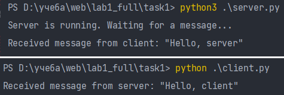
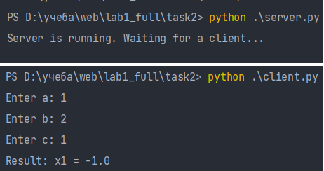
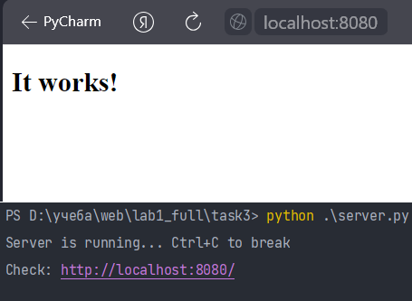
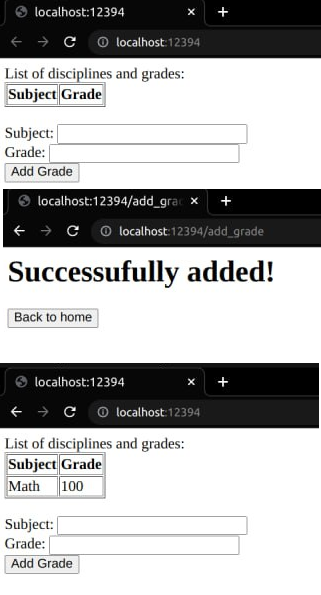

# Отчет по лабораторной работе №1 "Работа с сокетами" 

## Описание работы 
1. Реализовать клиентскую и серверную часть приложения. Клиент отсылает серверу
сообщение «Hello, server». Сообщение должно отразиться на стороне сервера.
Сервер в ответ отсылает клиенту сообщение «Hello, client». Сообщение должно
отобразиться у клиента.
Обязательно использовать библиотеку `socket`
Реализовать с помощью протокола UDP.
2. Реализовать клиентскую и серверную часть приложения. Клиент запрашивает у
сервера выполнение математической операции (решение квадратного уравнения),
параметры, которые вводятся с клавиатуры. Сервер обрабатывает полученные 
данные и возвращает результат клиенту.
Обязательно использовать библиотеку `socket`
Реализовать с помощью протокола TCP.
3. Реализовать серверную часть приложения. Клиент подключается к серверу. В ответ
клиент получает http-сообщение, содержащее html-страницу, которую сервер
подгружает из файла index.html.
Обязательно использовать библиотеку `socket`
4. Реализовать многопользовательский чат.
Обязательно использовать библиотеку `socket`
Реализовать с помощью протокола TCP.
Обязательно использовать библиотеку `threading`
Для применения с TCP необходимо запускать клиентские подключения И прием
и отправку сообщений всем юзерам на сервере в потоках. 
5. Необходимо написать простой web-сервер для обработки GET и POST http
запросов средствами Python и библиотеки `socket`
Задание: сделать сервер, который может:
принять и записать информацию о дисциплине и оценке по дисциплине;
отдать информацию обо всех оценах по дсициплине в виде html-страницы.

## Задание 1
В первом задании использовалась библиотека `socket` для создания простого
сервера.

Код программы сервера:
```python
import socket

server_socket = socket.socket(socket.AF_INET, socket.SOCK_DGRAM)

server_address = ('localhost', 9090)
server_socket.bind(server_address)

print("Server is running. Waiting for a message...")

data, client_address = server_socket.recvfrom(1024)
message = data.decode('utf-8')
print(f'Received message from client: "{message}"')

response_message = 'Hello, client'
server_socket.sendto(response_message.encode('utf-8'), client_address)

server_socket.close()
```

Код программы клиента:
```python
import socket

client_socket = socket.socket(socket.AF_INET, socket.SOCK_DGRAM)

server_address = ('localhost', 9090)
client_socket.connect(server_address)

message = 'Hello, server'
client_socket.send(message.encode('utf-8'))

response = client_socket.recv(1024)
response_message = response.decode('utf-8')

print(f'Received message from server: "{response_message}"')

client_socket.close()
```

Пример работы:



## Задание 2

Во втором задании клиент отправлял серверу три параметра: *a, b, c*, а в ответ
сервер отправлял клиенту решение математического уравнения вида 
$ax^2+bx+c=0$

Код программы сервера:
```python
import socket
import math

server_socket = socket.socket(socket.AF_INET, socket.SOCK_STREAM)

server_address = ('localhost', 9090)
server_socket.bind(server_address)

server_socket.listen(1)
print("Server is running. Waiting for a client...")


while True:
    try:
        client_socket, client_address = server_socket.accept()

        try:
            data = client_socket.recv(1024)
            params = data.decode('utf-8').split(',')
            a, b, c = map(float, params)

            discriminant = b**2 - 4*a*c
            if discriminant > 0:
                root1 = (-b + math.sqrt(discriminant)) / (2*a)
                root2 = (-b - math.sqrt(discriminant)) / (2*a)
                result = f"x1 = {root1}, x2 = {root2}"
            elif discriminant == 0:
                root1 = -b / (2*a)
                result = f"x1 = {root1}"
            else:
                result = "No real roots"

            client_socket.send(result.encode('utf-8'))
        except ValueError:
            error_message = "Parameters must be numbers"
            client_socket.send(error_message.encode('utf-8'))
    except KeyboardInterrupt:
        server_socket.close()
        print('Connection closed.')
        break
```

Код программы клиента:
```python
import socket

client_socket = socket.socket(socket.AF_INET, socket.SOCK_STREAM)

server_address = ('localhost', 9090)
client_socket.connect(server_address)


a = input("Enter a: ")
b = input("Enter b: ")
c = input("Enter c: ")

params = f"{a}, {b}, {c}"
client_socket.send(params.encode())

response = client_socket.recv(1024)
result = response.decode('utf-8')
print(f"Result: {result}")

client_socket.close()
```

Пример работы:



## Задание 3

В этом задании была реализована серверную часть приложения, которая позволяет
отправлять клиенту http-сообщение, содержащую html-страницу.

Код программы сервера:
```python
import socketserver


def read_file(filename):
    try:
        with open(filename, 'r', encoding='utf-8') as file:
            return file.read()
    except FileNotFoundError:
        return "File not found"


class MyHandler(socketserver.StreamRequestHandler):
    def handle(self):
        html_content = read_file('index.html')
        response = f"HTTP/1.1 200 OK\nContent-Length: {len(html_content)}\n\n{html_content}"
        self.request.sendall(response.encode('utf-8'))


if __name__ == "__main__":
    server_address = ('localhost', 8080)

    server = socketserver.TCPServer(server_address, MyHandler)
    print("Server is running... Ctrl+C to break\nCheck: http://localhost:8080/")

    try:
        server.serve_forever()
    except KeyboardInterrupt:
        server.server_close()
        print("Connection closed")
```

Пример работы:



##  Задание 4

В этом задании было предложено сделать многопользовательский чат.

Сервер принимает подключения от клиентов и рассылает их по остальным пользователям.
Чтобы приложение работало корректно постоянно отправка сообщений каждому пользователю,
а также прием подключений осуществлялись в разных потоках.

Код программы обработки сообщения:
```python
def handle_client(client_socket):
    while True:
        try:
            data = client_socket.recv(1024)
            if not data:
                clients.remove(client_socket)
                break
            address = client_socket.getpeername()

            message = f"{address}: {data.decode('utf-8')}"
            for client in clients:
                if client != client_socket:
                    client.send(message.encode('utf-8'))
        except Exception as e:
            print(f"Error: {e}")
            break
```

Код сервера:
```python
server_socket = socket.socket(socket.AF_INET, socket.SOCK_STREAM)
server_address = ('localhost', 12342)
server_socket.bind(server_address)
server_socket.listen(5)
print("Server is running. Waiting for a clients...")

while True:
    try:
        client_socket, client_address = server_socket.accept()
        clients.append(client_socket)
        print(f"Welcome {client_address}")
        client_handler = threading.Thread(target=handle_client,
                                          args=(client_socket,))
        client_handler.daemon = True
        client_handler.start()
    except KeyboardInterrupt:
        server_socket.close()
        break
```

Клиенты принимают ответы от сервера и отправляют собственные также в разных потоках,
чтобы не произошло ситуации, что некоторые сообщения останутся неполученными.

Код отправки сообщений:
```python
def send_message(client_socket):
    while True:
        message = input()
        client_socket.send(message.encode('utf-8'))
```

Код клиента:
```python
client_socket = socket.socket(socket.AF_INET, socket.SOCK_STREAM)
server_address = ('localhost', 12342)
client_socket.connect(server_address)
print("Welcome! You can start chatting")

send_thread = threading.Thread(target=send_message, args=(client_socket,))
send_thread.daemon = True
send_thread.start()

while True:
    try:
        data = client_socket.recv(1024)
        if not data:
            print('Server closed.')
            client_socket.close()
            sys.exit(0)
        print(data.decode('utf-8'))
    except KeyboardInterrupt:
        print('\nYou left the chat!')
        client_socket.close()
        break
```

Пример работы:


## Задание 5

В последнем задании нужно было написать простой web-сервер, способный обрабатывать
POST и GET запросы.

Для этого был реализован класс MyHTTPServer, который запускает принятие клиентов,
обрабатывает должным образом каждый из запросов, а также отсылает их обратно клиентам.

Код класса MyHTTPServer:
```python
class MyHTTPServer:
    def __init__(self, host, port, name):
        self.host = host
        self.port = port
        self.name = name
        self.grades = {}
        self.server_socket = None
        self.client_socket = None
        self.running = False

    def serve_forever(self):
        self.server_socket = socket.socket(socket.AF_INET, socket.SOCK_STREAM)
        self.server_socket.bind((self.host, self.port))
        self.server_socket.listen(5)
        print(f"Server is running on http://{self.host}:{self.port}")
        self.running = True

        while self.running:
            try:
                self.client_socket, client_address = self.server_socket.accept()
                self.serve_client()
            except KeyboardInterrupt:
                self.exit()

    def serve_client(self):
        request_data = self.client_socket.recv(1024).decode('utf-8')
        method, path = self.parse_request(request_data)
        headers = self.parse_headers(request_data)

        if method == "GET":
            response = self.handle_get_request(path)
        elif method == "POST":
            data_length = int(headers.get("Content-Length", 0))
            response = self.handle_post_request(path, request_data[-data_length:])
        else:
            response = "HTTP/1.1 405 Method Not Allowed\r\n\r\nMethod not supported"

        self.client_socket.sendall(response.encode('utf-8'))
        self.client_socket.close()

    def parse_request(self, request_data):
        lines = request_data.strip().split("\r\n")
        method, full_path, _ = lines[0].split(' ')
        parsed_url = urllib.parse.urlparse(full_path)
        path = parsed_url.path
        return method, path

    def parse_headers(self, request_data):
        lines = request_data.strip().split("\r\n")
        headers = {}
        for line in lines[1:]:
            if ": " in line:
                key, value = line.split(": ", 1)
                headers[key] = value
        return headers

    def handle_get_request(self, path):
        if path == "/":
            form = """
               <form method="POST" action="/add_grade">
                   <label for="subject">Subject:</label>
                   <input type="text" id="subject" name="subject" required><br>
                   <label for="grade">Grade:</label>
                   <input type="text" id="grade" name="grade" required><br>
                   <input type="submit" value="Add Grade">
               </form>
            """
            grade_table = self.generate_grade_table()
            page = f"List of disciplines and grades:<br>{grade_table}<br>{form}"
            response = f"HTTP/1.1 200 OK\r\nServer: {self.name}\r\nContent-Type: text/html\r\n\r\n{page}"
        else:
            response = f"HTTP/1.1 404 Not Found\r\nServer: {self.name}\r\n\r\nPage not found"
        return response


    def handle_post_request(self, path, request_body):
        if path == "/add_grade":
            query_params = urllib.parse.parse_qs(request_body)
            subject = query_params.get("subject", [''])[0]
            grade = query_params.get("grade", [""])[0]
            self.grades[subject] = grade
            page = """
                <h1>Successufully added!</h1>
                <button onclick="window.location.href = '/'">Back to home</button>
            """
            response = f"HTTP/1.1 201 Created\r\nServer: {self.name}\r\nContent-Type: text/html\r\n\r\n{page}"
        else:
            response = f"HTTP/1.1 404 Not Found\r\nServer: {self.name}\r\n\r\nPage not found"
        return response

    def generate_grade_table(self):
        table = "<table border='1'><tr><th>Subject</th><th>Grade</th></tr>"
        for subject, grade in self.grades.items():
            table += f"<tr><td>{subject}</td><td>{grade}</td></tr>"
        table += "</table>"
        return table

    def exit(self):
        self.running = False
        if self.server_socket:
            self.server_socket.close()
        if self.client_socket:
            self.client_socket.close()
        print("Server closed")
```

Код всего сервера:
```python
if __name__ == '__main__':
    host = "localhost"
    port = 12394
    name = "MyServer"
    serv = MyHTTPServer(host, port, name)
    try:
        serv.serve_forever()
    except KeyboardInterrupt:
        serv.exit()
        sys.exit(0)
```

Пример работы:


