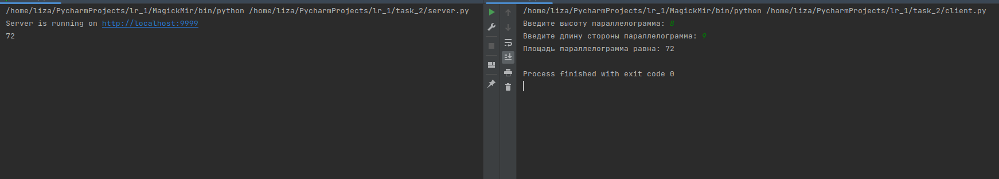

# Задание 2

Реализовать клиентскую и серверную часть приложения. Клиент запрашивает у
сервера выполнение математической операции(поиск площади параллелограмма), параметры, которые вводятся с
клавиатуры. Сервер обрабатывает полученные данные и возвращает результат
клиенту.

## Выполнение

### Реализация сервера

    import socket
    
    
    def main():
        server = socket.socket(socket.AF_INET, socket.SOCK_STREAM)
        server.bind(('localhost', 9999))
        server.listen(2)
        print(f"Server is running on http://localhost:9999")
    
        while True:
            client, address = server.accept()
            a, b = client.recv(1024).decode('utf-8').split(',')
            data = str(int(a) * int(b))
            print(data)
            client.send(data.encode('utf-8'))
            client.close()
    
    
    if __name__ == '__main__':
        main()

### Реализация клиента

    import socket
    
    
    def main():
        client = socket.socket(socket.AF_INET, socket.SOCK_STREAM)
        try:
            client.connect(('localhost', 9999))
            a = input('Введите высоту параллелограмма: ')
            b = input('Введите длину стороны параллелограмма: ')
            data = a + ',' + b
            client.send(data.encode('utf-8'))
            print('Площадь параллелограмма равна: ' + client.recv(1024).decode('utf-8'))
        except Exception as e:
            print('Error: ', str(e))
        finally:
            client.close()
    
    
    if __name__ == '__main__':
        main()

## Пример работы

