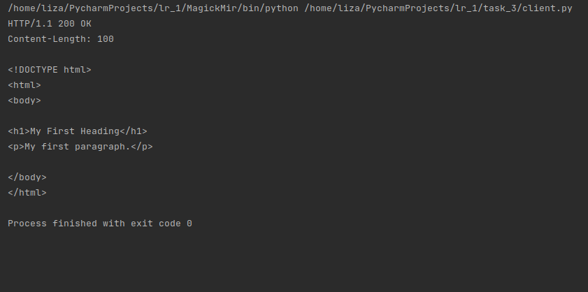

# Задание 3

Реализовать серверную часть приложения. Клиент подключается к серверу. В ответ
клиент получает http-сообщение, содержащее html-страницу, которую сервер
подгружает из файла index.html.

## Выполнение

### Реализация сервера

    import socket

    def get_response():
        try:
            with open('index.html') as file:
                content = file.read()
        except FileNotFoundError:
            content = "<html><body><h1>File index.html isn't found</h1></body></html>"
        response = f"HTTP/1.1 200 OK\r\nContent-Length: {len(content)}\r\n\r\n{content}"
        return response
    
    
    def main():
        server = socket.socket(socket.AF_INET, socket.SOCK_STREAM)
        server.bind(('localhost', 9999))
        server.listen(1)
        print(f"Server is running on http://localhost:9999")
    
        while True:
            client, address = server.accept()
            response = get_response()
            client.send(response.encode('utf-8'))
            client.close()
    
    
    if __name__ == '__main__':
        main()

### Реализация клиента

    import socket
    
    
    def main():
        client = socket.socket(socket.AF_INET, socket.SOCK_STREAM)
    
        try:
            client.connect(('localhost', 9999))
            response = client.recv(1024).decode('utf-8')
            print(response)
        except Exception as e:
            print('Error: ', str(e))
        finally:
            client.close()
    
    
    if __name__ == '__main__':
        main()

## Пример работы

