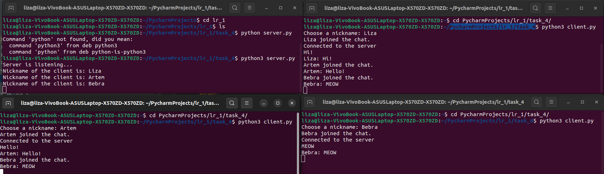

# Задание 4

Реализовать двухпользовательский или многопользовательский чат. Для применения с TCP необходимо запускать клиентские подключения И прием
и отправку сообщений всем юзерам на сервере в потоках. Не забудьте сохранять юзеров,
чтобы потом отправлять им сообщения.

## Выполнение

### Реализация сервера

    import socket
    import threading
    
    server = socket.socket(socket.AF_INET, socket.SOCK_STREAM)
    server.bind(('localhost', 9999))
    server.listen()
    
    clients = []
    nicknames = []
    
    
    def broadcast(message):
        for client in clients:
            client.send(message)
    
    
    def handle(client):
        while True:
            try:
                message = client.recv(1024)
                broadcast(message)
            except:
                index = clients.index(client)
                clients.remove(client)
                client.close()
                nickname = nicknames[index]
                broadcast(f'{nickname} left the chat.'.encode('utf-8'))
                nicknames.remove(nickname)
                break
    
    
    def receive():
        while True:
            client, address = server.accept()
            client.send('Nick'.encode('utf-8'))
            nickname = client.recv(1024).decode('utf-8')
            nicknames.append(nickname)
            clients.append(client)
    
            print(f'Nickname of the client is: {nickname}')
            broadcast(f'{nickname} joined the chat.'.encode('utf-8'))
            client.send('Connected to the server'.encode('utf-8'))
    
            thread = threading.Thread(target=handle, args=(client,))
            thread.start()
    
    
    print('Server is listening...')
    receive()

### Реализация клиента

    import socket
    import threading
    
    nickname = input('Choose a nickname: ')
    
    client = socket.socket(socket.AF_INET, socket.SOCK_STREAM)
    client.connect(('localhost', 9999))
    
    
    def receive():
        while True:
            try:
                message = client.recv(1024).decode('utf-8')
                if message == 'Nick':
                    client.send(nickname.encode('utf-8'))
                else:
                    print(message)
            except:
                print('An error occurred.')
                client.close()
                break
    
    
    def write_message():
        while True:
            message = f'{nickname}: {input("")}'
            client.send(message.encode('utf-8'))
    
    
    receive_thread = threading.Thread(target=receive)
    receive_thread.start()
    
    write_thread = threading.Thread(target=write_message)
    write_thread.start()

## Пример работы

