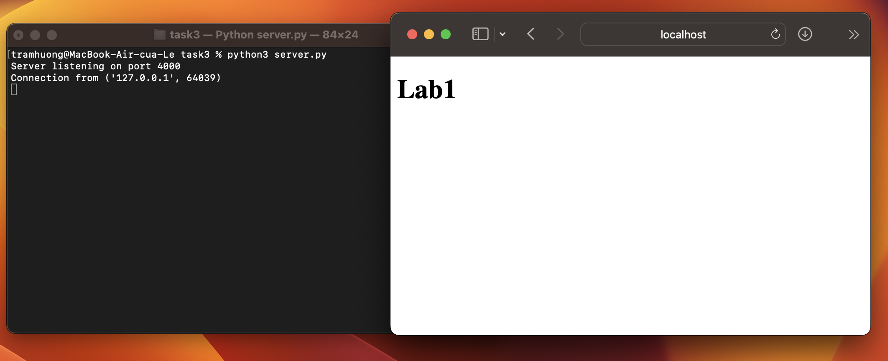

# Задание 3

Реализовать серверную часть приложения. Клиент подключается к
серверу. В ответ клиент получает http-сообщение, содержащее
html-страницу, которую сервер подгружает из файла index.html.

## Выполнение

### Реализация сервера

```python 
import socket

host = 'localhost'  
port = 4000  

def get_response_html():
    try:
        with open("index.html", "r") as file:
            html_content = file.read()
    except FileNotFoundError:
        html_content = "<html><body><h1>File index.html isn't found</h1></body></html>"

    response = f"HTTP/1.1 200 OK\r\nContent-Length: {len(html_content)}\r\n\r\n{html_content}"
    return response


def main():
    s = socket.socket(socket.AF_INET, socket.SOCK_STREAM)  # Создание серверного сокета
    s.bind((host, port))  # Привязка сокета к хосту и порту
    s.listen(1)  # Ожидание входящих подключений

    print("Server listening on port", port)

    while True:
        client, addr = s.accept()  # Принятие входящего подключения
        print(f"Connection from {addr}")

        request = client.recv(1024).decode('utf-8')  # Получение запроса от клиента

        if request:
            response = get_response_html()  # Генерация ответа
            client.send(response.encode('utf-8'))  # Отправка ответа клиенту

        client.close()  # Закрытие соединения с клиентом

if __name__ == "__main__":
    main()
```

## Пример работы

