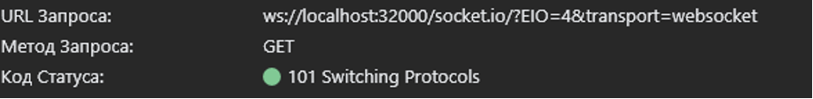
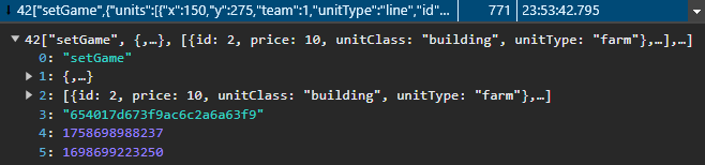
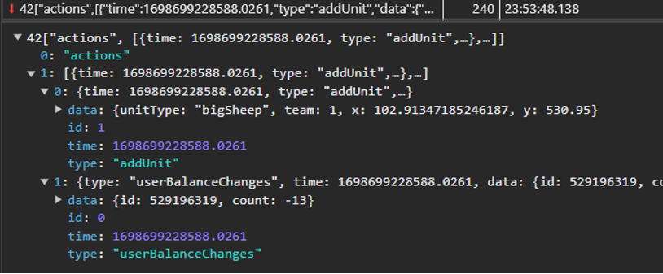
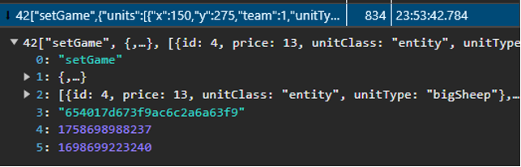
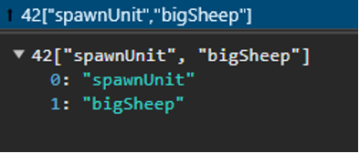
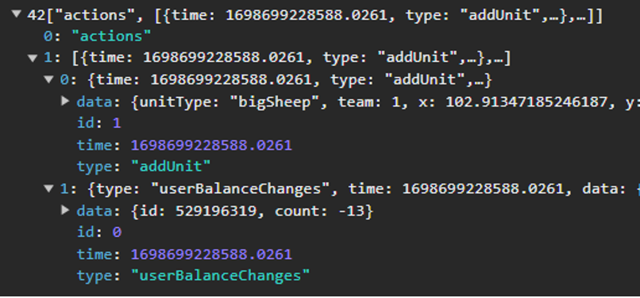

<figure markdown>
  
  <figcaption>Оба клиента подключились к lobbyUrl при входе в игру</figcaption>
</figure>

### Клиент A

<figure markdown>
  
  <figcaption>Получил информацию при подключении к лобби</figcaption>
</figure>

<figure markdown>
  
  <figcaption>Получил информацию о совершенном Клиент Б действии (создании игрового юнита)</figcaption>
</figure>

### Клиент Б

<figure markdown>
  
  <figcaption>Получил информацию при подключении к лобби</figcaption>
</figure>

<figure markdown>
  
  <figcaption>Отправил запрос на создание игрового юнита</figcaption>
</figure>

<figure markdown>
  
  <figcaption>Получил информацию о совершенном собой действии (создании игрового юнита)</figcaption>
</figure>

