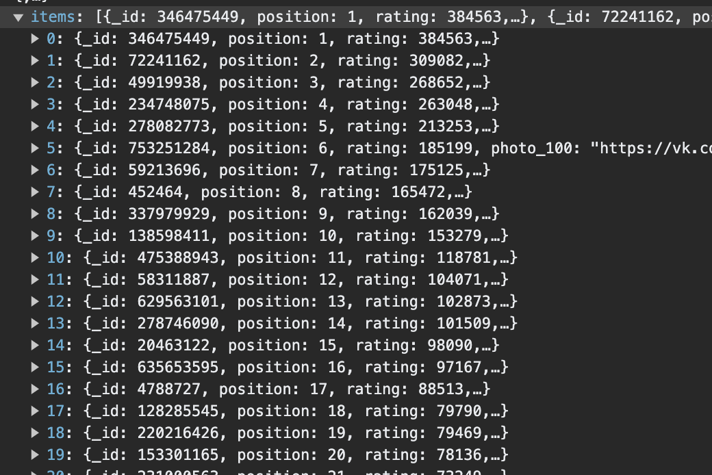

<figure markdown>
  
  <figcaption>Пример результата запроса /user/rating и /user/friendsRating</figcaption>
</figure>

<figure markdown>
  
  <figcaption>Итоговый визуал полученной программы</figcaption>
</figure>
