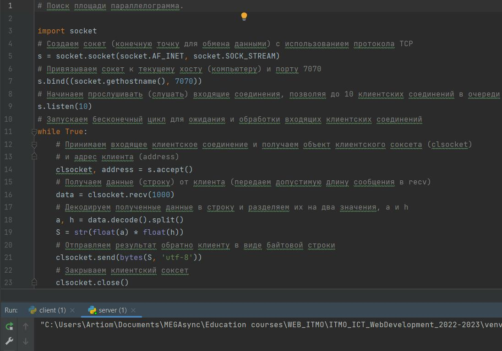
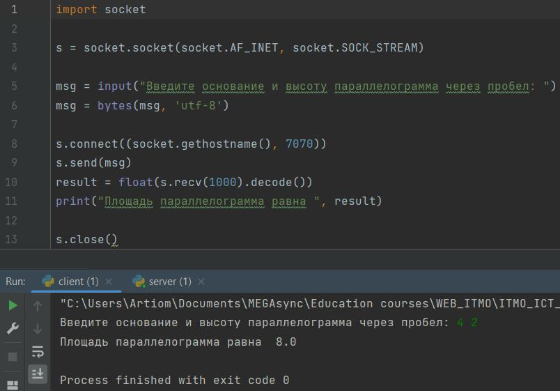

# Задание 2
**Cерверная часть**

Сервер не выводит никакой информации, только получает, обрабатывает его и отправляет ответ.

**Клиентская часть**

Программа запрашивает данные у пользователя, формирует сообщение, подключается к серверу и отправляет запрос. После получения ответа от сервера, программа выводит их пользователю.
