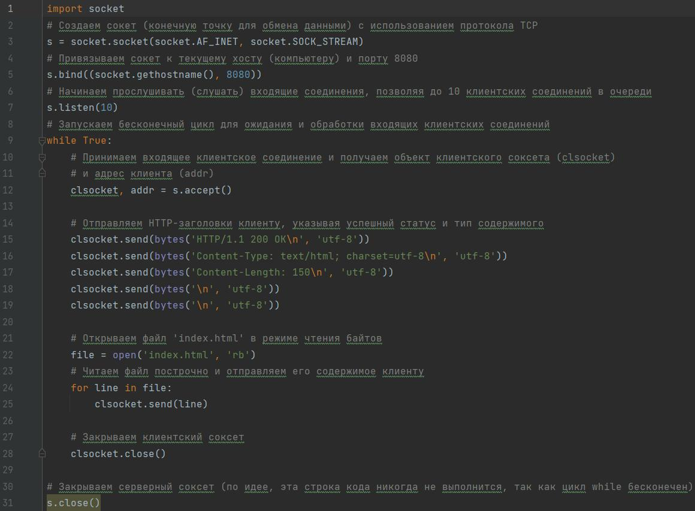
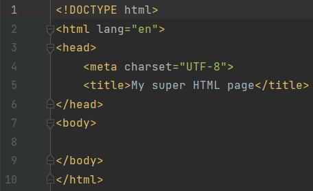

# Задание 3

**Серверная часть**

Сокет после установки соединения отправляется html-сообщение клиенту построчно, а затем также передает файл index.html.

**html-страница**

**Клиентская часть**

Клиент только получает данные, посылаемые сервером, и выводит их в консоль.

**Пример работы программы**

