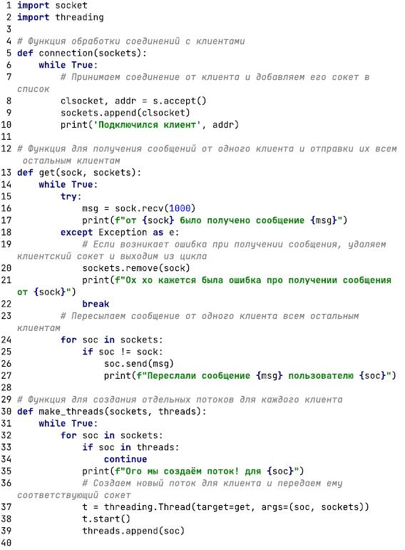
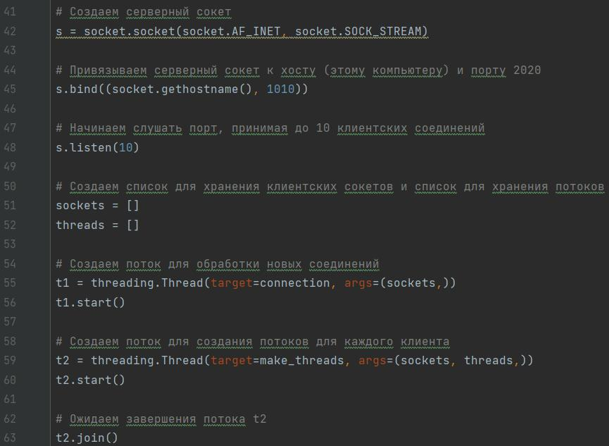
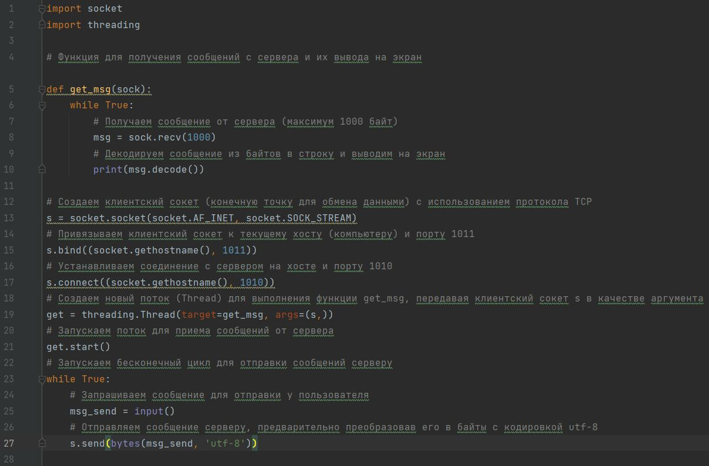
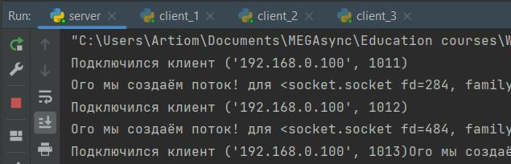
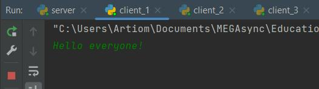
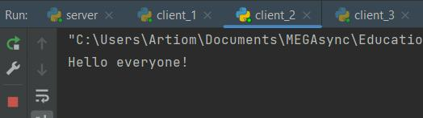
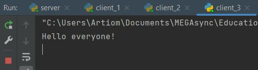

# Задание 4

**Серверная часть**

В файле сервера определено несколько функций. Первая отвечает за подключение пользователя, о чем выводит информацию в консоль. Вторая получает сообщение от клиента, если возвращается ошибка, то данное подключение удаляется из списка, а также отправляет всем подключенным клиентам полученное сообщение. Третья отвечает за создание потока для каждого клиента, чтобы они могли иметь одновременное подключение.

В другой части запускается серверный сокет, создаются массивы для подключений и потоков. Затем создаются два потока для одновременной обработки новых подключений и сообщений из чата.

**Клиентская часть**

У всех пользователей одинаковый скрипт. Отличается только вызов bind.

**Пример работы программы**

Запуск программы и подключение пользователей:

Первый пользователь отправил сообщение:

Второй пользователь получает сообщение от первого:

Третий пользователь получает сообщение от первого:

