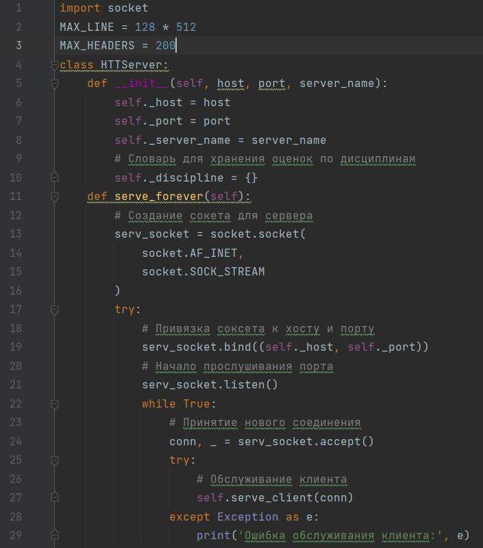
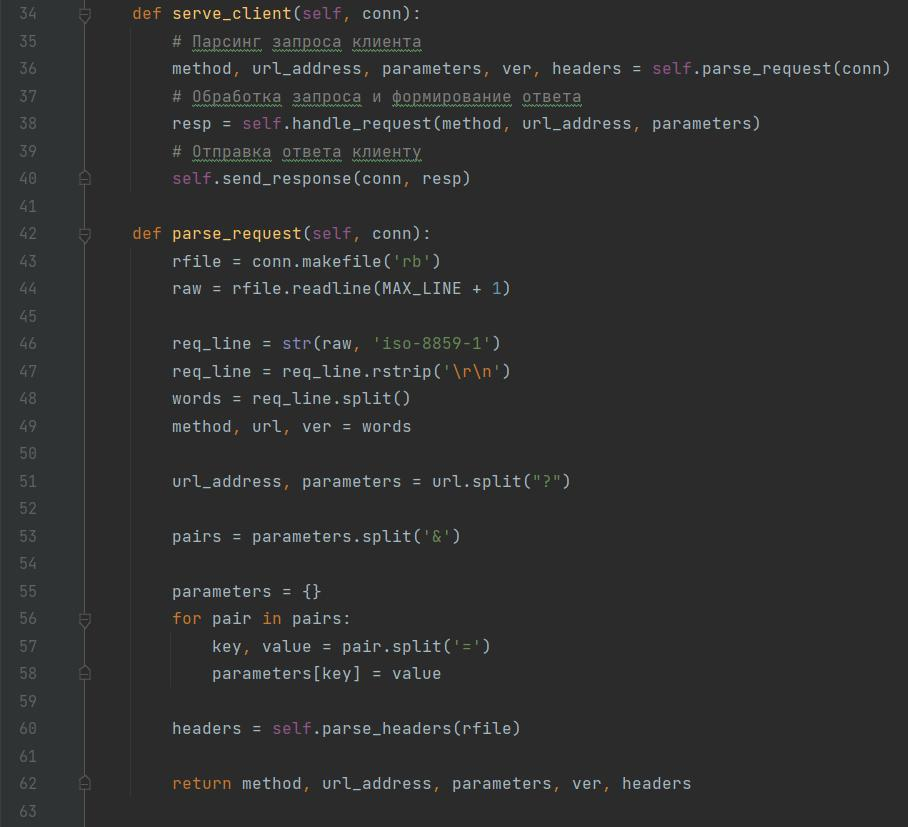
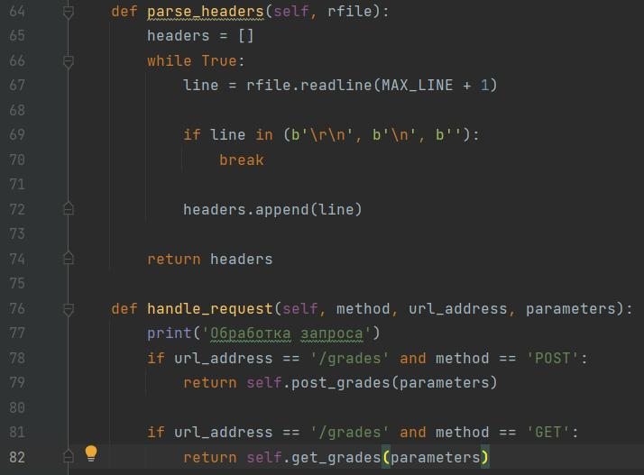
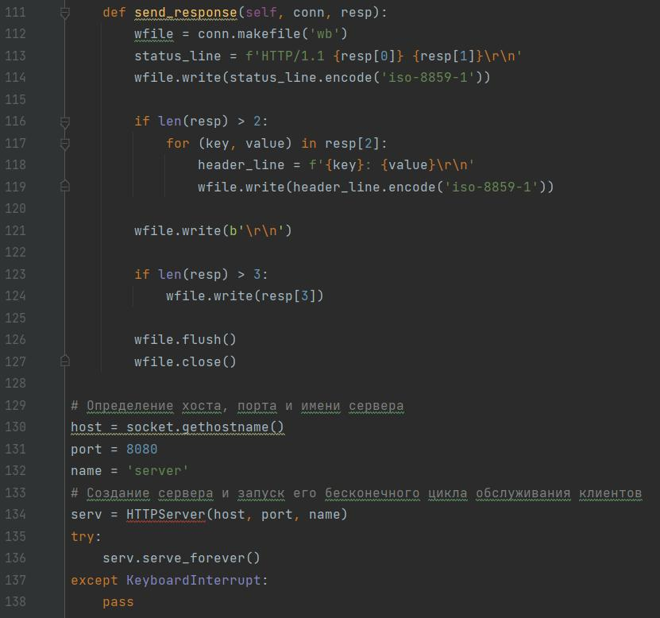
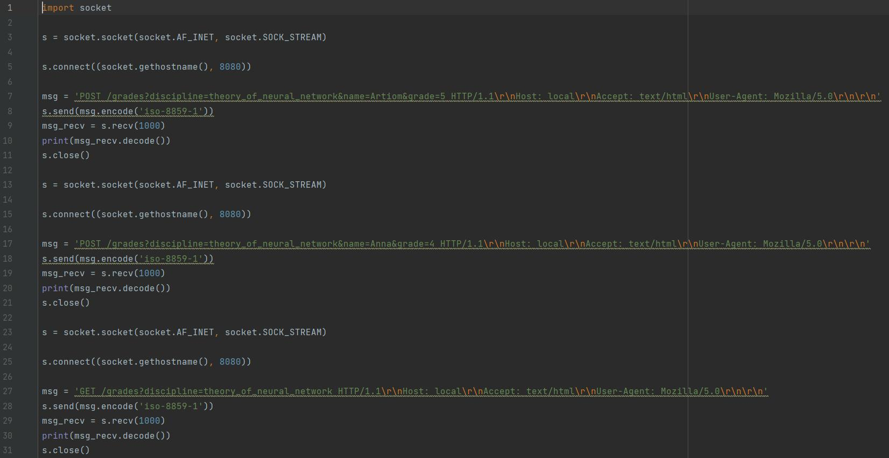
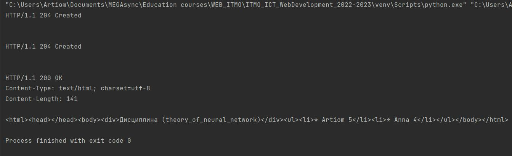

# Задание 5

**Серверная часть**

Здесь сервер является http-сервером. В первой функции проходит инициализация сервера и инициализация словаря для дисциплин, куда будут записываться оценки студентов. Далее описана главная функция сервера, где он запускается и обрабатывает клиентские подключения.

В обработке клиентского подключения входит парсинг заголовка, составление ответа и его отправка. Парсинг заголовка: данные запроса, разбиваются на метод, адрес и версию протокола, затем адрес разбивается на адрес и переданные параметры, которые в свою очередь оформляются в словарь.

В конце парсинга запроса идёт парсинг заголовков, который описан в функции parse_headers. В ее цикле построчно читается файл, переданный из предыдущей функции и до появления пустой строки заголовки записываются в соответствующий массив. После идет функция для создания ответа handle_request. В зависимости от переданного метода она вызывает либо функцию записи новых оценок, либо функцию получения информации по дисциплине.

В функции записи информации проверяется наличие переданной дисциплины, происходит добавление данных в словарь, объявленный при инициализации и возвращаются атрибуты ответа. Если же нужно получить данные, то построчно создается тело ответа с добавлением необходимых данных в соответствии с переданными параметрами и также возвращаются атрибуты ответа.

В функции отправки ответа send_response создается файл, который будет отправлен клиенту, в него в необходимом порядке вставляются атрибуты из предыдущих функций.

**Клиентская часть**

**Пример работы программы**

Вывод в консоль на стороне клиента:

